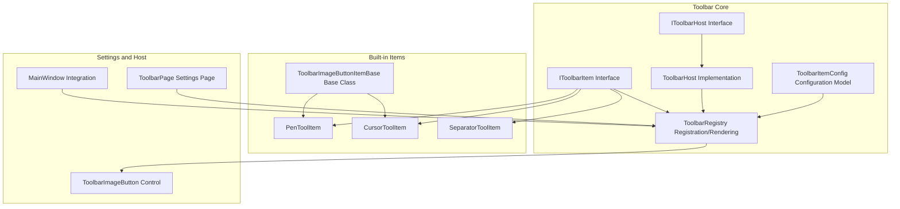
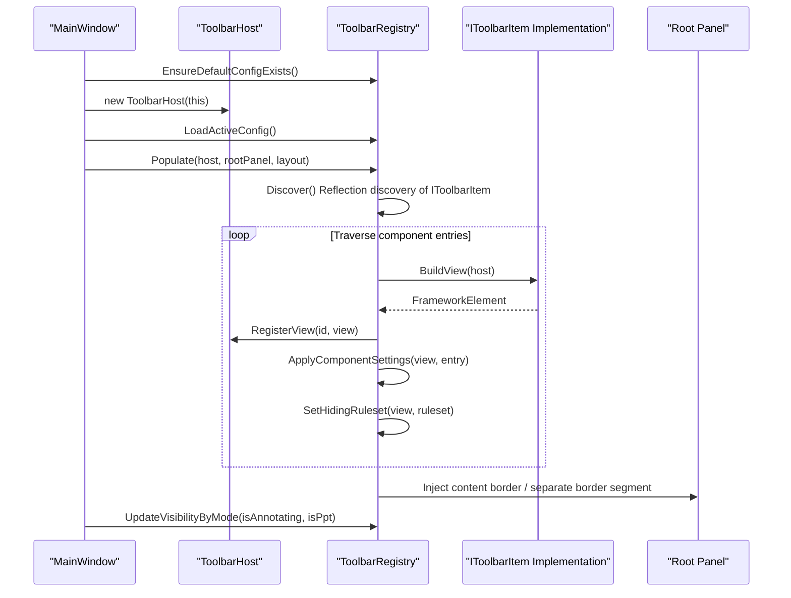
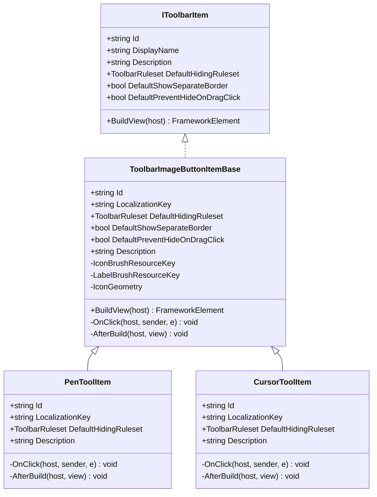
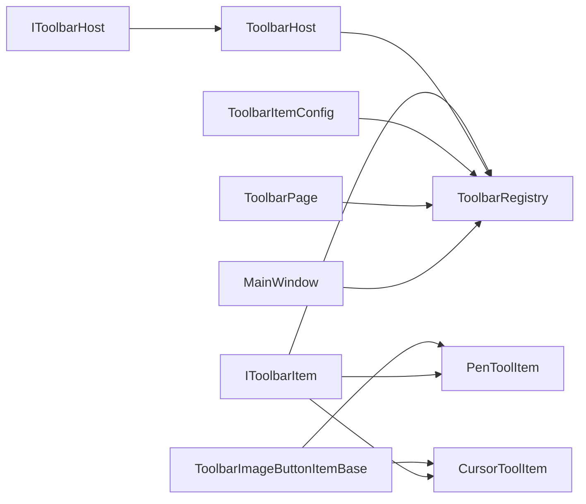

# Toolbar Customization and Extension

## Introduction
This guide is for developers who need to customize and extend the toolbar in Ink Canvas. It systematically explains how to:
- Inherit from ToolbarImageButtonItemBase to create custom toolbar button items
- Use the toolbar configuration system to manage the arrangement, separators, and layout of toolbar items
- Customize the style, icons, and interactive behavior of toolbar items
- Dynamically add, remove, and modify toolbar items at runtime
- Provide complete extension examples from simple buttons to complex composite tools
- Summarize best practices for performance optimization, memory management, and user experience enhancement

## Project Structure
The toolbar subsystem is located in the Ink Canvas/Controls/Toolbar and its Items subdirectory, consisting of the following core modules:
- Interface Layer: IToolbarItem, IToolbarHost
- Registration and Rendering: ToolbarRegistry, ToolbarHost
- Configuration Model: ToolbarItemConfig (rulesets, component entries, layout settings)
- Base Button Class: ToolbarImageButtonItemBase
- Built-in Item Examples: PenToolItem, CursorToolItem, SeparatorToolItem
- Settings Page and Dynamic Configuration: ToolbarPage.xaml.cs
- Main Window Integration: MW_Toolbar.cs
- Button Control: ToolbarImageButton.xaml.cs

## Core Components
- IToolbarItem: Defines the minimum contract of a toolbar item, including identifier, display name, description, default hiding rules, whether separate border is shown, whether hiding on drag-click is prevented, and the method to build the view.
- IToolbarHost: The bridge between the toolbar item and the host (MainWindow), providing the ability to register/find views.
- ToolbarHost: The implementation of IToolbarHost by MainWindow, maintaining the view dictionary mapping.
- ToolbarRegistry: Discovers, assembles, and renders toolbar items, supporting rule evaluation, visibility control, layout injection, and configuration file read/write and backup.
- ToolbarItemConfig: Configuration models including rulesets, rule groups, rules, component entries, and layout settings, supporting JSON serialization and deserialization.
- ToolbarImageButtonItemBase: An abstract base class for built-in button-type items, encapsulating icons, labels, click events, and the build workflow.
- Built-in Item Examples: PenToolItem, CursorToolItem, and SeparatorToolItem demonstrate how to quickly implement button items based on the base class.

## Architecture Overview
The runtime workflow of the toolbar is as follows:
- During MainWindow initialization, ToolbarHost is created, the current configuration is loaded, and ToolbarRegistry.Populate is called to inject toolbar items into the root panel.
- ToolbarRegistry discovers all IToolbarItem implementations via reflection, builds views one by one, and registers them in the host dictionary.
- For each component entry, settings (dimensions, alignments, margins, opacity, icon sizes, font sizes, red style, etc.) are applied, and the initial visibility is determined based on the ruleset.
- Supports dynamically updating visibility based on conditions (annotation mode, PPT mode, user collapsed state).
- The settings page ToolbarPage provides a visual editor, supporting drag-and-drop sorting, ruleset editing, component settings editing, and configuration file management.

## Detailed Component Analysis

### Component A: ToolbarImageButtonItemBase Base Class and Derived Items
- Responsibility: Provides a unified build workflow for button-type toolbar items, including labels, icons, resource binding, click events, and post-build hooks.
- Key Points:
  - Default hiding rules: AlwaysShow with the "user collapsed" condition appended.
  - Supports setting the icon path via a geometry string.
  - Supports setting icon/label brushes via resource keys.
  - Executes the AfterBuild hook after building to attach additional behaviors (e.g., popup panels).

## Dependency Analysis
- Component Coupling:
  - Loose coupling is established between IToolbarItem and ToolbarRegistry via reflection discovery and construction.
  - ToolbarHost is only responsible for view registration/lookup, with a single responsibility.
  - ToolbarRegistry depends on the ruleset and component settings of ToolbarItemConfig.
- External Dependencies:
  - Read/write of configuration files uses Newtonsoft.Json.
  - Logging uses LogHelper.
  - Settings page depends on SettingsManager and localized resources.

## Performance Considerations
- Ruleset Evaluation:
  - Uses state caching (Ruleset.State, RuleGroup.State, Rule.State) to avoid repeated computations.
  - Logical short-circuiting: And mode stops if not satisfied; Or mode stops if satisfied.
- View Construction:
  - Caches the view dictionary through ToolbarHost to reduce duplicate lookups.
  - ApplyComponentSettings sets properties only when necessary, avoiding unnecessary WPF layout passes.
- Visibility Updates:
  - UpdateVisibilityByMode recursively traverses injected elements, evaluating the ruleset before determining visibility.
  - HasVisibleLeafContent checks visibility only at the content border level, reducing redundant traversals.
- Configuration Files:
  - Backups are performed before reading/writing, with rollbacks on failure, reducing the risk of UI stuttering.

## Troubleshooting Guide
- Toolbar Item Not Displayed:
  - Check if the HidingRuleset of the component entry matches the current context (annotation mode, PPT mode, user collapsed).
  - Confirm whether the min/max size and fixed size in the component settings conflict.
- Abnormal Icon or Label Colors:
  - Confirm whether the resource key exists, or if UseRedStyle is set, which overrides the brush.
- Configuration File Corrupted:
  - Check the log messages for "loading backup" and "restoring from backup" to confirm if the backup was successful.
- Dynamic Configuration Ineffective:
  - Confirm that ToolbarPage has saved the configuration and triggered MainWindow.RebuildToolbar.
  - Check the Suppress flag on the settings page to avoid accidentally suppressing the save.

## Conclusion
Through the collaboration of ToolbarImageButtonItemBase and ToolbarRegistry, Ink Canvas provides a flexible and high-performance toolbar extension mechanism. With the rulesets and component settings of ToolbarItemConfig, developers can easily customize everything from simple buttons to complex composite tools, and perform visual configuration and dynamic adjustments through the settings page. Following the best practices in this document can significantly improve user experience while ensuring performance and stability.

## Appendix

### Best Practice Checklist
- Custom Button Items
  - Inherit from ToolbarImageButtonItemBase, override Id, LocalizationKey, DefaultHidingRuleset, and Description.
  - Call the corresponding handling logic of the host window in OnClick, and attach popup panels or position targets in AfterBuild.
  - If a custom icon is needed, set IconGeometry or IconBrushResourceKey.
- Separator and Layout
  - Use ShowSeparateBorder to distinguish separate border segments from regular content borders.
  - Reasonably use groups (builtin.group) to organize related buttons, facilitating batch show/hide.
- Style and Interaction
  - Use ComponentSettingKeys to set sizes, alignments, margins, opacity, font size, and icon size.
  - Use UseRedStyle to quickly switch to warning style.
  - Control the hiding strategy during drag-clicks via PreventHideOnDragClick.
- Dynamic Configuration
  - Add, remove, and sort components by dragging and dropping in ToolbarPage.
  - Edit rulesets to adapt to different scenarios (annotation/PPT/collapsed).
  - Save the configuration and call RebuildToolbar to take effect.
