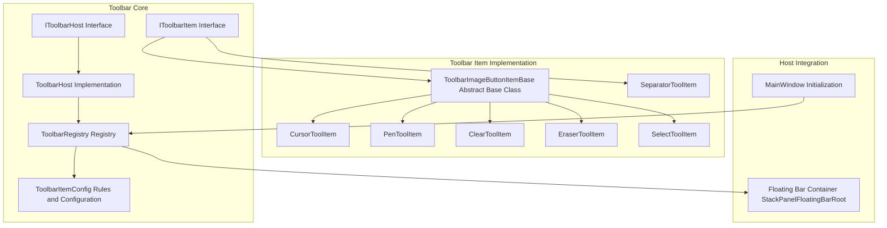
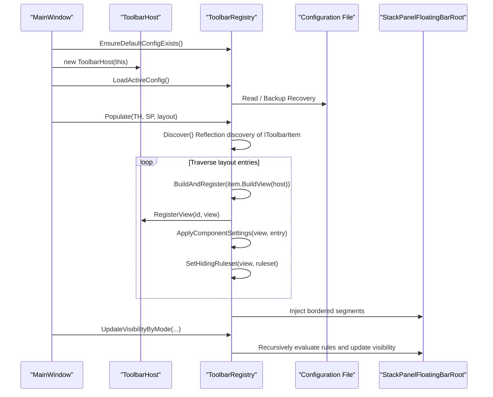
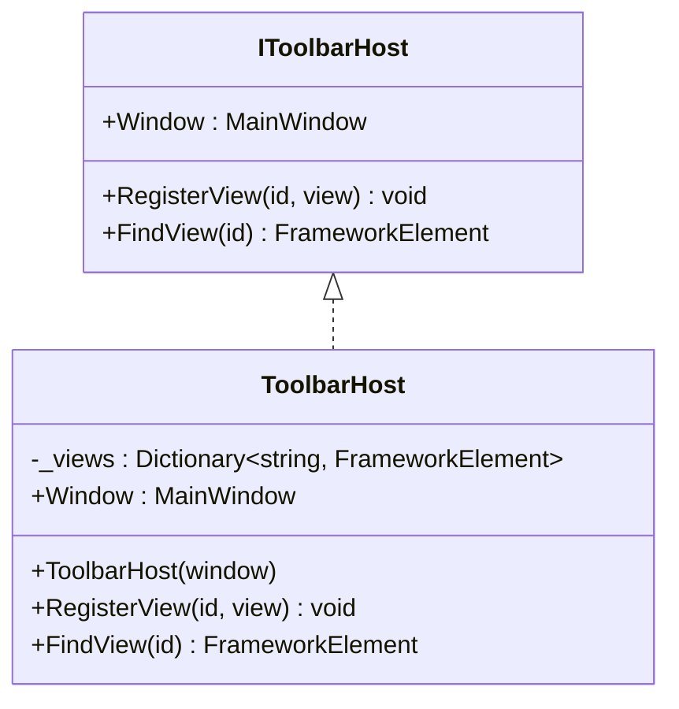
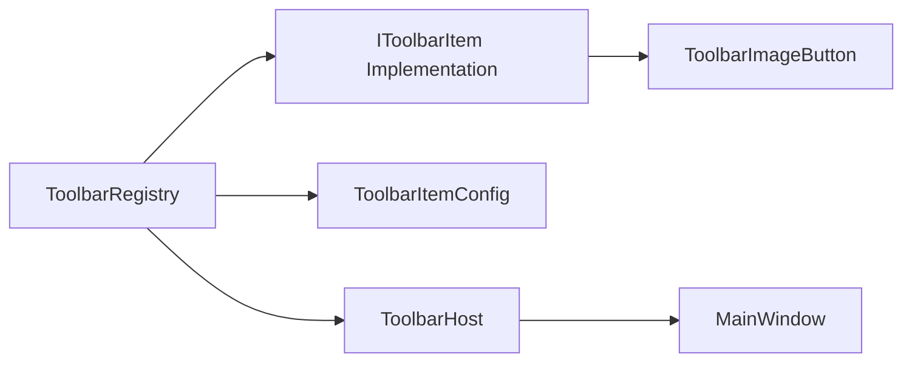

# Toolbar Management System

## Introduction
This document systematically introduces the toolbar management system of InkCanvasForClass, focusing on the following aspects:
- Architecture design and workflow of ToolbarHost: initialization, host bridging, view registration, and lookup.
- ToolbarRegistry toolbar item registration, discovery, and management: rule evaluation, layout assembly, visibility control, configuration persistence, and dynamic loading.
- Design philosophy and implementation specifications of the IToolbarItem interface: unified build workflow, default hiding strategies, localization, and icon resources.
- Toolbar drag-and-drop sorting, custom configuration, and dynamic loading mechanisms: layout configuration files, condition rules, grouping, and separate borders.
- Toolbar item state management, icon resources, and localization support: attached properties, styles, and resource binding.
- Best practices and performance optimization recommendations: avoiding reflection overhead, reducing UI hierarchies, and using attached properties reasonably.

## Project Structure
The toolbar-related code is centralized under Ink Canvas/Controls/Toolbar, containing interfaces, hosts, registries, configuration models, built-in toolbar item base classes, and several concrete items; MainWindow completes the assembly and dynamic loading of the toolbar through ToolbarRegistry during initialization.

## Core Components
- IToolbarHost: The bridge interface between toolbar items and the host (MainWindow), providing window reference and view registration/lookup capabilities.
- IToolbarItem: The minimum contract of a toolbar item, defining identifiers, display names, descriptions, default hiding rules, whether separate border is shown, whether hiding on drag-click is prevented, and responsible for building views.
- ToolbarHost: The concrete implementation of IToolbarHost, holding the MainWindow reference and maintaining a mapping dictionary from id to view.
- ToolbarRegistry: A static registry responsible for the automatic discovery of toolbar items, layout assembly, rule evaluation, visibility updates, reading/writing and backup/recovery of configuration files, and injecting the final UI into the host container.
- ToolbarItemConfig: Rule and configuration models, including logical combinations of ToolbarRuleset/Group/Rule, condition sets, layout entries ToolbarComponentEntry, and their setting key-values.

## Architecture Overview
The operational workflow of the toolbar system is as follows:
- During MainWindow initialization, ToolbarHost is created, the current configuration file is loaded, and ToolbarRegistry.Populate is called to assemble the layout into the specified container.
- ToolbarRegistry discovers all types implementing IToolbarItem via reflection, builds views, and registers them to ToolbarHost.
- Each view applies styles such as size, alignment, margins, opacity, icon size, and colors according to the settings of ToolbarComponentEntry.
- ToolbarRegistry flattens the entries into DisplayItems, segments them into "separate border" and "content border", and generates a Border+StackPanel structure to inject into the container.
- Visibility is determined jointly by ToolbarRuleset and context conditions (annotation mode, PPT mode, user collapsed state), and the visibility inside the container is recursively updated.

## Detailed Component Analysis

### ToolbarHost: Host Bridge and View Registration
- Responsibilities
  - Expose MainWindow reference, serving as the entry point for plugin-host interaction.
  - Maintain the mapping from id to FrameworkElement, supporting view lookups by id.
- Design Points
  - Stores in a dictionary; registration/lookup are both O(1).
  - Defensive checks on null parameters to avoid exceptions.
- Collaboration with ToolbarRegistry
  - After building each IToolbarItem view, ToolbarRegistry calls RegisterView to register it, enabling cross-component lookup via FindView later.

## Dependency Analysis
- Component Coupling
  - ToolbarRegistry depends on the implementations of IToolbarItem and the rules/configuration models of ToolbarItemConfig.
  - ToolbarHost only depends on the MainWindow reference and dictionary mapping, with low coupling.
- External Dependencies
  - Configuration file read/write depends on Newtonsoft.Json and the file system.
  - Logging depends on LogHelper.
- Potential Circular Dependencies
  - No circular dependencies found in the current structure; IToolbarItem implementations are injected into containers via ToolbarRegistry and do not have reverse dependencies on ToolbarRegistry.

## Performance Considerations
- Reflection and Instantiation
  - Discover scans and instantiates IToolbarItem through reflection; it is recommended to cache the results after the first use to avoid repeated scans.
- UI Hierarchy and Visibility
  - Populate clears and rebuilds injected elements; when switching configurations frequently, consider partial updates instead of a full rebuild.
  - UpdateVisibilityByMode uses recursive traversal; it is recommended to limit the refresh frequency or perform batch updates when dealing with large toolbars.
- Resources and Styles
  - ApplyComponentSettings sets multiple properties for each item; it is recommended to merge settings or defer their application.
  - Red styles and resource resolution might trigger resource lookups; it is recommended to handle them centrally or reuse resource references.

[This section is a general guideline and does not require a specific file source]

## Troubleshooting Guide
- Configuration File Issues
  - When the main configuration is missing or corrupted, attempt to restore from backup; if it still fails, it will fall back to the default layout.
  - Check permissions and write protection on the configuration directory, and use a write protection manager if necessary.
- Toolbar Item Not Displayed
  - Check if the IToolbarItem implementation is correctly discovered (non-abstract, non-interface, and instantiable).
  - Verify HidingRuleset against the current context (annotation/PPT/collapsed) to check the evaluation result.
- View Not Registered
  - Confirm that BuildView returns a non-empty view and that it has been registered to ToolbarHost after BuildAndRegister.
- Events Not Responding
  - Confirm that events are correctly bound in BuildView and that necessary host associations are completed in AfterBuild.

## Conclusion
Through a clear interface contract and registry pattern, this toolbar system achieves automatic discovery of toolbar items, flexible rule-driven visibility control, and extensible configuration persistence and dynamic loading. Utilizing the host bridge provided by ToolbarHost, plugins can easily access MainWindow capabilities; ToolbarImageButtonItemBase unifies the build workflow, localization, and icon resource handling of button-type items. It is recommended to follow interface specifications, use rule systems and component setting keys reasonably, and pay attention to performance and maintainability in practical extensions.

[This section is a summary and does not require a specific file source]

## Appendix: Custom Toolbar Item Development Guide
- Implementation Steps
  - Create a new class implementing IToolbarItem or inheriting from ToolbarImageButtonItemBase.
  - Define a unique Id and DisplayName (localization keys can be used), and set DefaultHidingRuleset.
  - Create and configure the view in BuildView, bind events; if additional integration with host UI is needed, override AfterBuild.
  - Delegate the click logic to the corresponding handling method in MainWindow.
- Rules and Visibility
  - Use ToolbarRuleset.AlwaysShow()/AnnotationOnly()/PptOnly()/PptAnnotationOnly() as starting points, overlaying WithHideOnCollapsed/WithPreventHideOnCollapsed if necessary.
  - Set hidingRuleset in the layout configuration or migrate to new rulesets.
- Component Settings
  - Use ComponentSettingKeys to set sizes, alignments, margins, opacity, icon/font sizes, red style, etc.
  - For special controls (like a quick color palette), synchronize the display mode in AfterBuild.
- Localization and Icons
  - Set label text and icon brushes via Strings.GetString or resource keys.
  - Icon geometry can be parsed from strings or set directly via resource keys.
- Best Practices
  - Avoid performing time-consuming operations in BuildView, try to defer them to AfterBuild.
  - Keep the Id unique and stable to avoid conflicts with built-in items.
  - Reserve a place for the new item in the configuration file to facilitate user customization of sorting and grouping.
