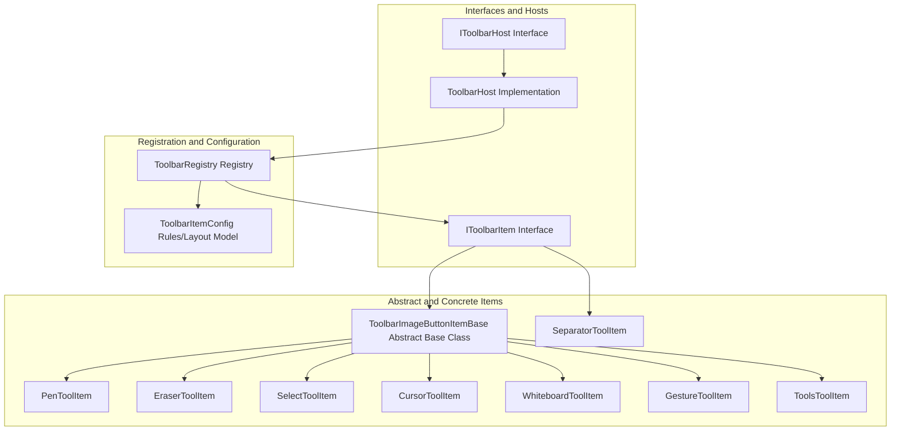
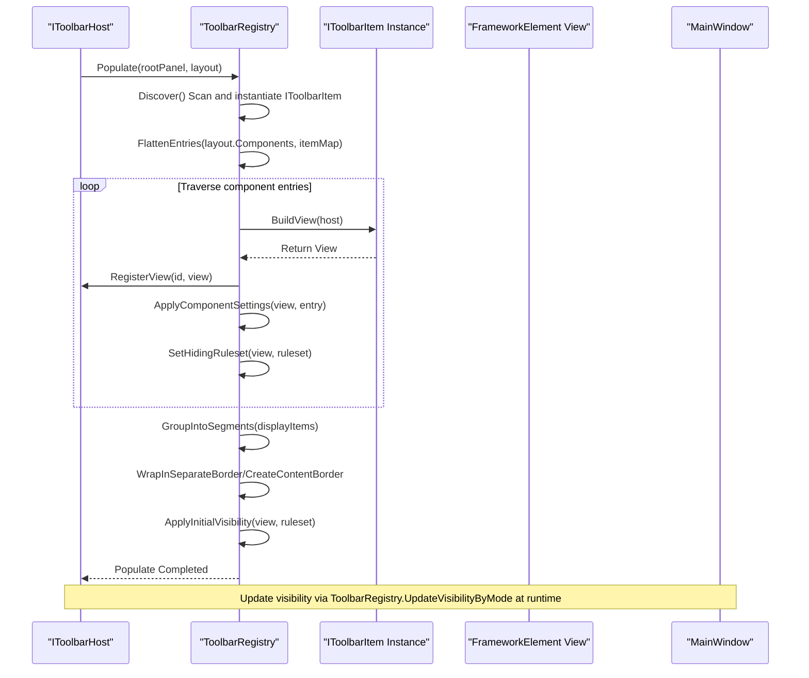
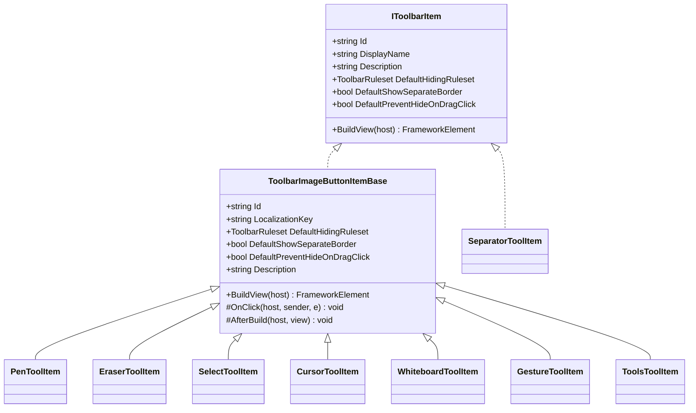
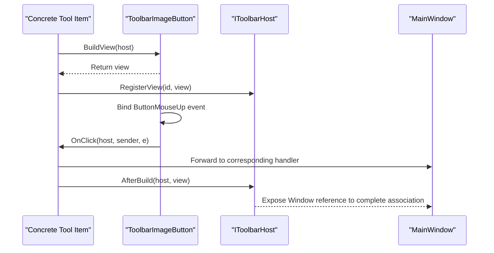
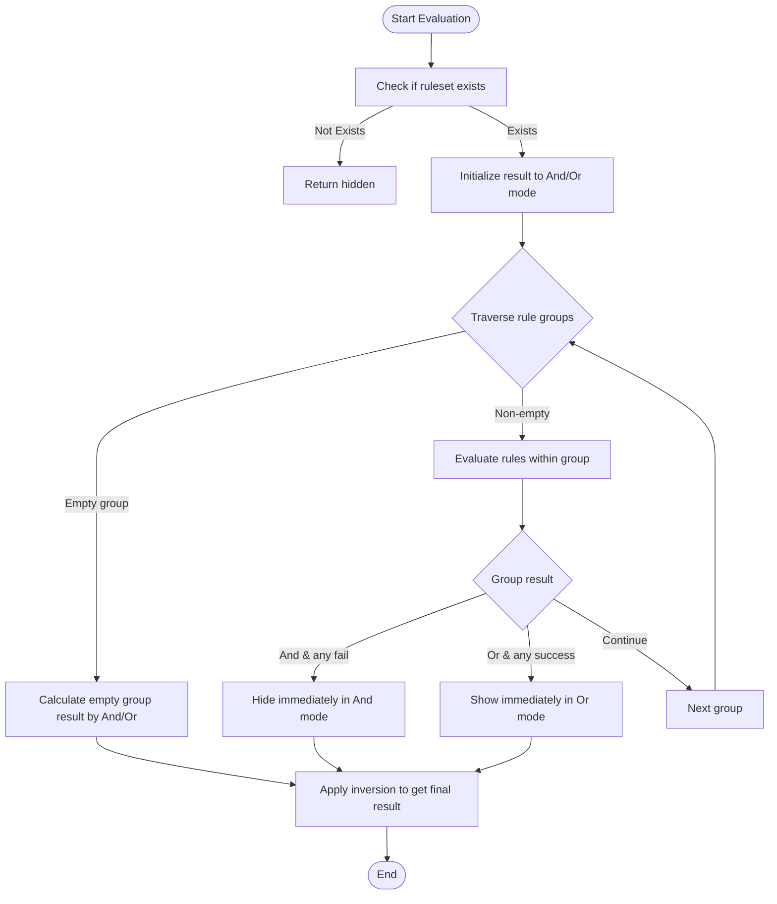
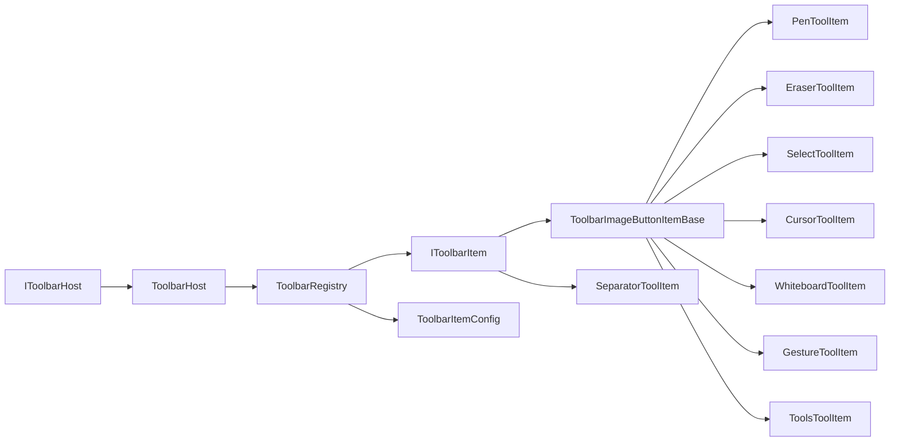

# Toolbar Item Implementation

## Introduction
This is the technical documentation for "Toolbar Item Implementation," focusing on the implementation details and runtime mechanisms of built-in toolbar items. It highlights the following areas:
- Core toolbar items: PenToolItem, EraserToolItem, SelectToolItem, CursorToolItem, WhiteboardToolItem, GestureToolItem, ToolsToolItem, etc.
- Interfaces and hosts: IToolbarItem, IToolbarHost, ToolbarHost
- Rule system: hiding rules, grouping and logical combinations, and condition contexts
- Lifecycle and events: building views, click callbacks, and post-build hooks
- Communication with MainWindow: forwarding events to MainWindow via IToolbarHost
- Icons and localization: resource keys, geometry icons, and string localization
- Extensibility: how to add custom toolbar items
- Performance and stability: visibility evaluation, configuration persistence, and error logging

## Project Structure
The toolbar system is located under Ink Canvas/Controls/Toolbar and adopts a layered design of "interface + abstract base class + concrete item + registry + configuration model":
- Interface Layer: IToolbarItem, IToolbarHost
- Abstract Layer: ToolbarImageButtonItemBase
- Concrete Items: PenToolItem, EraserToolItem, SelectToolItem, CursorToolItem, WhiteboardToolItem, GestureToolItem, ToolsToolItem, SeparatorToolItem
- Registration and Layout: ToolbarRegistry (discovery, assembly, segmentation, visibility evaluation, configuration read/write)
- Configuration Model: ToolbarItemConfig (rules, groups, logical modes, component entries, layout settings)

## Core Components
- IToolbarItem: Defines the toolbar item's identifier, display name, description, default hiding rules, whether separate border is shown, whether hiding on drag-click is prevented, and the contract for BuildView to build the view.
- IToolbarHost/ToolbarHost: Provides host bridging to access MainWindow, and maintains a dictionary of registered views, supporting lookups and backfilling by id.
- ToolbarImageButtonItemBase: An abstract base class for general image button toolbar items, responsible for labels, icons, click event binding, post-build hooks, etc.
- ToolbarRegistry: The core of toolbar assembly and layout, responsible for discovering IToolbarItem instances, assembling views, segmentation, applying hiding rules, reading/writing configurations, and updating visibility.
- ToolbarItemConfig: Data models for the rule system and layout configurations, including ToolbarRuleset, ToolbarRuleGroup, ToolbarRule, ToolbarComponentEntry, and ToolbarLayoutSettings.

## Architecture Overview
The runtime execution flow for toolbar items is as follows:
- The registry scans the assembly, instantiates all IToolbarItem implementations, and forms an assemblable list.
- Component entries are flattened based on layout configurations (ToolbarLayoutSettings), views are constructed, and then registered to the host.
- Consecutive items are grouped into content borders, whereas items marked with "separate border" are wrapped individually.
- Hiding rules (based on the condition context) are applied to determine the initial visibility.
- During runtime, the visibility is dynamically evaluated and updated according to mode switches (annotation/presentation/collapsed).

## Detailed Component Analysis

### IToolbarItem and ToolbarImageButtonItemBase
- IToolbarItem: Uniformly exposes Id, DisplayName, Description, DefaultHidingRuleset, DefaultShowSeparateBorder, DefaultPreventHideOnDragClick, and BuildView.
- ToolbarImageButtonItemBase: Encapsulates the build workflow of general image buttons, including:
  - Setting label text (prioritizing localization keys)
  - Optional geometry icons and resource color brushes
  - Binding the ButtonMouseUp event to OnClick
  - AfterBuild hook for subclasses to attach MainWindow association logic

### PenToolItem
- Responsibility: Serves as the "Pen" tool item, forwarding click events to MainWindow.PenIcon_Click; associates the view via AttachPenIconView after construction.
- Default hiding rule: AlwaysShow and hides when "collapsed by user".
- Localization Key: FloatingBar_Annotate
- Icon and Theme: Handled uniformly by the base class, supporting resource keys and geometry icons.

### EraserToolItem
- Responsibility: Area eraser tool item, forwarding click events to MainWindow.EraserIcon_Click; associates the view via AttachEraserIcon after construction.
- Default hiding rule: Displayed only in annotation mode, and hides when "collapsed by user".
- Localization Key: FloatingBar_AreaEraser

### SelectToolItem
- Responsibility: Lasso select tool item, forwarding click events to MainWindow.SymbolIconSelect_MouseUp; associates the view via AttachSymbolIconSelect after construction.
- Default hiding rule: Displayed only in annotation mode, and hides when "collapsed by user".
- Localization Key: FloatingBar_LassoSelect

### CursorToolItem
- Responsibility: Mouse cursor tool item, forwarding click events to MainWindow.CursorIcon_Click; associates the view via AttachCursorIconView after construction.
- Default hiding rule: AlwaysShow and hides when "collapsed by user".
- Localization Key: FloatingBar_Mouse

### WhiteboardToolItem
- Responsibility: Whiteboard tool item, forwarding click events to MainWindow.ImageBlackboard_MouseUp; associates the view via AttachWhiteboardBtn after construction.
- Default hiding rule: AlwaysShow and hides when "collapsed by user".
- Localization Key: FloatingBar_Whiteboard

### GestureToolItem
- Responsibility: Gesture tool item, forwarding click events to MainWindow.TwoFingerGestureBorder_MouseUp; associates the view via AttachGestureBtn after construction.
- Default hiding rule: Displayed only in annotation mode (does not automatically hide with collapse).
- Separate border: Enabled by default, preventing hiding on drag-click.
- Icon: Uses geometry icon DisabledGestureIcon.

### ToolsToolItem
- Responsibility: Toolbox entry, forwarding click events to MainWindow.SymbolIconTools_MouseUp; associates the view via AttachToolsBtn after construction.
- Default hiding rule: AlwaysShow and hides when "collapsed by user".
- Localization Key: Board_Tools

### SeparatorToolItem
- Responsibility: Toolbar separator, rendered as a thin vertical border line.
- Default hiding rule: AlwaysShow and hides when "collapsed by user".
- Not an image button type, directly returns a Border view.

### Event Handling and Lifecycle
- Construction Phase: BuildView is responsible for creating ToolbarImageButton or other FrameworkElements, setting labels, icons, color resources, and binding the ButtonMouseUp event.
- Callback Phase: OnClick is implemented by subclasses to forward the event to the corresponding handler in MainWindow.
- Attachment Phase: AfterBuild provides subclasses with an opportunity to hook into main window controls (such as view registration and state bindings).

### Rule System and Visibility
- Condition Context: isAnnotating, isPptMode, isContentCollapsedByUser
- Rule Model: ToolbarRuleset contains multiple ToolbarRuleGroups, and each group contains several ToolbarRules, supporting And/Or logic and inversion.
- Evaluation Process: First evaluate each rule, then aggregate by groups, and finally invert according to the overall ruleset to obtain the final state.
- Application Timing: Sets initial visibility during Populate; dynamically updates via UpdateVisibilityByMode at runtime.

### Communication with MainWindow
- IToolbarHost exposes the MainWindow reference; plugins can access main window members via host.Window.
- Tool items forward events to specific handling functions in MainWindow (e.g., PenIcon_Click, EraserIcon_Click, etc.) via OnClick.
- The AfterBuild phase is commonly used to register the view to the main window or establish additional bindings.

### Icon Resource Management, Localization, and Theme Adaptation
- Localization: DisplayName is retrieved via Strings.GetString(LocalizationKey); if not found, it falls back to the key name.
- Icons: Supports two methods:
  - Geometry Icons: IconGeometry is a string of geometry data, which is parsed and assigned to the button.
  - Resource Color Brushes: IconBrushResourceKey/LabelBrushResourceKey prioritizes resource lookup, otherwise falls back to SetResourceReference.
- Theme Adaptation: Border background and stroke are applied through the resource keys FloatBarBackground and FloatBarBorderBrush, automatically taking effect when the theme is toggled.

## Dependency Analysis
- Component Coupling
  - Tool items depend on the IToolbarItem interface and the ToolbarImageButtonItemBase abstract class, reducing direct coupling with the main window.
  - ToolbarRegistry depends on the collection of IToolbarItem implementations, configuration models, and the host interface.
  - IToolbarHost and ToolbarHost expose the main window to plugins, facilitating extension.
- Rule Dependencies
  - ToolbarRuleset depends on ToolbarRuleGroup and ToolbarRule, forming serializable rule expressions.
- Configuration Dependencies
  - ToolbarLayoutSettings depends on ToolbarComponentEntry, which contains component id, instance id, hiding rules, settings dictionary, and child nodes.

## Performance Considerations
- Rule Evaluation Caching: The rule state is recorded via the State field, avoiding redundant computations.
- Visibility Batch Updates: UpdateVisibilityByMode evaluates the entire subtree at once, reducing multiple traversals.
- Configuration Persistence: Reading and writing configuration files uses a backup strategy, backing out quickly on exceptions to ensure stability.
- Resource Reuse: Icons and color brushes are reused via resource keys, reducing object creation overhead.

## Troubleshooting Guide
- Tool Item Not Displayed
  - Check default hiding rules and the current mode (annotation/presentation/collapsed) to verify if it was evaluated as hidden by EvaluateRuleset.
  - Confirm whether ShowSeparateBorder or PreventHideOnDragClick is set in the component entry.
- No Response on Click
  - Confirm whether OnClick is correctly forwarded to the corresponding handling function in MainWindow.
  - Check if the view has been successfully registered to IToolbarHost.
- Icons or Colors Do Not Take Effect
  - Check if IconBrushResourceKey/LabelBrushResourceKey exists in the resource dictionary.
  - Check if IconGeometry is a valid geometry string.
- Configuration Loading Failed
  - Check the log output to confirm if the main configuration file exists or is corrupted.
  - If the main file is corrupted, the system will attempt to load the backup and recover.

## Conclusion
This toolbar system achieves highly cohesive, loosely coupled tool item extension capabilities through clear interfaces and abstract base classes. Guided by the rule system and configuration persistence, it provides flexible visibility control and layout customization. Through the collaboration of IToolbarHost and ToolbarRegistry, it ensures loosely coupled communication with the main window and stable runtime performance. For adding new tool items, following the conventions of ToolbarImageButtonItemBase allows for rapid integration.

## Appendix: Extension Development Guide
- Creating Custom Toolbar Items
  - Create a new class implementing IToolbarItem or inheriting from ToolbarImageButtonItemBase.
  - In BuildView, create the view, set the label and icon, and bind the click event.
  - In OnClick, forward the event to the handling function of MainWindow.
  - If additional association with the main window is required, complete it in AfterBuild.
- Interface Implementation Key Points
  - Id must be unique; DisplayName is retrieved via localization keys; Description is used for tooltips.
  - DefaultHidingRuleset uses ToolbarRuleset factory methods and can be chained with WithHideOnCollapsed/WithPreventHideOnCollapsed.
  - If separate borders or preventing hiding on drag-click is needed, set the corresponding default values.
- Integration Methods
  - Compile the new class into the same assembly, and ToolbarRegistry will automatically discover and instantiate it.
  - Add ToolbarComponentEntry in the layout configuration, specifying id, hidingRuleset, settings, etc.
  - Inject it into the target Panel via ToolbarRegistry.Populate.
- Best Practices
  - Keep OnClick strictly for event forwarding, with business logic centralized in MainWindow.
  - Use resource keys instead of hardcoded colors to ensure theme consistency.
  - Provide both geometry data and resource color brushes for complex icons to improve maintainability.
  - Add logging to critical paths to facilitate troubleshooting.
