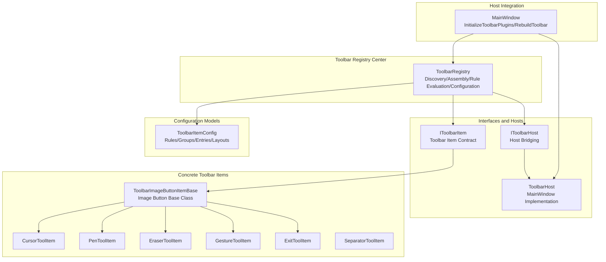
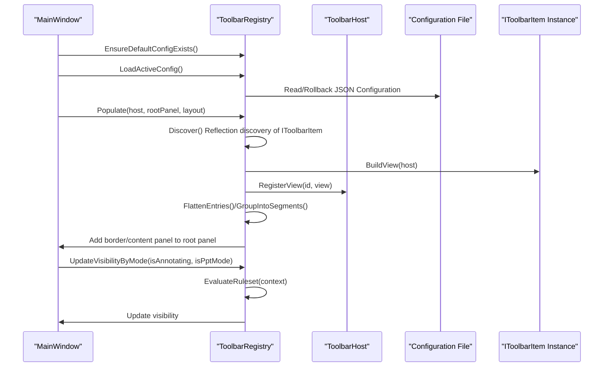
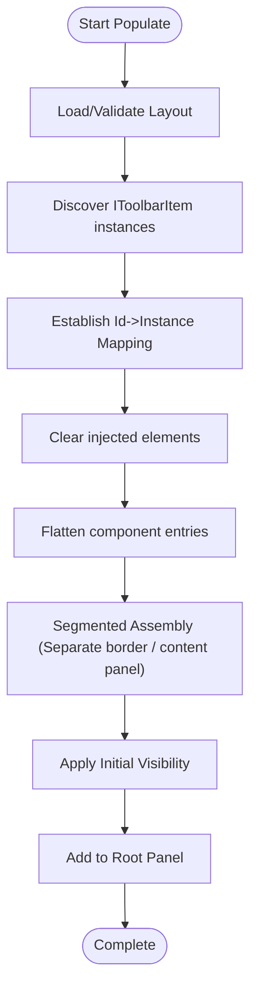
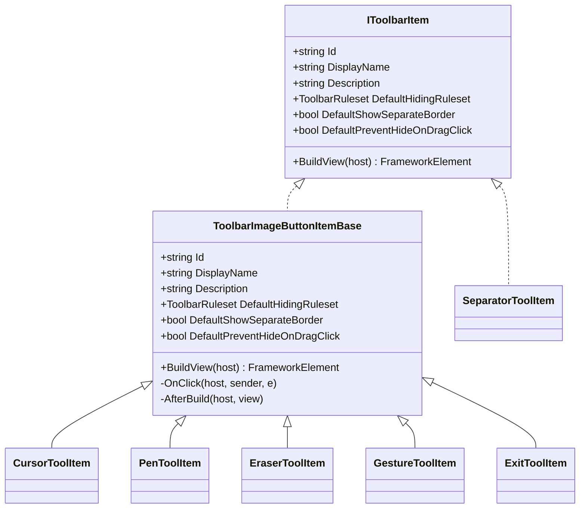
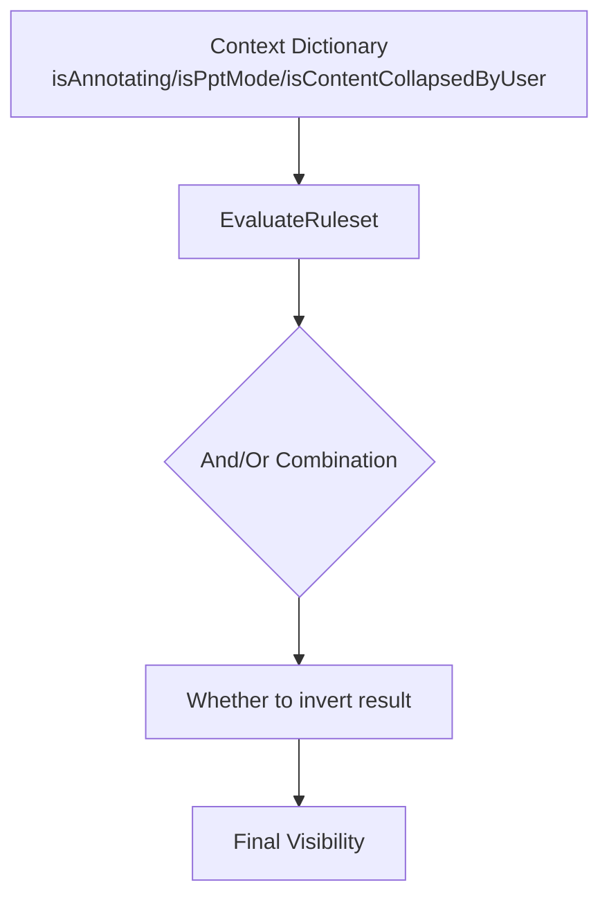
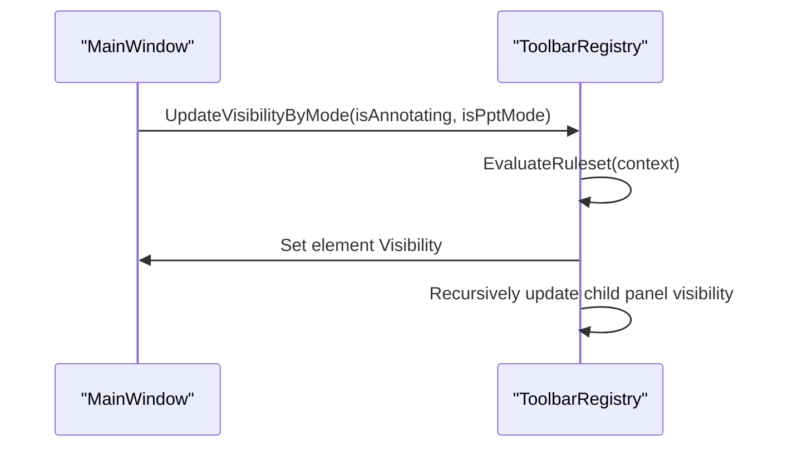
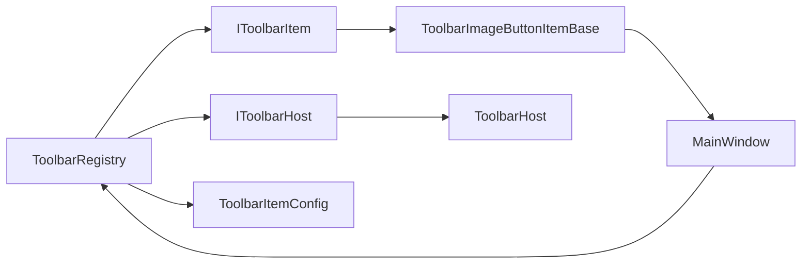

# Toolbar Registry Center

## Introduction
This document systematically explains the design and implementation of the toolbar registry center, focusing on the following areas:
- Core responsibilities of ToolbarRegistry: toolbar item discovery, layout assembly, rule evaluation, visibility control, configuration persistence, and rollback.
- IToolbarItem interface specifications and key implementation points to help developers quickly build custom toolbar items.
- Classification systems of toolbar items, hiding rules and priority management, dynamic loading, and runtime visibility updates.
- Metadata management (component settings), state synchronization, and event propagation mechanisms.
- Best practices, performance optimization recommendations, and error handling strategies.

## Project Structure
The toolbar-related code is centralized in the Ink Canvas/Controls/Toolbar directory and is layered around the "registry center + interface + configuration model + host bridge":
- Registry Center: ToolbarRegistry is responsible for discovery, assembly, rendering, rule evaluation, and configuration management.
- Interface and Host: IToolbarItem defines the toolbar item contract; IToolbarHost provides host capability bridging.
- Configuration Model: ToolbarItemConfig defines rulesets, component entries, and layout settings.
- Concrete Toolbar Items: Built-in items that inherit from ToolbarImageButtonItemBase or directly implement IToolbarItem.
- Host Integration: MainWindow exposes the window instance through ToolbarHost and calls the registry center during initialization to complete assembly.

## Core Components
- ToolbarRegistry: The static registry center, responsible for the reflection-based discovery of toolbar items, layout assembly, rule evaluation, visibility updates, reading/writing and rolling back of configuration files, cleaning up injected elements, etc.
- IToolbarItem: The toolbar item contract, defining unique identifiers, display names, descriptions, default hiding rules, default separate border strategy, default behavior for preventing hiding on drag-clicks, and the method to build views.
- IToolbarHost/ToolbarHost: Host bridging, exposing the MainWindow reference to plugins, and providing the ability to register/look up views by id.
- ToolbarItemConfig: Rule and layout models, containing logical modes (And/Or), rule groups, rules, component entries, layout settings, hiding rule enums, etc.
- Concrete Toolbar Items: Such as ToolbarImageButtonItemBase and its derived items (cursor, pen, eraser, gesture, exit, etc.), as well as separators, etc.

## Architecture Overview
The toolbar registry center adopts a layered architecture of "declarative layout + rule-driven visibility":
- Declarative Layout: Describes the component order, grouping, border strategy, and component settings of the toolbar via ToolbarLayoutSettings and ToolbarComponentEntry.
- Rule-driven: ToolbarRuleset/ToolbarRuleGroup/ToolbarRule defines And/Or logical combinations, inversions, and condition sets, supporting conditions such as isAnnotating, isPptMode, isContentCollapsedByUser, etc.
- Runtime Assembly: ToolbarRegistry discovers IToolbarItem instances through reflection, builds views and registers them with the host, then assembles them into the root panel according to the layout, and finally evaluates rules to update visibility.

## Detailed Component Analysis

### ToolbarRegistry Component Analysis
- Discovery Mechanism: Scans the current assembly via reflection, filters non-abstract types implementing IToolbarItem, instantiates them, and caches them to avoid repeated discoveries.
- Assembly Workflow: Maps component entries in the layout to discovered toolbar items, builds views, and registers them with the host; flattens and segmentizes groupings to generate containers with borders or content panels.
- Rule Evaluation: Supports And/Or logic, rule group inversion, rule inversion, combining the context dictionary (annotation mode, PPT mode, user collapsed state) to calculate final visibility.
- Configuration Management: Provides configuration directories, lists, loading, saving, deletion, default configuration creation, and rollback; logs errors on exceptions and falls back to the default layout.
- Visibility Updates: Recursively traverses panels, evaluates child element visibility according to rules, and performs "leaf node visibility aggregation" at the content panel level.

### IToolbarItem Interface and Implementation Guidelines
- Essential Properties and Methods: Id, DisplayName, Description, DefaultHidingRuleset, DefaultShowSeparateBorder, DefaultPreventHideOnDragClick, BuildView(host).
- Implementation Recommendations:
  - Use stable Ids to avoid conflicts with built-in Ids.
  - DefaultHidingRuleset should be chosen according to business scenarios (AlwaysShow/AnnotationOnly/PptOnly/PptAnnotationOnly) and can be chained with WithHideOnCollapsed/WithPreventHideOnCollapsed.
  - The FrameworkElement returned by BuildView should have InjectedTag set, helping the registry identify and clean it up.
  - For button-type items, it is recommended to inherit from ToolbarImageButtonItemBase to reuse icon/label resource bindings and click event encapsulations.

### Hiding Rules and Priority Management
- Rule Model: ToolbarRuleset contains multiple ToolbarRuleGroups, and each group contains several ToolbarRules; supports And/Or logic, group inversion, and rule inversion.
- Condition System: Built-in conditions isAnnotating, isPptMode, isContentCollapsedByUser; localized names can be retrieved via AvailableConditions.
- Priority Strategy:
  - Component-level priority: The HidingRuleset of ToolbarComponentEntry takes precedence over HidingRule (migration compatibility).
  - Grouping strategy: ShowSeparateBorder controls whether to show with separate borders, affecting layout and style.
  - User preferences: IsContentCollapsedByUser affects the behaviors of WithHideOnCollapsed/WithPreventHideOnCollapsed.

### Dynamic Loading and Runtime Visibility Updates
- Initialization: MainWindow.InitializeToolbarPlugins calls EnsureDefaultConfigExists, LoadActiveConfig, Populate, and registers the visibility update callback.
- Runtime Updates: UpdateToolbarComponentVisibility calls UpdateVisibilityByMode, passing the annotation mode and PPT mode states, triggering a visibility recalculation of the entire injected tree.
- Event Propagation: Toolbar items access MainWindow events (e.g., click events) via host bridging, realizing cross-component collaboration.

### Metadata Management and Component Settings
- Component Settings Keys: Min/max/fixed dimensions, font/icon sizes, horizontal/vertical alignments, margins/paddings, opacity, whether to use red style, display modes, etc.
- Application Strategy: ApplyComponentSettings maps settings to view properties; supports red styles and resource bindings for ToolbarImageButton; supports display mode forcing for QuickColorPaletteControl.
- Layout Defaults: CreateDefaultLayout provides the built-in default layout, containing common tools, groupings, separators, separate border items, etc.

## Dependency Analysis
- ToolbarRegistry depends on:
  - IToolbarItem: Scanning and discovering specific toolbar items via reflection.
  - IToolbarHost/ToolbarHost: Registering views for host lookups and collaboration.
  - ToolbarItemConfig: Parsing layouts and rules.
  - Logging and settings: Logging errors, configuration file paths, and settings reading.
- Toolbar items depend on:
  - ToolbarImageButtonItemBase: Unifying the build and resource binding of button-type items.
  - MainWindow: Accessing window events and UI elements via host bridging.
- Host Integration:
  - MainWindow completes configuration preparation, registry center assembly, and visibility updates during the initialization phase.

## Performance Considerations
- Reflection Discovery: Executed only on the first call to Discover, with results cached to avoid repeated scanning.
- Panel Traversal: UpdatePanelVisibility recursively traverses injected elements; it is recommended to keep layout hierarchies reasonable to reduce unnecessary nesting.
- Configuration I/O: Saving/loading involves disk I/O; it is recommended to execute on background threads or perform batch operations, wrapping in process protection if necessary.
- View Construction: Exceptions in BuildView(host) will be caught and logged, avoiding affecting the overall assembly workflow.

## Troubleshooting Guide
- Discovery Failure: Check if the IToolbarItem implementation class can be instantiated via reflection, and check the "instantiation failure" logs.
- Configuration Missing/Corrupted: EnsureDefaultConfigExists creates default configurations; if the main configuration does not exist or is corrupted, it attempts to roll back the .bak file and logs warning/error messages.
- Visibility Anomalies: Confirm that the HidingRuleset of the component entry is correctly set; check if the context dictionary contains isAnnotating/isPptMode/isContentCollapsedByUser.
- View Not Registered: Confirm that BuildView(host) returns non-empty and has been registered via host.RegisterView; otherwise, the host cannot find it via FindView(id).

## Conclusion
The toolbar registry center realizes flexible and extensible toolbar assembly and runtime control through declarative layouts and rule-driven visibility management. Relying on the IToolbarItem interface and ToolbarItemConfig model, developers can quickly implement custom toolbar items and participate in the unified hiding rules and component settings system. Cooperating with the host bridge of MainWindow, toolbar items can closely collaborate with main interface events, meeting complex interaction needs.

## Appendix: Best Practices and Extension Guide

- Custom Toolbar Item Implementation Steps
  - Implement IToolbarItem or inherit from ToolbarImageButtonItemBase, providing a stable Id, default hiding rules, and BuildView.
  - In BuildView, return the FrameworkElement and set InjectedTag; for buttons, leverage ToolbarImageButton's resource bindings to simplify icon/label rendering.
  - If interacting with the main window is required, access events or UI elements via host.Window (taking note of limits during the interface evolution phase).
  - Ensure the configuration exists and complete Populate in MainWindow.InitializeToolbarPlugins.

- Hiding Rules and Priority
  - Prioritize using HidingRuleset; if not present, migrate HidingRule.
  - For components that need manual hiding by users, use WithHideOnCollapsed; for components that must always be displayed, use WithPreventHideOnCollapsed.
  - Use ShowSeparateBorder reasonably to control separate border displays, enhancing visual hierarchy.

- Component Settings and Style
  - Use keys in ComponentSettingKeys to set sizes, alignments, margins, paddings, opacity, red style, and display modes.
  - For button-type components, prioritize using ToolbarImageButton's LabelFontSize/IconHeight and UseRedStyle; for QuickColorPaletteControl, support forcing display modes.

- Configuration Management
  - Automatically create default.json on the first run; support listing, loading, saving, deleting, and rolling back.
  - Automatically roll back .bak and log error when configurations are corrupted, downgrading to the default layout if necessary.

- Error Handling and Logging
  - Discovery and build exceptions are caught and logged; it is recommended to pay attention to log outputs during the development phase to locate issues.
  - Configuration I/O exceptions are also logged to facilitate troubleshooting of permissions and path issues.
