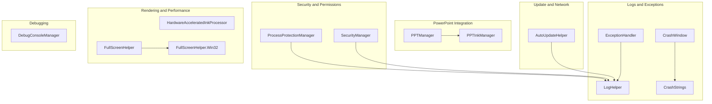
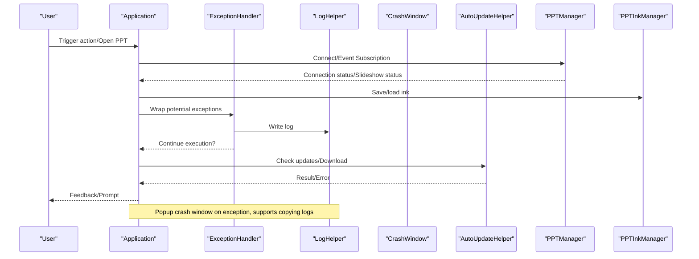
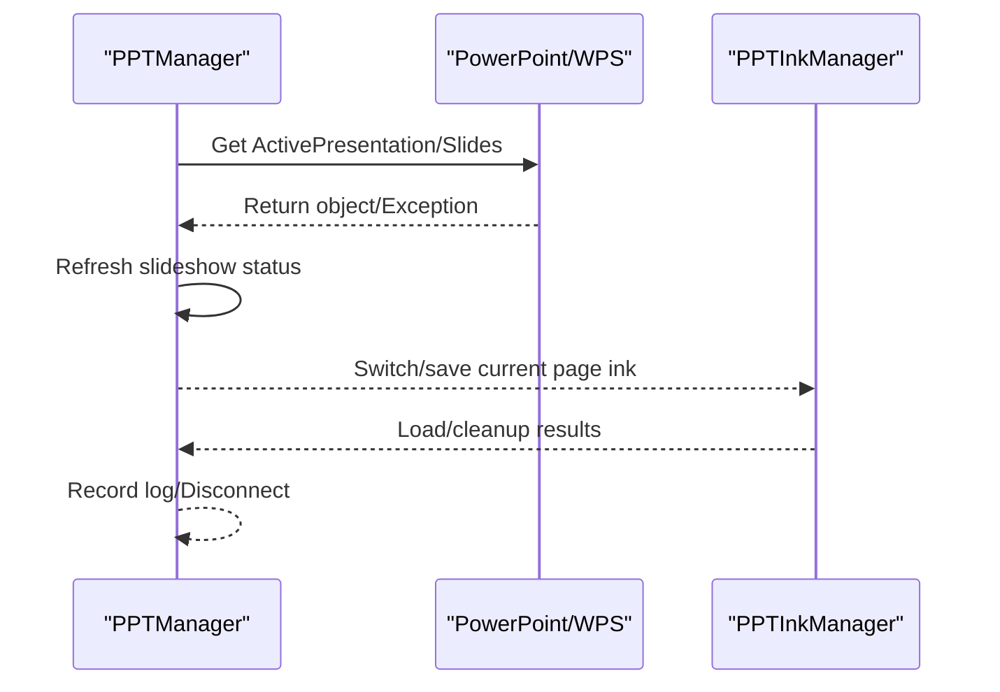
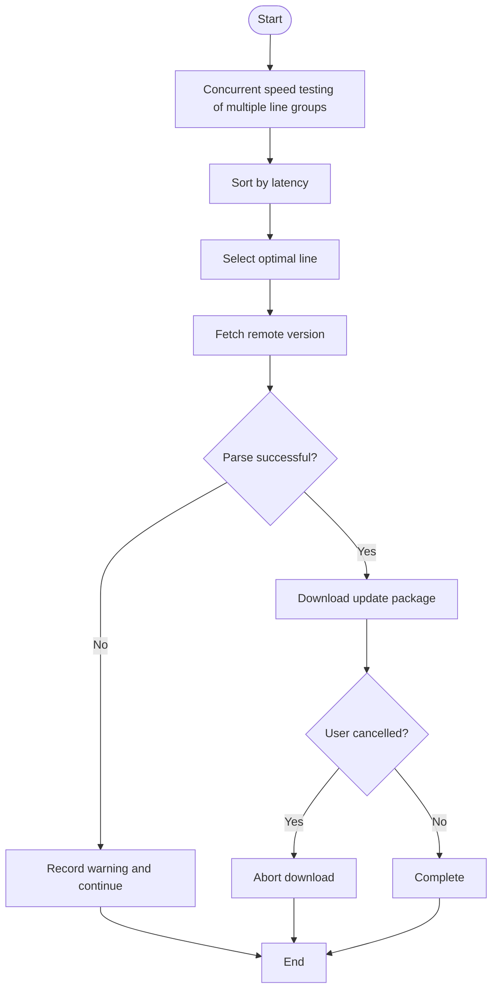
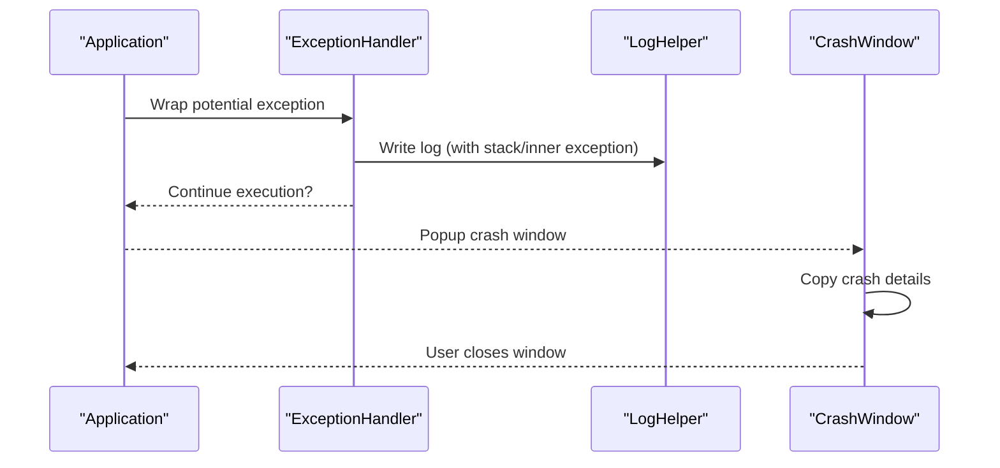
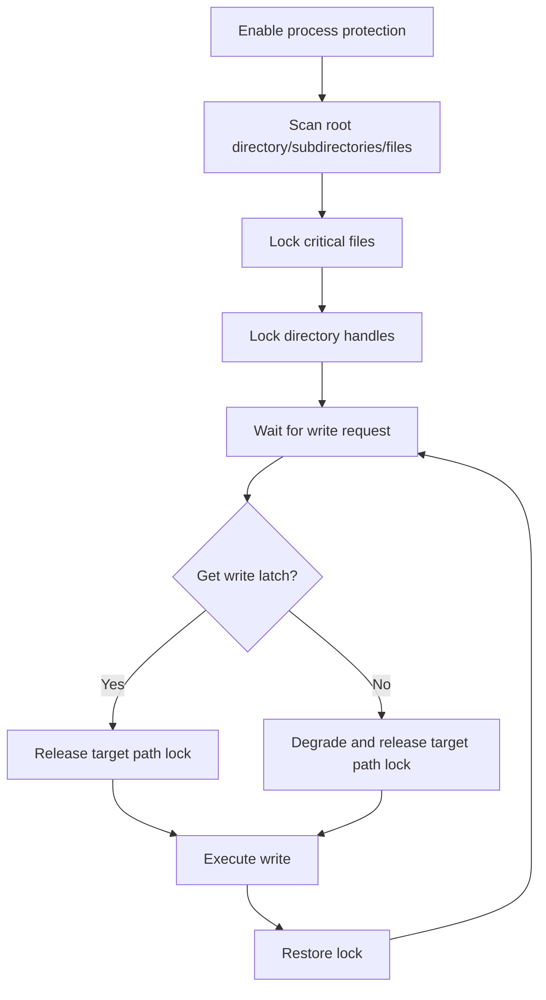
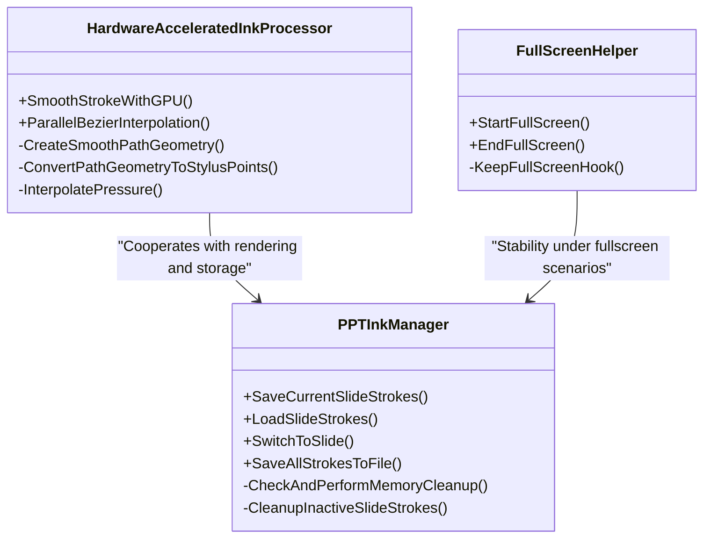
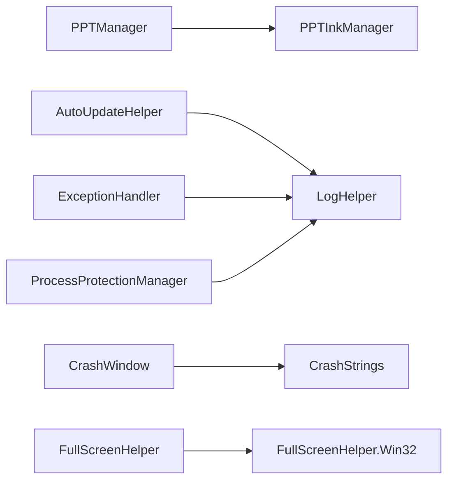

# Troubleshooting and FAQ

## Introduction
This document is intended for teachers and technical support personnel using InkCanvasForClass, systematically organizing common issues during installation, configuration, and usage phases, covering PowerPoint integration, Office compatibility, system permissions, crash handling, performance optimization, network updates & proxies, and system compatibility. The document provides actionable diagnosis workflows, log analysis methods, error code interpretations, and root cause analysis techniques, alongside a standardized user feedback and issue reporting flow.

## Project Structure
The code related to the "Troubleshooting" topic in InkCanvasForClass is mainly distributed across the following modules:
- Logging and Exception Handling: ExceptionHandler, LogHelper, CrashWindow, CrashStrings
- PowerPoint Integration: PPTManager, PPTInkManager
- Automatic Updates and Network: AutoUpdateHelper
- Security and Permissions: SecurityManager, ProcessProtectionManager
- Rendering and Performance: HardwareAcceleratedInkProcessor, FullScreenHelper, FullScreenHelper.Win32
- Debugging Tools: DebugConsoleManager

## Core Components
- Logging and Exception Handling: Unified exception capturing, log file writing, crash window display, and copying.
- PowerPoint Integration: Unified connection, event subscription, slideshow status detection, slide-by-slide ink persistence, and memory management.
- Automatic Updates: Multi-line speed testing, timeout control, download cancellation, version parsing, and caching.
- Security and Permissions: Password/TOTP verification, process protection (file/directory handle locking), write latch.
- Rendering and Performance: GPU-accelerated smoothing, fullscreen Hook, memory cleanup strategies.
- Debugging Tools: Console visibility and output.

## Architecture Overview
The diagram below shows the closed-loop flow of "diagnosis - logs - exceptions - updates - integration," helping locate crashes, network issues, and Office integration problems.

## Detailed Component Analysis

### PowerPoint Integration Issues (PPTManager and PPTInkManager)
- Connection and Events
  - Acquires PowerPoint/WPS application objects via COM, registering events for open, close, slide show start, and slide switch.
  - Slide show status is judged via SlideShowWindows/View; determines disconnection based on HResult during exceptions.
- Ink Management
  - Stores StrokeCollection in memory page-by-page, supporting forced save, load, and switch.
  - Memory thresholds and cleanup strategies to prevent memory bloat during prolonged slide shows.
- Common Issues
  - Protected mode read-only, corrupted COM components, permission inconsistency, page count of empty presentation is 0.
- Diagnosis Key Points
  - Check IsConnected and IsInSlideShow status change events.
  - Check records of "connection/disconnection/event registration/slide show status" in logs.
  - Focus on COM exception HResults to distinguish between business exceptions and environmental issues.

### Automatic Updates and Network Issues (AutoUpdateHelper)
- Multi-line Speed Testing and Caching: Concurrent HEAD speed testing, sorted by latency, cached for 15 minutes.
- Timeout and Exceptions: Unified 10-second timeout, distinguishing HTML responses from version extraction.
- Download Cancellation: Global cancellation token to avoid blocking the UI for a long time.
- Windows 7 Compatibility: Custom HttpClientHandler, bypassing certificate verification.
- Common Issues
  - Line unavailable, timeout, version parsing failure, download interrupted.
- Diagnosis Key Points
  - Check logs for "available line groups / latency / cache reuse / timeout / HTML extraction".
  - Trigger cancellation using RequestCancelDownload, and check the status file.

### Crash Handling and Log Analysis (ExceptionHandler, LogHelper, CrashWindow)
- Exception Handling
  - Operations wrapped with TryExecute/TryExecuteAsync, logging errors uniformly and deciding whether to continue.
  - Direct termination for fatal exceptions like OutOfMemoryException, AccessViolationException, etc.
- Log System
  - Supports log categorization by startup time, size limit cleanup, thread-safe writing, and caller information.
  - Configurable switches: whether to enable logging, whether to categorize by date.
- Crash Window
  - Displays crash details, copies to clipboard, and adapts to themes.
- Diagnosis Flow
  - Collect log files (including Log_{AppStartTime}.txt files categorized by startup time).
  - Copy crash details, specifying reproduction steps and environmental information (Office version, Windows version, permissions).
  - Include logs and crash details when submitting issues.

### Security and Permissions (SecurityManager, ProcessProtectionManager)
- Passwords and TOTP
  - PBKDF2 derivation, constant-time comparison, and 6-digit verification code tolerance window for TOTP.
  - Supports password setting/changing/verification, and TOTP-only mode.
- Process Protection
  - Once enabled, recursively locks .exe/.dll/.config/.manifest/.dat/.enc and Names.txt under the application root directory.
  - Temporarily releases target path locks during writing to avoid deadlocks; handles write latch timeouts with degradation.
- Common Issues
  - Write failed, lock conflict, timeout degradation, path exclusions.
- Diagnosis Key Points
  - Check logs for "write latch timeout / degradation release / locked directory / locked file".
  - Ensure excluded directories (Configs/Saves/Backups/Logs/AutoUpdate) are not accidentally locked or deleted.

### Rendering and Performance (HardwareAcceleratedInkProcessor, FullScreenHelper)
- GPU-Accelerated Smoothing: Uses PathGeometry and parallel Bezier interpolation, retaining pressure information.
- Fullscreen Stability: Forces the window to go fullscreen via Win32 Hook, disables DWM transition animations, and writes WPF sizes back upon restoration.
- Memory Cleanup: PPTInkManager stores ink per-page in memory, clearing inactive pages once they exceed thresholds, with periodic cleanups.
- Common Issues
  - Rendering lag, fullscreen flickering, high memory footprint.
- Diagnosis Key Points
  - Check logs for "GPU acceleration / parallel interpolation / memory cleanup".
  - Compare window sizes and Hook behaviors before and after going fullscreen.

## Dependency Analysis
- Component Coupling
  - Strong coupling between PPTManager and PPTInkManager: the former manages connections and events, while the latter manages ink lifecycles.
  - AutoUpdateHelper and LogHelper: the former writes logs heavily, while the latter handles writing to disk and cleanup.
  - ProcessProtectionManager and LogHelper: cooperates with log persistence via WithWriteAccess during writing.
- External Dependencies
  - Office COM components (PowerPoint/WPS), Windows APIs (User32/Dwmapi), .NET Runtime.
- Circular Dependencies
  - No direct circular dependencies detected; logging and exception handling form a one-way dependency chain.

## Performance Considerations
- Rendering Performance
  - Employs GPU-accelerated smoothing and parallel Bezier interpolation to maintain pressure consistency.
  - Disables DWM transition animations in fullscreen scenarios to reduce transition jitter.
- Memory Management
  - PPTInkManager sets a 100MB memory limit and cleans up inactive pages every 5 minutes.
  - Employs "fast switching protection" to avoid jitter caused by frequent writes.
- CPU Utilization
  - Timers check periodic states (connection/slideshow/processes) at low frequencies to save CPU cycles.
  - Speed testing is concurrent but cached, avoiding duplicate tests.
- Recommendations
  - Enabling hardware acceleration is recommended for high-resolution or high-framerate scenarios.
  - Enabling auto-save is recommended for prolonged slideshows to prevent continuous memory growth.

## Troubleshooting Guide

### 1. Installation and Runtime Environment
- .NET Runtime
  - Symptom: Fails to start / prompts that runtime is missing.
  - Action: Verify that .NET 6.0 or higher is installed.
- Office Compatibility
  - Symptom: Crashes immediately upon startup, does not switch to PPT mode after slideshow starts.
  - Action: Ensure Office is activated; exit Protected Mode; run with the same permissions as PowerPoint; avoid WPS COM component conflicts.

### 2. PowerPoint Integration Issues
- Symptoms
  - Unable to connect to PowerPoint/WPS, slideshow status is abnormal, crashes when switching pages.
- Diagnosis
  - Check logs in PPTManager for "connection / event registration / slideshow status / disconnection".
  - Focus on COM exception HResults to distinguish between business exceptions and environment issues.
  - Check memory cleanup logs in PPTInkManager to confirm if cleanup is triggered.
- Resolution
  - Run the application and PowerPoint with the same permissions.
  - Reinstall Office after uninstalling WPS, or repair COM components.
  - Avoid running slideshows in Protected Mode.

### 3. System Permissions and Process Protection
- Symptoms
  - Write failed, file in use, update failed.
- Diagnosis
  - Check logs in ProcessProtectionManager for "write latch timeout / degradation release / locked directory / locked file".
  - Verify that the target path is under excluded directories (Logs, AutoUpdate, etc.).
- Resolution
  - Run the application with administrator privileges.
  - Terminate other processes occupying the target files.
  - Check security software isolation policies.

### 4. Crashes and Log Analysis
- Symptoms
  - Application crashes, black screen, frozen.
- Diagnosis
  - Open the crash window and copy the crash details.
  - Collect log files (categorized by startup time), looking for exception stacks and inner exceptions.
  - Use DebugConsoleManager to show the console and monitor real-time outputs.
- Resolution
  - Troubleshoot in the order of "System Permissions — Office Permissions — PowerPoint Integration — Network Updates".
  - Include logs and crash details when submitting issues.

### 5. Network-Related Issues (Updates, Proxies, Cloud Storage)
- Symptoms
  - Update failed, version parsing failed, download interrupted.
- Diagnosis
  - Check logs in AutoUpdateHelper for "speed test / cache / timeout / HTML extraction / download cancellation".
  - Check certificate bypass logic under Windows 7.
- Resolution
  - Change line groups or use direct connection.
  - Configure system proxies or corporate proxy whitelists.
  - Use RequestCancelDownload to cancel long-running blocked tasks.

### 6. System Compatibility Issues
- Windows Version Differences
  - Windows 7: Uses a special HttpClientHandler; pay attention to certificate verification.
  - Other Versions: Standard HTTP client.
- Hardware Acceleration
  - Disables DWM transition animations in fullscreen scenarios; uses GPU acceleration in rendering scenarios.
- Recommendations
  - Prioritize using newer Windows versions and modern Office.
  - If running on older systems, ensure that fonts and runtimes are complete.

### 7. User Feedback and Issue Reporting Flow (Standardized)
- Steps
  1) Replicate issue: Record reproduction steps and environmental information (Office version, Windows version, permissions).
  2) Collect logs: Zip the Logs folder and log files categorized by startup time.
  3) Screenshot/Recording: Provide screenshots of the crash window or recording clips.
  4) Submit Issue: Include logs, crash details, environmental info, and reproduction steps.
- Template Suggestion
  - Title: Brief description of the issue (e.g., "Crash after slideshow starts")
  - Environment: Windows version, Office version, .NET version, admin privileges
  - Steps: Specific reproduction steps
  - Logs: Attach log files and crash details
  - Attachments: Screenshots/Recordings

## Conclusion
Through a unified logging system, robust exception handling, stable PowerPoint integration, and process protection mechanisms, InkCanvasForClass provides a reliable writing and presentation experience in complex teaching environments. Users are advised to prepare the runtime and Office beforehand. When issues arise, troubleshoot in the order of "logs — permissions — Office — network — integration," and submit feedback in a standardized manner for quick tracking and resolutions.

## Appendix
- Common Log Keywords
  - Connect/Disconnect/Event Registration/Slideshow Status/Ink Save/Memory Cleanup/Write Latch/Degradation Release/Speed Test/Cache/Timeout/HTML Extraction
- Common HResults
  - 0x80010001/0x8001010A: COM Busy
  - 0x80048240: No active presentation
  - 0x8001010E/0x80004005/0x800706B5: Invalid object / Access denied / System error
- Debugging Tools
  - DebugConsoleManager: Shows/hides the console, outputting UTF-8 log lines
