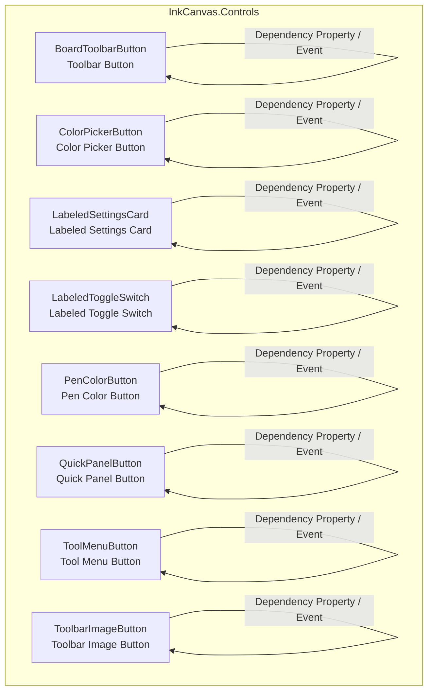
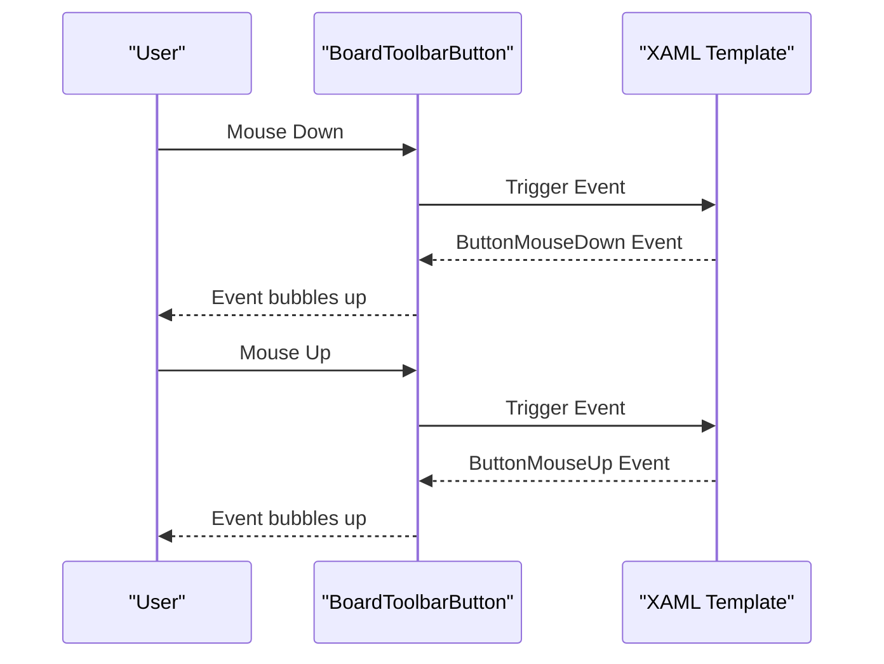
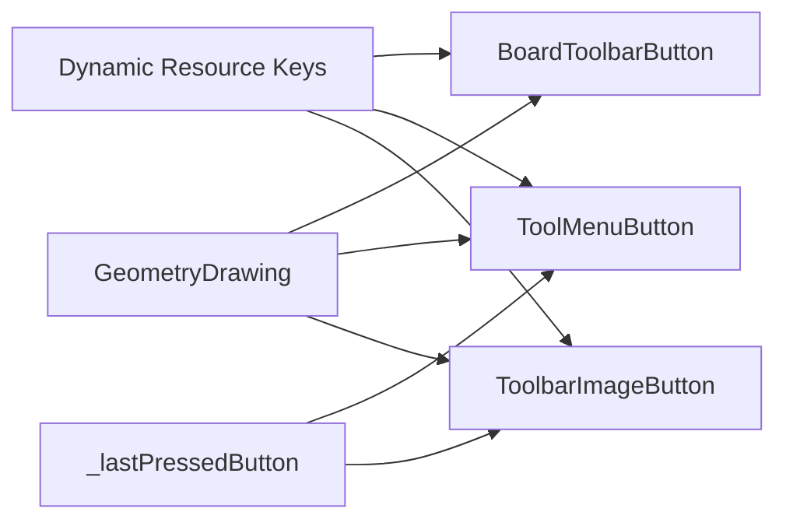

# Custom Controls Library

## Introduction
This document systematically organizes the controls related to the whiteboard toolbar in the InkCanvasForClass custom controls library: BoardToolbarButton, ColorPickerButton, LabeledSettingsCard, LabeledToggleSwitch, PenColorButton, QuickPanelButton, ToolMenuButton, and ToolbarImageButton. The contents cover design concepts, data bindings and dependency properties, event models, style and theme adaptations, inheritance and reuse mechanisms, templates and resource management, performance optimization, memory management recommendations, typical usage scenarios, and best practices.

## Project Structure
These controls are all located in the InkCanvas.Controls subproject, organized using the standard WPF pattern of "XAML view + code-behind". The controls derive from UserControl, interacting with the host page through dependency properties and events, and extensively utilize DynamicResources to support theme switching.

## Core Components
This section provides an overview of each control, with subsequent sections diving deeper into each.

- BoardToolbarButton: A button used for the whiteboard floating toolbar, supporting icon geometry paths, label text, border corner radius, and position states (first/middle/last/single), exposing appearance properties such as borders and foreground.
- ColorPickerButton: A monochrome button in the color picker, supporting checkmark icons in selected states, dimensions, and checkmark icon size controls.
- LabeledSettingsCard: A wrapper based on modern UI settings cards, containing a bidirectionally bindable switch, supporting headers, descriptions, icon sources, and display conditions.
- LabeledToggleSwitch: A switch control with labels and hint texts, supporting display conditions, switch texts, and hint texts.
- PenColorButton: A pen color selection button, supporting translucent grids for highlighter overlays, checkmark icons in selected states, border colors, and selection states.
- QuickPanelButton: A quick panel button, supporting icons and optional label text, with the label automatically showing/hiding based on text presence.
- ToolMenuButton: A tool menu button, supporting icon geometry paths and brushes, press state background highlighting, and global press state memory.
- ToolbarImageButton: A toolbar image button, supporting icon geometry drawing, labels and foreground colors, disabled semi-transparency effects, and press state background highlighting.

## Architecture Overview
These controls share a unified interaction pattern: driving UI updates through dependency properties; transmitting user actions to the host via events; achieving themed appearances via dynamic resources; and decoupling views and behaviors through XAML templates and code-behind logic.

```mermaid
classDiagram
class BoardToolbarButton {
+Dependency Properties : Label, IconGeometry, Position, IconBrush, IsEnabledBinding
+Events : ButtonMouseDown, ButtonMouseUp
+Appearance : Background, BorderBrush, Foreground
+Methods : UpdateCornerRadius(), UpdateIconOpacity()
}
class ColorPickerButton {
+Dependency Properties : Color, IsChecked, CheckIconFill, ButtonSize, CheckIconSize
+Events : ButtonMouseDown, ButtonMouseLeave, ButtonMouseUp
}
class LabeledSettingsCard {
+Dependency Properties : Header, Description, Icon, IconSource, HeaderIcon, IsOn, ShowWhen, SwitchName
+Events : Toggled
+Methods : ApplyIcon()
}
class LabeledToggleSwitch {
+Dependency Properties : Label, Hint, IsOn, OnContent, OffContent, ShowWhen
+Events : Toggled
}
class PenColorButton {
+Dependency Properties : Color, BorderBrushColor, IsHighlighter, IsChecked, CheckIconSource
+Events : ButtonMouseUp
}
class QuickPanelButton {
+Dependency Properties : Label, IconSource, LabelFontSize
+Events : ButtonMouseUp
}
class ToolMenuButton {
+Dependency Properties : Label, IconGeometry, IconBrush
+Static : _lastPressedButton
+Events : ButtonMouseDown, ButtonMouseLeave, ButtonMouseUp
}
class ToolbarImageButton {
+Dependency Properties : Label, IconGeometryDrawing, IconBrush, LabelBrush
+Static : _lastPressedButton
+Events : ButtonMouseDown, ButtonMouseLeave, ButtonMouseUp
}
```

## Detailed Component Analysis

### BoardToolbarButton Component
- Design Philosophy: Provides a unified button container for the whiteboard floating toolbar, supporting corner radius and border treatments for multiple position combinations (first/middle/last/single), allowing icon injection via geometry paths, and supporting opacity adjustments in disabled states.
- Key Dependency Properties
  - Label: Label text below the button
  - IconGeometry: SVG geometry string, parsed into Geometry at runtime
  - Position: The button's position in a group, affecting corner radius and borders
  - IconBrush: Icon brush
  - IsEnabledBinding: External disabled binding, linking to icon opacity
- Events
  - ButtonMouseDown/ButtonMouseUp: Mouse down/up event transparent forwarding
- Appearance Properties
  - Background/BorderBrush/Foreground: Directly proxied to internal borders and text blocks
- Usage Scenarios
  - Toolbar combination buttons, segmented button groups, contextual toolbars
- Best Practices
  - Set Position during loading to apply corner radius correctly
  - Use dynamic resources to bind IconBrush and foreground colors to adapt to themes

## Dependency Analysis
- There are no direct dependencies between controls; they all interact with the host via dependency properties and events.
- Shared Characteristics
  - Dynamic Resources: IconForeground, FloatBarForeground, BoardFloatBarBackground, BoardFloatBarBorderBrush, etc.
  - Press State Consistency: ToolMenuButton and ToolbarImageButton use static variables to maintain a unique press state.
  - Geometry Icons: BoardToolbarButton, ToolMenuButton, and ToolbarImageButton use DrawingImage + GeometryDrawing to inject icons.
- Resources and Themes
  - Theme switching realized through DynamicResource.
  - It is recommended to define the above dynamic resource keys centrally in App.xaml or theme resource dictionaries.

## Performance Considerations
- Rendering and Scaling
  - Icons uniformly use high-precision bitmap scaling modes to avoid blurriness.
  - Geometry icons use DrawingImage + GeometryDrawing, suitable for vector scaling.
- Events and States
  - ToolMenuButton and ToolbarImageButton use static variables to record press states, avoiding repeated calculations and layout jitters.
  - Disabled states uniformly lower opacity and disable interactions, reducing invalid event processing.
- Memory and Resources
  - Checkmark icon resources are recommended to use relative paths and cache-friendly naming to avoid duplicate loading.
  - Highlighter transparent grids are visible only when enabled, reducing unnecessary rendering overhead.
- Recommendations
  - For scenarios with frequent theme switching, try to use dynamic resource keys instead of hardcoding colors.
  - Parse and assign geometry icon strings and brushes in one go when the control is loaded.

[This section contains general performance recommendations and does not require specific file references]

## Troubleshooting Guide
- Icons Do Not Display or Display Abnormally
  - Check if the geometry string is valid and confirm it has been parsed during loading.
  - Confirm whether the dynamic resource key exists and its value is non-null.
- Press State Not Recovered
  - Confirm that mouse leave events are not intercepted.
  - Check if the control is in a disabled state.
- Checkmark Icon Does Not Display
  - Confirm that IsChecked is true and the checkmark icon resource path is valid.
- Label Text Does Not Display
  - Confirm that Label is non-null; QuickPanelButton automatically shows/hides based on text presence.
- Colors Do Not Take Effect After Theme Switch
  - Confirm that DynamicResource is used and the corresponding key is defined in the theme resource dictionary.

## Conclusion
Centralized on whiteboard toolbar scenarios, this control library provides a complete suite of UI components from basic buttons to settings cards. It achieves loosely coupled interactions via dependency properties and events, themed appearances via dynamic resources, and clean rendering via geometry icons and high-precision scaling. It is recommended to follow the usage patterns and best practices of this document in actual projects to achieve a stable, maintainable, and high-performance user experience.

[This section contains summary content and does not require specific file references]

## Appendix
- Style and Resource Management Recommendations
  - Define commonly used colors, sizes, fonts, etc. in resource dictionaries for centralized management.
  - Provide unified size and spacing specifications for icons and buttons.
- Theme Adaptation
  - Provide separate resource dictionaries for light/dark themes, switching on demand.
  - Use DynamicResource to bind colors and brushes, avoiding hardcoding.
- Usage Patterns
  - Toolbar Combination: BoardToolbarButton + ToolbarImageButton
  - Color Selection: ColorPickerButton + PenColorButton
  - Settings Items: LabeledSettingsCard + LabeledToggleSwitch
  - Quick Entry: QuickPanelButton
  - Tool Menu: ToolMenuButton

[This section contains conceptual content and does not require specific file references]
