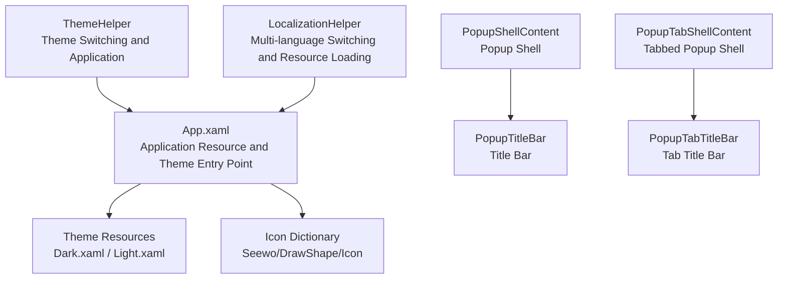
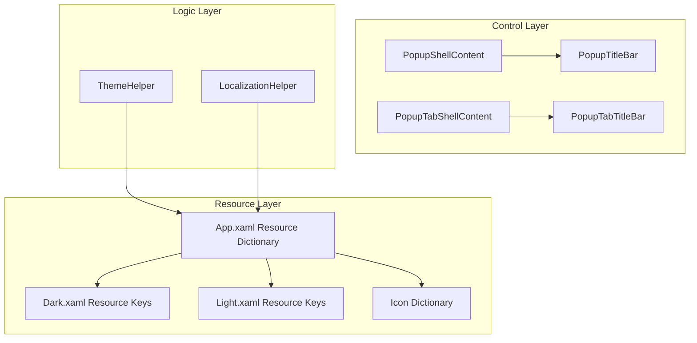
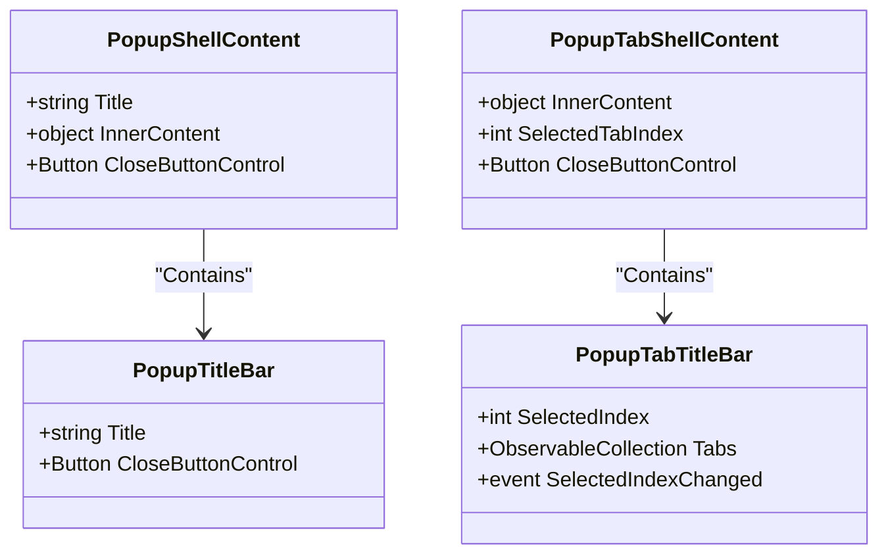
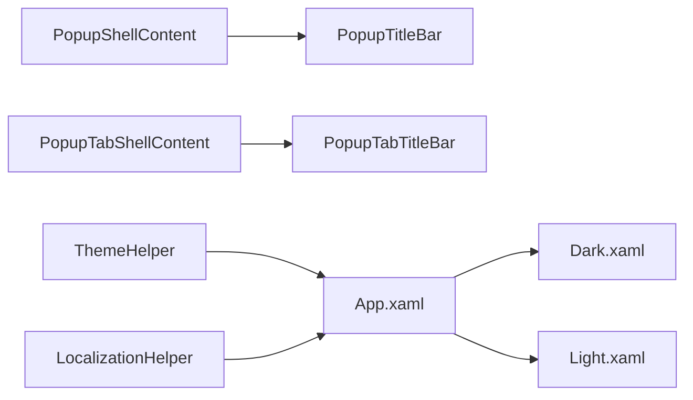

# User Interface System

## Introduction
This document addresses the user interface system of InkCanvasForClass, focusing on the design and implementation of the custom control library. It covers the control inheritance hierarchy, style system, and template mechanisms; the theme system (dark/light theme switching, dynamic style application, custom theme creation); multi-language support (resource file management, dynamic language switching, text localization mechanisms); the popup system (extension mechanisms for PopupShellContent, modal dialog management, and responsive layout adaptations); custom control development guides (template definitions, event handling, data binding best practices), UI performance optimization strategies, memory management, rendering optimization techniques, and provides concrete control usage examples and style customization methods.

## Project Structure
- The application resource and theme entry point is located in App.xaml, unifying the Modern theme and icon dictionaries.
- Custom popup controls are located in InkCanvas.Controls/Popups, containing the basic popup shell, tabbed shell, title bar, etc.
- Style resources are located in Ink Canvas/Resources/Styles, providing two sets of theme resources: dark and light.
- Theme and localization helpers are located in Ink Canvas/Helpers, responsible for theme application and multi-language switching, respectively.

## Core Components
- Popup Shell and Title Bar
  - PopupShellContent: Provides a content-bearing popup shell, supporting dynamic titles and inner content binding.
  - PopupTitleBar: Built-in title and close button, using dynamic resources to realize theme colors.
  - PopupTabShellContent: Tabbed popup shell, supporting multi-tab switching.
  - PopupTabTitleBar: Dynamically generates tab items, supporting icons, selection indicators, and interactions.
- Theme System
  - Dark.xaml / Light.xaml: Defines a large number of dynamic resource keys, covering backgrounds, borders, foregrounds, icons, etc.
  - ThemeHelper: Selects and applies the active theme to elements based on settings and the system theme.
- Multi-language System
  - LocalizationHelper: Dynamically switches the current culture, supporting embedded resource and fallback resource management.
- Application Resource Entry
  - App.xaml: Merges the Modern theme, XAML control resources, and icon dictionaries, serving as the global resource entry point.

## Architecture Overview
The UI architecture revolves around the design of "resource-driven + control templates + dynamic themes + multi-language":
- Resource-driven: Merges theme and icon resources via Application.Resources. Controls bind to resource keys via DynamicResource, achieving automatic updates upon theme switching.
- Control Templates: PopupShellContent/PopupTabShellContent use ContentPresenter to carry inner content, supporting the reuse of shell styles in template form.
- Theme System: ThemeHelper selects ElementTheme based on settings and system themes, calling ThemeManager to apply it. Dark/Light resource dictionaries provide complete visual variables.
- Multi-language System: LocalizationHelper switches CurrentUICulture, dynamically replacing the resource managers of each Strings class, supporting embedded and external resx fallbacks.

## Detailed Component Analysis

### Popup Shell and Title Bar Components
- PopupShellContent
  - Dependency Properties: Title, InnerContent; internally carries content via ContentPresenter.
  - Template Structure: Outer rounded border + inner border and background + title bar + content area.
  - Usage Scenarios: Tool popups, settings panels, and other scenarios requiring a unified shell style.
- PopupTitleBar
  - Dependency Properties: Title; built-in close button, using dynamic resources to control foreground colors and hover styles.
  - Usage Scenarios: Titles and close operations for all popups.
- PopupTabShellContent and PopupTabTitleBar
  - Supports tab page collections, dynamically building tab items, with selected state visual feedback (background and underline indicators).
  - Usage Scenarios: Popups for multi-module settings or functional groupings.

## Dependency Analysis
- Resource Dependencies
  - Control templates reference resource keys via DynamicResource. These resource keys are provided by Dark.xaml / Light.xaml, and App.xaml merges the resource dictionaries.
- Code Dependencies
  - ThemeHelper depends on ThemeManager of iNKORE.UI.WPF.Modern and registry queries.
  - LocalizationHelper depends on reflection and resource manager substitution, ensuring multicultural strings take effect immediately.
- Control Dependencies
  - PopupShellContent/PopupTabShellContent depend on PopupTitleBar/PopupTabTitleBar common controls.

## Performance Considerations
- Resource Access
  - Using DynamicResource allows theme switching without rebuilding the control tree, but frequent switching may still trigger layout recalculations; it is recommended to refresh the UI after batch theme transitions.
- Icons and Bitmaps
  - Icon resources are provided as BitmapImages; care should be taken to avoid repeatedly loading the same URI. The WPF caching mechanism can be leveraged to reduce memory usage.
- Collections and Events
  - PopupTabTitleBar uses ObservableCollection to manage tabs; it is recommended to perform collection operations on the UI thread to avoid cross-thread exceptions and flickering.
- String Resources
  - LocalizationHelper caches embedded resources to reduce duplicate parsing overhead; frequent switching should be avoided after toggling cultures to reduce I/O and reflection costs.

[This section is general guidance and does not require specific file sources]

## Troubleshooting Guide
- Themes Not Taking Effect
  - Check if ThemeHelper.ApplyTheme is passed a non-null element and settings; confirm that the valid theme return value and ThemeManager call did not throw exceptions.
  - Confirm that App.xaml has merged Modern theme resources.
- Text Not Localized
  - Check if CurrentCulture has been successfully set; confirm that the target Strings class has installed EmbeddedResourceManager or restored the original resource manager.
  - Confirm that the embedded resource key exists and its case matches.
- Popup Shell Content Not Displaying
  - Confirm that InnerContent has been assigned and ContentPresenter is bound normally; check the naming and visibility of ContentArea in the shell template.

## Conclusion
This UI system achieves a highly cohesive, loosely coupled extensible interface framework through the combination of "resource-driven + control templates + dynamic themes + multi-language". Popup shell and title bar components provide unified appearances and interactive experiences; the theme system and resource dictionaries guarantee the consistency of dark/light modes; the multi-language system supports embedded and external resource fallbacks, meeting internationalization needs. In conjunction with the development guide and performance recommendations provided in this document, development efficiency and runtime performance can be improved while ensuring user experience.

[This section contains summary content and does not require specific file references]

## Appendix

### Custom Control Development Guide (Best Practices)
- Control Template Definition
  - Use ContentProperty to annotate inner content properties, combining with ContentPresenter to carry child content, facilitating the reuse of shell styles.
  - Reference resource keys via DynamicResource, avoiding hardcoded colors and sizes.
- Event Handling
  - Use dependency properties and callbacks (such as SelectedIndexChanged) to realize synchronization of interaction states.
  - The close button provides a unified close entry point by exposing CloseButtonControl, facilitating command bindings at the business layer.
- Data Binding
  - Expose properties like title, icon, and selection state as dependency properties, supporting two-way and template bindings.
  - Use ObservableCollection in collection-type controls to ensure automatic UI refreshing.
