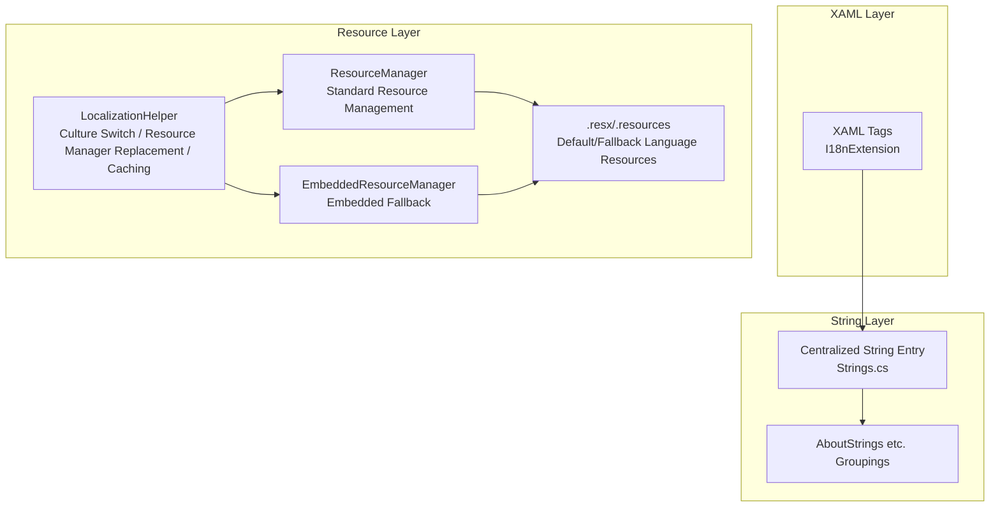
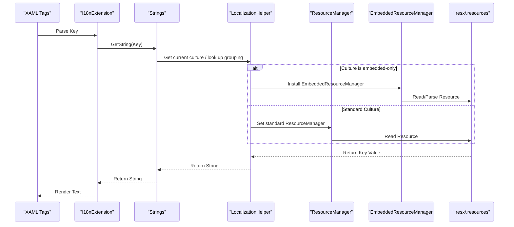
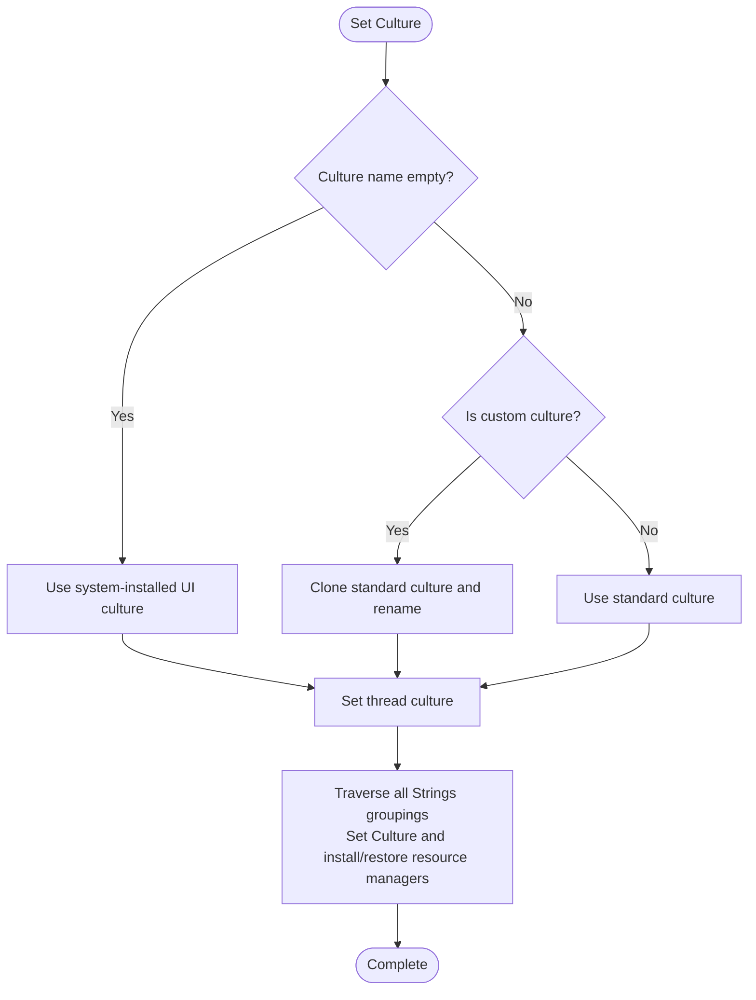
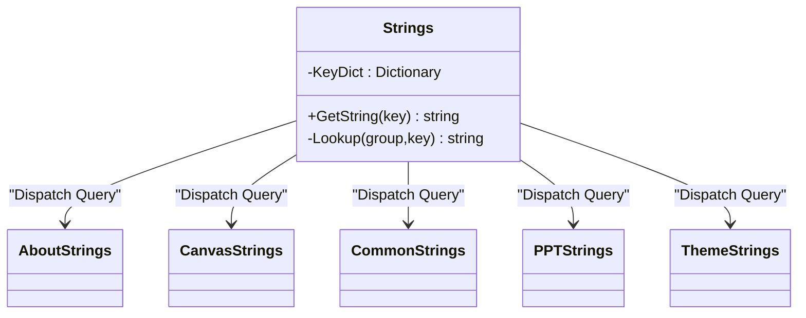
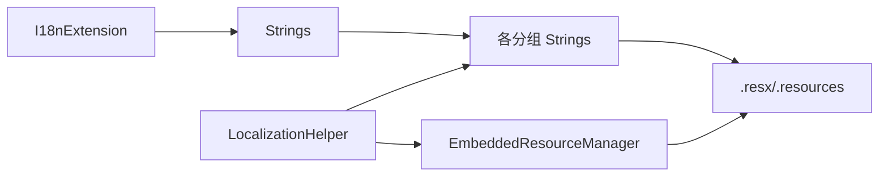
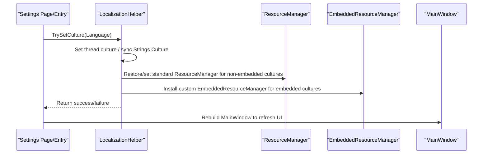

# Multi-language Support

## Introduction
This document systematically organizes the multi-language support system of InkCanvasForClass, revolving around internationalization architecture design, resource file organization, dynamic language switching, and text localization mechanisms. It highlights the following areas:
- Centralized management of strings and resource key naming conventions
- Language detection, resource loading, and caching mechanisms of LocalizationHelper
- Structure, default language, and fallback language handling of .resx resource files
- Creation and maintenance workflows, and quality assurance of multi-language resource files
- Implementation considerations and localization testing strategies for RTL (Right-to-Left) language support
- Integration processes for new languages and encoding precautions for special character sets

## Project Structure
The multi-language capability of InkCanvasForClass consists of three layers: "centralized string entry + runtime resource management + XAML markup extensions":
- String Entry and Grouping: Uniformly queried via a centralized class, split into multiple Strings groupings (such as AboutStrings, CanvasStrings, etc.) based on functional modules.
- Runtime Resource Management: LocalizationHelper is responsible for thread culture switching, resource manager replacement, and embedded resource caching.
- XAML Markup Extension: I18nExtension provides markup syntax to simplify localization bindings in XAML.

## Core Components
- Centralized String Entry: The centralized class is responsible for mapping logical keys to concrete grouping key-values, uniformly providing the GetString query interface externally.
- Runtime Resource Management: LocalizationHelper is responsible for thread culture switching, resource manager replacement, and embedded resource caching and fallbacks.
- XAML Markup Extension: I18nExtension maps Keys to localized texts, supporting empty key fallbacks and placeholder hints.

## Architecture Overview
The following diagram shows the complete call chain from XAML to resource files, as well as the resource manager replacement and embedded fallback strategies during culture switching.

## Detailed Component Analysis

### Component 1: LocalizationHelper (Language Detection, Resource Loading, and Caching)
- Language Detection and Switching
  - Supports setting the current culture through three paths: system-installed UI culture, custom culture names, and standard culture names.
  - Custom cultures are realized by cloning standard cultures and modifying internal name fields, compatible with non-standard locales.
- Resource Manager Replacement
  - For embedded-only cultures (e.g., en-US, zh-ME), a custom EmbeddedResourceManager is installed, prioritizing returns from the embedded dictionary and falling back to the original ResourceManager.
  - Non-embedded cultures restore the original ResourceManager or remove custom wrappers.
- Resource Loading and Caching
  - Prioritizes loading from the assembly's built-in .resources; on failure, attempts to parse .resx and cache it; finally falls back to the .resx files on disk.
  - Uses a dictionary to cache parsed key-value pairs, avoiding duplicate I/O and parsing.

### Component 2: Strings (String Management and Key Mapping)
- Key Mapping Table
  - Internally maintains a mapping dictionary from keys to "grouping name + key name", queried uniformly by the centralized class.
  - Returns placeholder hints when queries fail, facilitating the location of missing keys.
- Grouping Access
  - Dispatched via a switch to individual Strings groupings (such as AboutStrings, CanvasStrings, etc.), with actual values provided by the ResourceManager of each grouping.
- Culture Propagation
  - During culture transitions, the centralized class synchronizes the Culture settings across all groupings, ensuring cross-grouping consistency.

### Component 3: I18nExtension (XAML Markup Extension)
- Purpose
  - Binds localized texts in XAML with clean syntax, returning placeholder hints when Keys are missing.
- Use Scenarios
  - Localization of settings pages, menu items, button texts, and other static copy.

### Component 4: .resx Resource Files and Embedded Loading
- Structure and Content
  - .resx adopts standard ResXSchema, containing metadata, assembly, data, and other nodes.
  - Default and fallback languages provide data entries in different languages respectively.
- Loading Strategy
  - Prioritizes loading from the assembly's built-in .resources; if not present, parses .resx and caches it; finally attempts the .resx on disk.
- Example Files
  - Default Language: AboutStrings.resx
  - English Language: AboutStrings.en-US.resx
  - Embedded-only Language: AboutStrings.zh-ME.resx

### Component 5: Dynamic Language Switching and Application Entries
- Application Startup
  - Reads the preferred language from configurations and calls LocalizationHelper to set the culture.
- Settings Page Switching
  - AppearancePage saves the language settings and calls LocalizationHelper, subsequently rebuilding the MainWindow to apply the new language.
- Main Window Events
  - Language switching trigger points also exist in MainWindow and settings loading flows.

## Dependency Analysis
- Component Coupling
  - I18nExtension only depends on Strings, with low coupling, making it easy to use widely in XAML.
  - Strings depends on individual grouping Strings classes and their ResourceManagers, forming clear stratification.
  - LocalizationHelper is strongly coupled with ResourceManager/EmbeddedResourceManager, assuming resource loading and caching responsibilities.
- External Dependencies
  - .resx/.resources files serve as resource storage media, with LocalizationHelper providing parsing and caching.
  - Assembly元数据与反射用于动态发现与替换资源管理器

## Performance Considerations
- Caching Strategy
  - Embedded resource parsing results are cached by "(grouping name, culture)" keys, avoiding duplicate I/O and XML parsing.
- Resource Manager Replacement
  - Replacement is performed only when culture changes, reducing frequent reflection and instantiation.
- String Query
  - The mapping from keys to groupings is a constant dictionary; queries are O(1), and cross-grouping consistency is guaranteed through syncs of centralized class Culture.

## Troubleshooting Guide
- Text Not Localized or Displaying Placeholders
  - Check if the key exists and is spelled correctly; missing keys will return placeholder hints containing the key name.
- Language Switching Ineffective
  - Confirm that LocalizationHelper.TrySetCulture has been called and thread culture is set correctly.
  - For embedded-only cultures, confirm that resource files exist and can be parsed.
- XAML Texts Not Updated
  - Ensure I18nExtension is used, and rebuild the main window after language switching to refresh the UI.
- Resource File Loading Failed
  - Check if .resx/.resources exist in the assembly or on disk; confirm that the naming aligns with the culture.

## Conclusion
The multi-language system of InkCanvasForClass takes the centralized string entry as its core, combining runtime resource manager replacement and embedded caching to realize flexible and extensible language switching and resource loading. Through standardized .resx management and key mapping mechanisms, it not only guarantees development efficiency but also reserves space for subsequent integrations of new languages and RTL support.

## Appendix

### String Management and Key Naming Conventions
- Naming Recommendations
  - Use the style of "moduleName_functionalDescription_state/property", maintaining clear hierarchies.
  - Semanticize key names, avoiding the use of numbers or abbreviations only.
- Placeholders and Plurals
  - Placeholders are recommended to use positional placeholders (e.g., {0}, {1}) instead of named placeholders, making it easy for different languages to adjust the order.
  - Plural forms are recommended to be distinguished via resource keys (e.g., Item_One, Item_Few, Item_Many), or selected on the caller side according to numerical values.
- Key Mapping and Migration
  - Use key_mapping.json to uniformly record key changes and belonging groupings, facilitating migration and auditing.

### .resx File Structure and Management
- Structural Key Points
  - The data node contains name and value, supporting comments.
  - The resheader contains metadata such as version, reader/writer, etc.
- Default Language and Fallback Language
  - The default language file provides basic key-values; fallback language files provide corresponding translations.
  - Embedded-only cultures (e.g., zh-ME) can be maintained independently, avoiding conflicts with standard cultures.

### Dynamic Language Switching Flow

### RTL (Right-to-Left) Language Support Implementation Considerations
- Text Direction
  - Controlled via the WPF FlowDirection property (e.g., RightToLeft), synchronized during language switching.
- Layout Adaptation
  - Menu and button arrangements and icon directions need mirroring; spacing and alignments should adapt to RTL reading habits.
- Fonts and Character Sets
  - Ensure fonts support target language character sets; attention should be paid to ligatures and character shapes in Arabic, Hebrew, etc.
- Testing Strategies
  - Use mock RTL texts and real RTL languages to validate UI layouts.
  - Focus on scrollbars, input methods, and text selection behaviors.

[This section is conceptual guidance, does not directly analyze specific files, hence no chapter source]

### Multi-language Resource File Creation and Maintenance Guide
- Creation Steps
  - Create a new .resx file with the same name as the existing .resx (without culture suffix) under Properties.
  - Create a .resx file with the same name for the new language (e.g., AboutStrings.fr-FR.resx).
  - Use ResXResourceWriter to write key-values, or edit in IDE.
- Translation Workflow
  - Use key_mapping.json to uniformly track key ownership and changes.
  - Adopt two-person proofreading and automated checks (e.g., key missing, placeholder count match).
- Quality Assurance
  - Maintain consistency of placeholders and comments.
  - Compare default and target language key sets, ensuring no omissions.
  - Provide language switching preview and rapid fallback in the settings page.

### New Language Integration Process
- Prepare Resources
  - Copy default language .resx to the new culture .resx.
  - Fill translations, ensuring placeholders and comments are complete.
- Register Culture
  - If standard culture, use standard culture name directly; if embedded-only culture, include in the EmbeddedOnlyCultures list.
- Verification and Regression
  - Switch language in the settings page to verify UI texts and layouts.
  - Regression test critical paths (menus, dialogs, notifications).

### Special Character Sets and Encoding Issues
- Encoding
  - .resx defaults to UTF-8, ensuring it contains non-ASCII characters (e.g., Chinese, Japanese, emojis).
- Fonts and Rendering
  - Prepare appropriate fonts for special character sets; avoid using fonts supporting Latin characters only.
- Input Methods and IME
  - Verify candidates and composition behaviors of input methods under different languages.
- Cross-platform Consistency
  - Compare rendering effects across different operating systems, providing font fallback strategies if necessary.

[This section contains general practical recommendations, does not directly analyze specific files, hence no chapter source]
