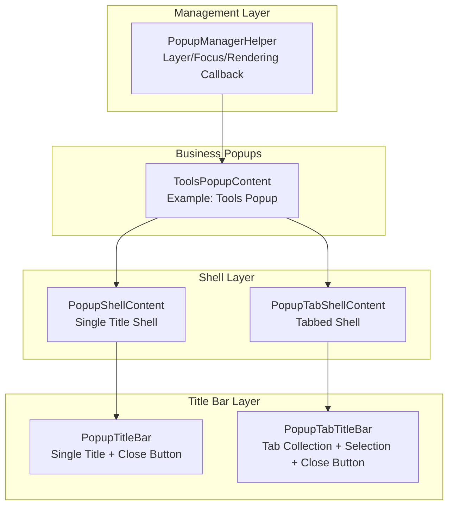
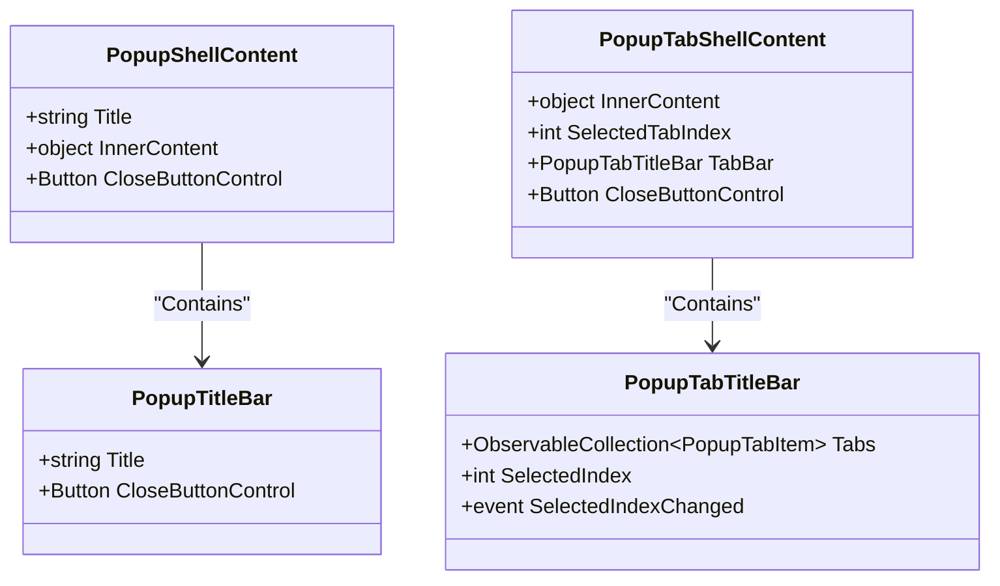
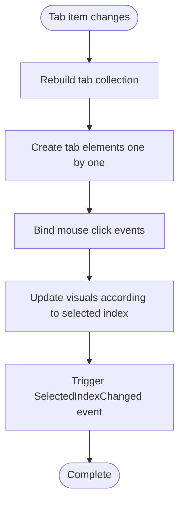
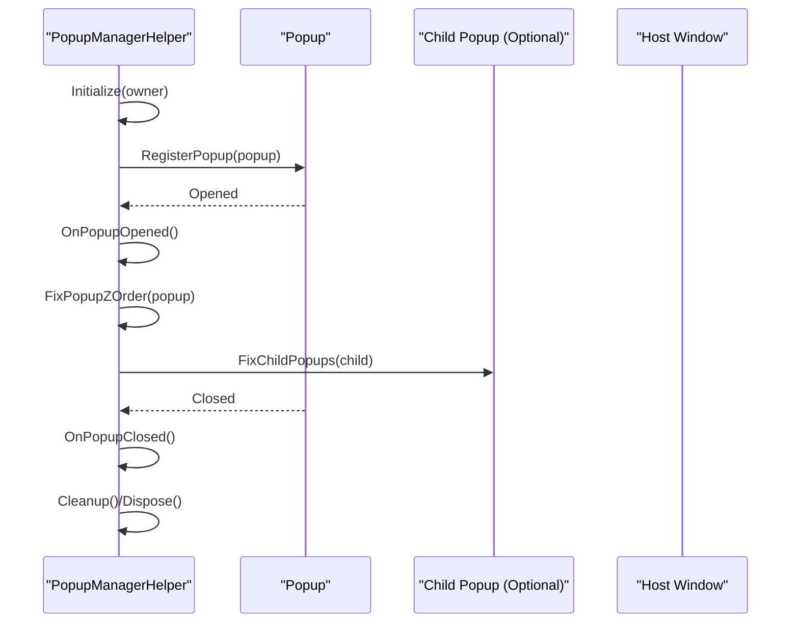
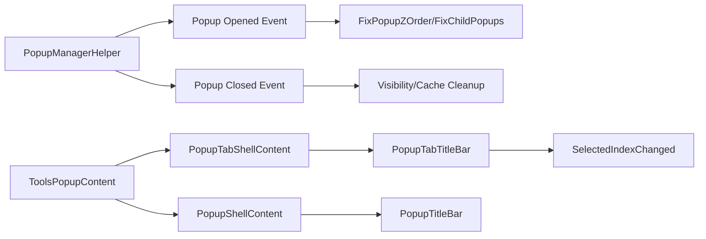

# Popup System

## Introduction
This document is for the popup system of InkCanvasForClass, explaining in depth the architectural design, popup container management, layer control, and focus handling mechanisms of PopupShellContent and PopupTabShellContent; it also elaborates on the functional differences and applicable scenarios of PopupTitleBar and PopupTabTitleBar; and summarizes the responsibilities of PopupManagerHelper in popup lifecycle management, event propagation, and memory cleanup. Finally, it provides extension guidelines (custom popup types, modal dialog implementations, responsive layout adaptations), performance optimization strategies (lazy loading, virtualization, memory pools), and compatibility handling recommendations under different window states (minimized, maximized, fullscreen).

## Project Structure
The popup system mainly consists of three layers:
- Shell Layer: PopupShellContent and PopupTabShellContent, responsible for unifying the appearance, borders, paddings, and content carriage.
- Title Bar Layer: PopupTitleBar and PopupTabTitleBar, providing the title area and close button for single titles and multi-tabs, respectively.
- Management Layer: PopupManagerHelper, responsible for maintaining stability within popup layers, focus, and rendering cycles.



## Core Components
- PopupShellContent: Single title popup shell, supporting Title binding and InnerContent dependency properties, carrying content internally via ContentPresenter.
- PopupTabShellContent: Tabbed popup shell, managing multiple tab pages internally via PopupTabTitleBar, supporting SelectedTabIndex and InnerContent.
- PopupTitleBar: Single title bar, containing title text and a close button, exposing CloseButtonControl for external event bindings.
- PopupTabTitleBar: Tabbed title bar, supporting dynamic addition of tab items, selected item change events, and visual highlight indications.
- PopupManagerHelper: Popup lifecycle and layer management, responsible for popup open/close event handling, Z-order topmost placement, rendering callbacks, and memory cleanup.

## Architecture Overview
The popup system adopts a layered design of "shell + title bar + content". Business popups combine with shells via InnerContentHost, achieving design-time preview and runtime replaceable content. The management layer ensures correct layers and focus under different window states and interactions through rendering callbacks and Win32 layer APIs.

```mermaid
sequenceDiagram
participant Host as "Business Popup (Example)"
participant Shell as "Shell (PopupShell/TabShell)"
participant Title as "Title Bar (PopupTitleBar/TabTitleBar)"
participant Manager as "PopupManagerHelper"
Host->>Shell : Set InnerContent
Shell->>Title : Bind Title/Close Button
Host->>Manager : Register Popup / Initialize
Manager->>Manager : Subscribe to popup Opened/Closed events
Manager->>Manager : Maintain Z-order in rendering callback
Manager-->>Host : Bring to top / Restore layer
```

## Component Details

### PopupShellContent and PopupTabShellContent
- Design Points
  - Appearance: Unified rounded corners, strokes, and background colors, wrapped internally with another border and background, forming nested visual hierarchies.
  - Content carriage: Content injection realized via InnerContent dependency properties and ContentPresenter, supporting runtime replacement.
  - Close button: Shell exposes CloseButtonControl, facilitating the business side to bind close logic directly.
- PopupTabShellContent Features
  - Manages tab collections and selected items via PopupTabTitleBar, supporting reads and writes of SelectedTabIndex.
  - Content area is consistent with single shell, still carried by InnerContent.



### PopupTitleBar and PopupTabTitleBar
- PopupTitleBar
  - Single title + close button, title displayed via bindings, close button exposed via CloseButtonControl.
- PopupTabTitleBar
  - Supports dynamically building tab item collections, each tab item containing an icon and text; triggers SelectedIndexChanged event when selected items change, and updates tab visual states (background color, bold, bottom indicator line).



### PopupManagerHelper: Popup Lifecycle and Layer Control
- Lifecycle Management
  - Register/Unregister Popup: RegisterPopup/UnregisterPopup, subscribing to Opened/Closed events.
  - Open/Close Callbacks: OnPopupOpened/OnPopupClosed, responsible for visibility and cache maintenance.
- Layer Control and Focus Handling
  - FixPopupZOrder: Brings popup to topmost or cancels topmost based on Win32 SetWindowPos, putting host windows under popups if necessary.
  - FixChildPopups: Recursively finds child popups and brings them to top, ensuring consistency of nested popups.
  - ShouldBeTopmost: Evaluates whether topmost placement is required via a delegate, supporting dynamic toggles.
- Rendering Cycle and Position Updates
  - OnRendering: Periodically checks and repairs layers; when marked for update, executes tiny offset adjustments on open popups to refresh layouts.
  - UpdatePosition: Performs tiny offsets on open popups with PlacementTargets to force redraws.
- Memory Cleanup
  - Cleanup/Dispose: Unbinds rendering events, unregisters popup events, clears caches and collections, avoiding memory leaks.



### Business Popup Example: ToolsPopupContent
- Structural Pattern
  - Uses Grid layout, outer Shell as the shell, and InnerContentHost as the content container previewable at design-time.
  - Assigns the content of InnerContentHost to Shell.InnerContent in the constructor, achieving the "shell + content" combination.
- Interaction and Extension
  - Exposes accessors for controls like buttons, facilitating MainWindow or other components to bind events.
  - Toggles content visibility as needed (e.g., hiding certain buttons in specific modes).

## Dependency Analysis
- Component Coupling
  - Composition relationships exist between PopupShellContent/PopupTabShellContent and PopupTitleBar/PopupTabTitleBar, where shells hold title bar instances.
  - Business popups (such as ToolsPopupContent) depend on shells and title bars, combining with shells via InnerContentHost.
- External Dependencies
  - PopupManagerHelper depends on the WPF rendering pipeline (CompositionTarget.Rendering) and Win32 APIs (SetWindowPos, GetWindowLong, SetWindowLong).
- Event Propagation
  - Popup open/close events are uniformly subscribed to and handled by PopupManagerHelper, then propagating topmost logic to child popups.
  - SelectedIndexChanged events of PopupTabTitleBar are subscribed to by shell holders, used to switch contents or execute business logic.



## Performance Considerations
- Lazy Loading
  - Leverages deferred settings of InnerContent to construct complex contents only when popups open, reducing startup overheads.
- Virtualization
  - For long list contents, virtualizing containers (such as VirtualizingStackPanel) can be adopted in InnerContent, lowering visual tree node counts.
- Memory Pools and Object Reuse
  - For popup contents frequently created/destroyed, object pool caching can be considered to avoid GC jitters.
- Rendering Optimization
  - Rendering callbacks of PopupManagerHelper check layers at a fixed frequency to avoid high-frequency per-frame operations; uses tiny offsets to trigger redraws instead of forced refreshes if necessary.
- Resources and Styles
  - Uniformly uses dynamic resources and style keys, reducing duplicate definitions and theme switching costs.

## Troubleshooting Guide
- Popup Layer Anomalies
  - Symptoms: Popups are obscured or fail to stay topmost.
  - Troubleshooting: Confirm ShouldBeTopmost return values; check host window handle validity; verify if FixPopupZOrder was successfully called.
- Remnants After Popup Close
  - Symptoms: Occupies memory or continues rendering after close.
  - Troubleshooting: Confirm whether UnregisterPopup/Dispose/Cleanup was executed; check if events were correctly unbound.
- Child Popups Not Topmost
  - Symptoms: Nested popup layers are incorrect.
  - Troubleshooting: Confirm if FixChildPopups traverses child popups; check if child popups are open and possess valid Hwnds.
- Rendering Jitters or Flickering
  - Symptoms: Popups frequently change positions or layers, causing flickering.
  - Troubleshooting: Check if the tiny adjustments of UpdatePosition are excessive; verify rendering callback frequencies and trigger conditions.

## Conclusion
This popup system realizes stable, extensible, and easily maintainable popup schemes through clear stratification of shells and title bars, loose coupling combinations of business popups and shells, and the lifecycle and layer management of PopupManagerHelper. Cooperating with strategies such as lazy loading, virtualization, and resource reuse, it maintains good performance and user experiences under complex scenarios.

## Appendix

### Extension Guide
- Custom Popup Types
  - Use PopupShellContent or PopupTabShellContent as the shell and InnerContentHost to carry content, assigning the content of InnerContentHost to the shell in the constructor.
  - If tab pages are needed, use PopupTabShellContent and control tab switches via the Tabs collection and SelectedIndex of PopupTabTitleBar.
- Modal Dialog Implementation
  - Set the disabled state of host windows before popups open, restoring them after popups close; combined with the layer control of PopupManagerHelper, ensure popups always stay topmost during modal periods.
- Responsive Layout Adaptation
  - Use adaptive layouts (e.g., AutoFontSizeHelper, grid column adaptive widths) in InnerContent, triggering UpdatePosition to refresh layouts when window sizes change.
- Internationalization and Themes
  - Use i18n resources and dynamic resource keys, ensuring visual consistency under multi-languages and dark/light themes.

### Window State Compatibility
- Minimization/Restoration
  - Avoid frequent layer repairs during minimization; trigger a centralized repair via OnOwnerActivated/NotifyTopmostMaintained after restoration.
- Maximization/Fullscreen
  - Topmost strategies link with host window states, ensuring popups stay in correct layers under maximization/fullscreen; recursively bring child popups topmost if necessary.
- Multi-monitor/Scaling
  - Trigger redraws via tiny offsets, avoiding position drifts caused by DPI or multi-screens; call UpdatePosition when layouts change.
