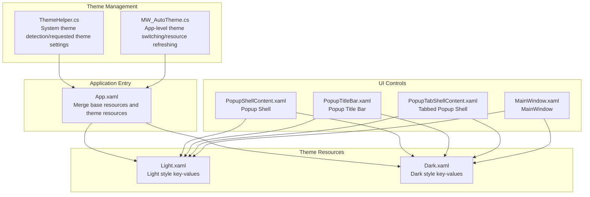
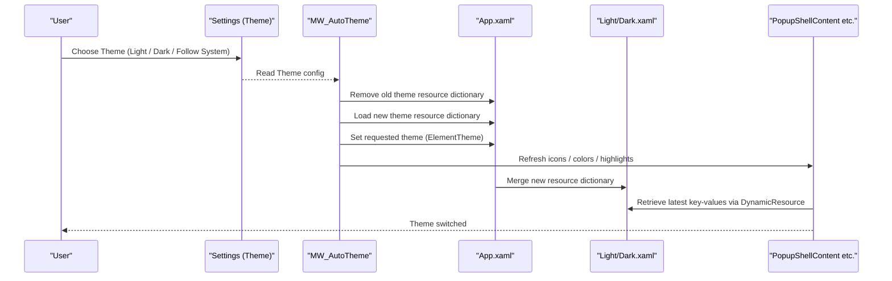
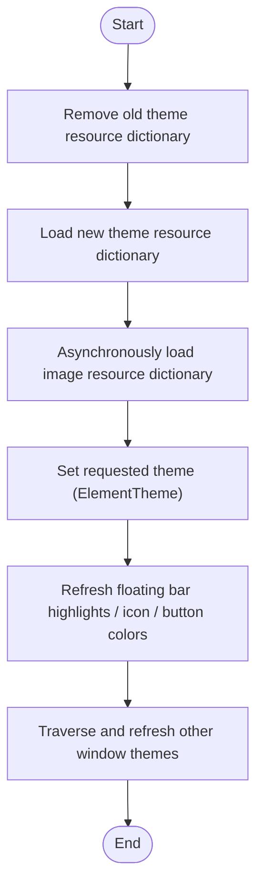
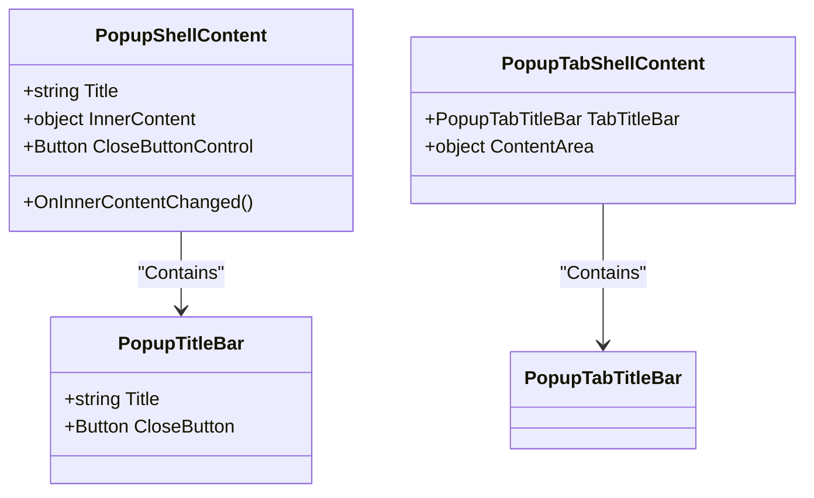
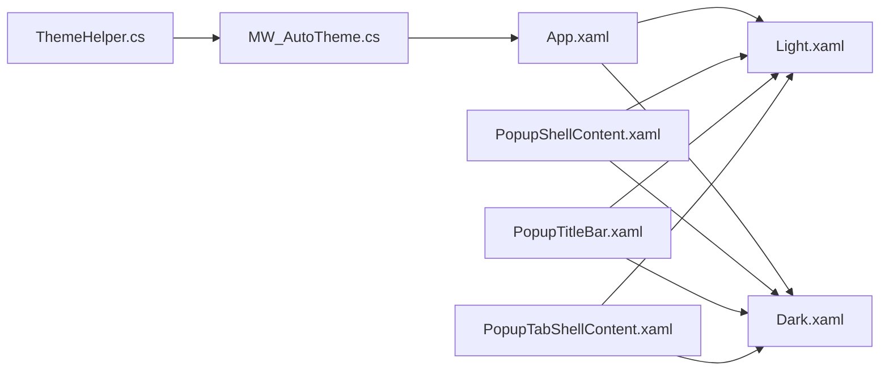

# Theme System

## Introduction
This document systematically explains the theme system of InkCanvasForClass, focusing on the implementation architecture of dark and light themes, style resource management, dynamic theme switching mechanisms, theme state persistence, theme adaptation of key controls (such as PopupShellContent), guidelines for creating custom themes, user experience design (smooth transitions and state preservation), and adaptation strategies under different screen sizes and high-DPI environments. The goal is to help developers and product personnel quickly understand and extend the theme system.

## Project Structure
The theme system revolves around "resource dictionaries + dynamic switching + unified theme management", with core files distributed as follows:
- Resource Dictionaries: Light and dark styles are located in Resources/Styles/Light.xaml and Dark.xaml, respectively.
- Theme Helpers: ThemeHelper provides system theme detection and requested theme settings; MW_AutoTheme is responsible for application-level theme switching and resource refreshing.
- Application Entry: App.xaml merges base resources and theme resources.
- Popup Shell: Controls like PopupShellContent reference theme key-values via DynamicResource to realize theme linkage.
- Settings Persistence: The Theme field in Settings.cs is used to save the theme mode selected by the user.

## Core Components
- Resource Dictionaries (Light/Dark)
  - Defines a large number of theme key-values such as floating window backgrounds, inner backgrounds, borders, foreground colors, icon resources, etc., covering popups, floating bars, selection toolbars, windows, and other UI elements.
- ThemeHelper
  - Provides capabilities such as system theme evaluation, requested theme settings, and theme application callbacks.
- MW_AutoTheme
  - Realizes application-level theme switching: removing old theme dictionaries, loading new theme dictionaries, asynchronously loading image resource dictionaries, setting requested themes, refreshing floating bar highlight colors, icon and button colors, and other window themes.
- App.xaml
  - Merges base resources and theme resources, ensuring global availability.
- Popup Shell Controls
  - PopupShellContent, PopupTitleBar, and PopupTabShellContent reference theme key-values via DynamicResource to achieve theme linkage.

## Architecture Overview
The theme system adopts a three-layer architecture of "resource dictionaries + dynamic replacement + requested themes":
- Resource Layer: Light.xaml and Dark.xaml provide the complete collection of style key-values.
- Switching Layer: MW_AutoTheme is responsible for removing old resources, loading new resources, setting requested themes, and refreshing icons and colors.
- Usage Layer: Each control references theme key-values via DynamicResource, automatically updating as the resource dictionary switches.

## Detailed Component Analysis

### Resource Dictionary Organization and Style Inheritance
- Key-Value Naming Conventions
  - Floating window related: ToolsPopupBackground, ToolsPopupInnerBackground, ToolsPopupInnerBorderBrush, ToolsPopupTitleForeground
  - Floating bar related: FloatBarBackground, FloatBarBorderBrush, FloatBarForeground, FloatBarForegroundColor
  - Whiteboard mode: BoardFloatBarBackground, BoardFloatBarBorderBrush, BoardFloatBarSelected* etc.
  - Windows and buttons: QuickDrawWindow*, SettingsPage*, RandWindow*, TimerWindow*, OperatingGuideWindow* etc.
  - Icon resources: various BitmapImage key-values, distinguishing light/dark themes.
- Style Inheritance and Reuse
  - Through unified key-value naming, controls can reuse the same style keys across themes, reducing duplicate definitions.
  - Popup shells use DynamicResource, automatically following the changes of key-values in the current resource dictionary.

### Dynamic Theme Switching Mechanism
- Switching Process
  - Remove existing Light/Dark resource dictionaries.
  - Load the new theme resource dictionary according to settings.
  - Load the image resource dictionary after an asynchronous delay to avoid blocking the main thread.
  - Set the requested theme (ElementTheme), triggering control theme refreshes.
  - Refresh floating bar highlight colors, icons, button colors, etc.
  - Traverse other windows and refresh their themes.
- System Theme Listening
  - Listen to system preference change events, automatically switching themes based on settings strategies.

### Theme State Persistence
- Settings Item
  - The Theme field in Settings.cs is used to save the theme mode selected by the user (0 = Light, 1 = Dark, 2 = Follow System).
- Application Entry
  - App.xaml merges base resources and theme resources, ensuring global availability.
- Theme Strings
  - ThemeStrings provides theme-related localized text, facilitating settings page display.

### Theme Adaptation of Key Controls: PopupShellContent etc.
- PopupShellContent
  - Outer border background uses DynamicResource ToolsPopupBackground.
  - Inner border background and border use DynamicResource ToolsPopupInnerBackground and ToolsPopupInnerBorderBrush.
  - Passes the title through TitleBar, with ContentPresenter carrying content internally.
- PopupTitleBar
  - Title text uses DynamicResource ToolsPopupTitleForeground.
  - Close button template uses the theme color when hovered/pressed.
- PopupTabShellContent
  - Structure is similar to PopupShellContent, supporting tab scenarios.

### Guidelines for Creating Custom Themes
- Adding a New Theme Resource Dictionary
  - Add MyTheme.xaml under Resources/Styles, defining the same key-value collection as Light/Dark.
- Registration and Switching
  - Add new theme constants and path mappings in MW_AutoTheme.
  - Load the corresponding resource dictionary according to the new theme in SetTheme.
- Icons and Images
  - Prepare the corresponding BitmapImage resource dictionary for the new theme and merge it during the asynchronous loading flow.
- Consistency Validation
  - Ensure all DynamicResource key-values used by controls are defined in the new theme, avoiding runtime missing errors that lead to rendering anomalies.

### User Experience Design: Smooth Transitions and State Preservation
- Smooth Transitions
  - Avoid stutters at the moment of theme switching by asynchronously delay-loading the image resource dictionary.
  - Refresh floating bar highlight colors and button colors immediately after setting the requested theme to guarantee visual continuity.
- State Preservation
  - Reinitialize floating bar foregrounds, refresh quick panel icons, selection toolbar icons, gesture button icons, and highlight colors after switching themes.
  - Traverse other windows and refresh their themes, ensuring multi-window consistency.

### Screen Size and High DPI Adaptation Strategies
- DPI Change Handling
  - Declaring the DpiChanged event in MainWindow.xaml allows layout and font size adjustments when DPI changes.
- Fonts and Layout
  - Through mechanisms such as AutoFontSizeHelper, text automatically scales under different DPIs, avoiding truncation.
- Borders and Shadows
  - Borders and shadows of popups and floating bars maintain consistent visual weights under different themes, avoiding visual inconsistencies caused by DPI amplification.

## Dependency Analysis
- Resource Dependencies
  - App.xaml merges base resources and theme resources, ensuring global availability.
  - Light/Dark resource dictionaries are dynamically loaded and replaced by MW_AutoTheme.
- Control Dependencies
  - Controls like PopupShellContent depend on key-values in the resource dictionaries via DynamicResource.
- Theme Management Dependencies
  - ThemeHelper provides system theme detection and requested theme settings, called by MW_AutoTheme.

## Performance Considerations
- Resource Loading Optimization
  - Load the image resource dictionary asynchronously, reducing temporary main thread blocks during theme switches.
- Theme Switching Costs
  - Only replace the resource dictionary and set requested themes, avoiding rebuilding the control tree.
- Visual Consistency
  - Through unified key-value naming and DynamicResource, duplicate style definitions are reduced, improving maintenance efficiency.

## Troubleshooting Guide
- Theme Switch Ineffective
  - Check whether ThemeHelper.ApplyTheme or MW_AutoTheme.SetTheme is called correctly.
  - Confirm that the resource dictionary path and key-values exist.
- Control Not Toggling with Theme
  - Confirm that the control references the theme key-value using DynamicResource.
  - Check if refreshing the icon or color of this control was missed.
- System Theme Listening Not Working
  - Check system preference change event bindings and settings strategies.

## Conclusion
The theme system of InkCanvasForClass takes resource dictionaries as its core, combining ThemeHelper and MW_AutoTheme to realize flexible, extensible, and high-performance theme switching. Through unified key-value naming and the use of DynamicResource, it achieves loose coupling between controls and resources; through asynchronous loading and state refreshing, it guarantees smoothness in user experience. This system provides a solid foundation for subsequent custom themes and multi-platform adaptations.

## Appendix
- Theme Key-Value Reference
  - Floating window related: ToolsPopupBackground, ToolsPopupInnerBackground, ToolsPopupInnerBorderBrush, ToolsPopupTitleForeground
  - Floating bar related: FloatBarBackground, FloatBarBorderBrush, FloatBarForeground, FloatBarForegroundColor
  - Whiteboard mode: BoardFloatBarBackground, BoardFloatBarBorderBrush, BoardFloatBarSelected*
  - Windows and buttons: QuickDrawWindow*, SettingsPage*, RandWindow*, TimerWindow*, OperatingGuideWindow*
  - Icon resources: various BitmapImage key-values, distinguishing light/dark themes.
