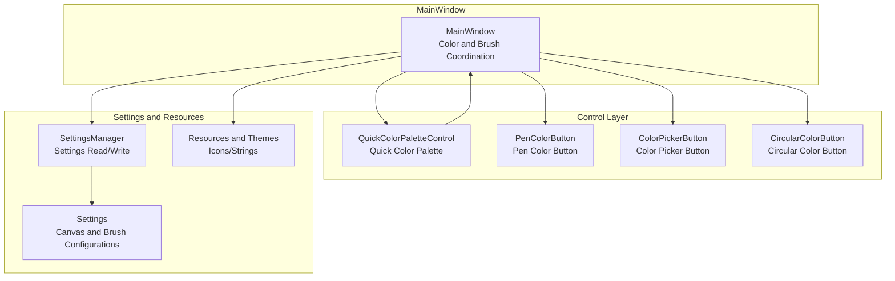
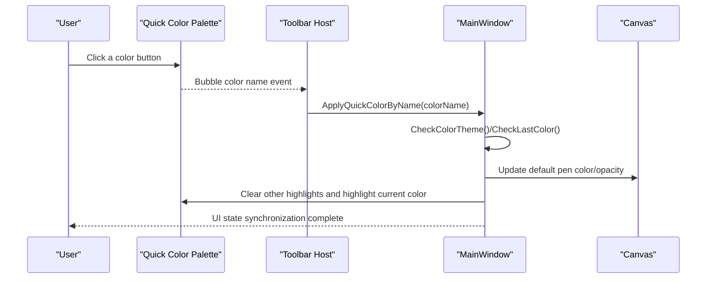
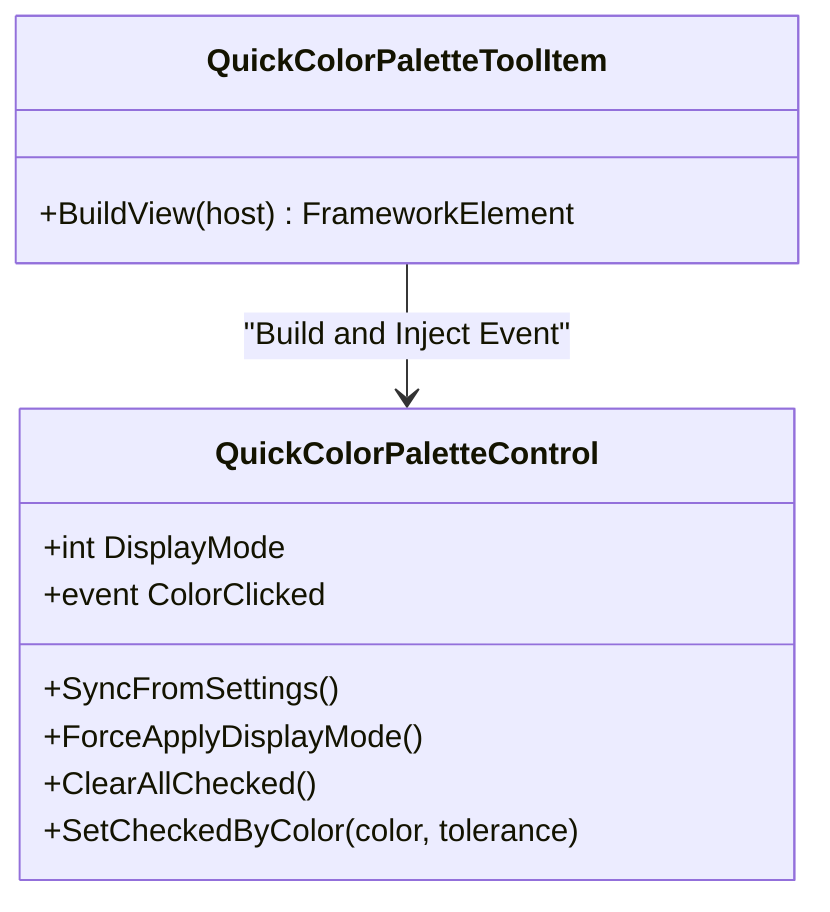
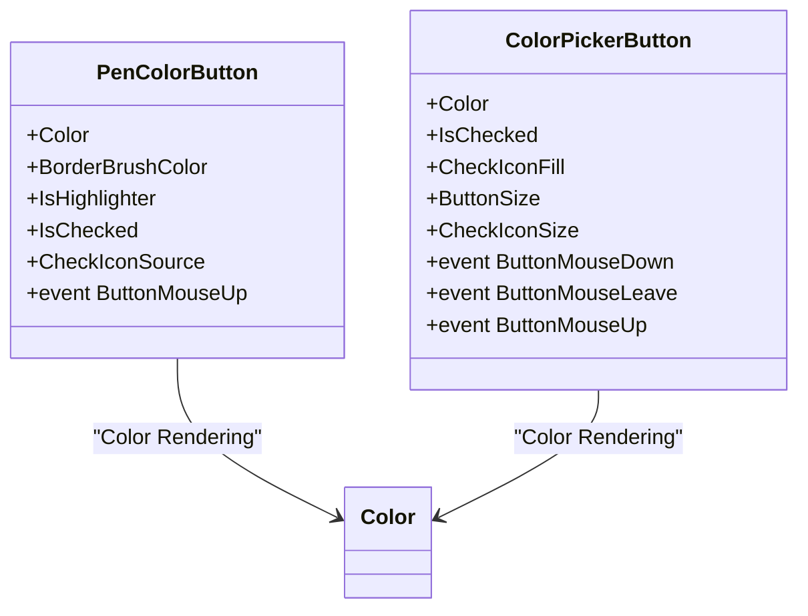
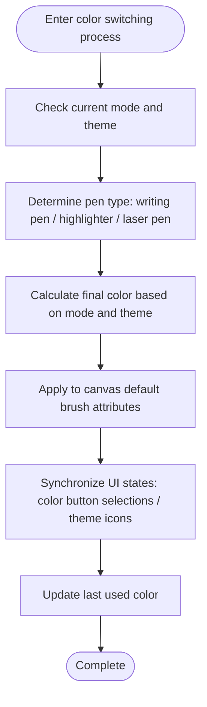
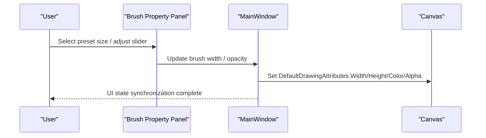
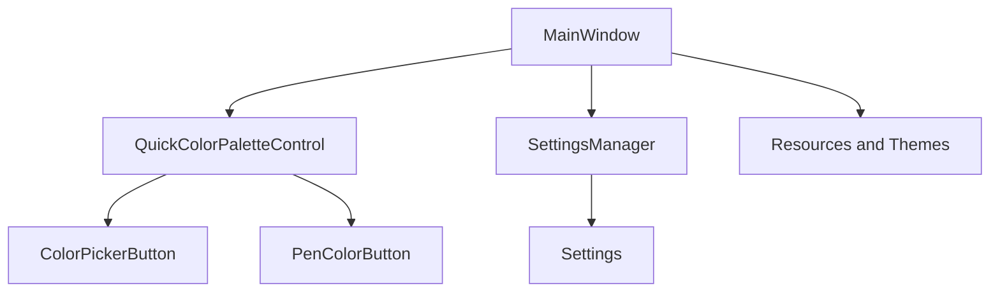

# Color and Brush Management System

## Introduction
This document addresses the color and brush management system, covering color pickers, brush type and property management, color themes and user preference persistence, as well as cross-platform compatibility. It highlights the following areas:
- Color Picker Implementation: quick color palettes, color button controls, color theme switching and synchronization.
- Brush Manager: brush types (writing pen, highlighter, laser pen), size and opacity control, pen tip shapes and special effects.
- PenColorButton and ColorPickerButton: color preview, selection interactions, state management, and event propagation.
- Custom Brush Effects: implementation ideas and extension points for textures, gradients, and special effects.
- Color theme systems, user preference storage, and cross-platform compatibility.

## Project Structure
The system is organized around "MainWindow logic + control layer + settings and resources", with color and brush-related modules distributed as follows:
- MainWindow Logic: responsible for color themes, brush type switching, brush property synchronization, and UI state management.
- Control Layer: provides reusable UI components such as color buttons, quick color palettes, and circular color buttons.
- Settings and Resources: user preference persistence, canvas configurations, theme icons, and string resources.

## Core Components
- Quick Color Palette Control: Provides common color collections, supporting display mode switching between double/single row, color highlights, and event bubbling.
- Color Button Control Family: PenColorButton (with translucent grid and checkmark selection), ColorPickerButton (small size color selection), CircularColorButton (circular preview and opacity).
- MainWindow Color Coordinator: Uniformly manages color themes, brush types, brush properties (width, height, opacity, stylus tip shape), and synchronizes UI states.
- Settings and Resources: SettingsManager handles settings read/write, Settings defines canvas and brush configurations, and resources provide theme icons and strings.

## Architecture Overview
The color and brush system adopts a layered architecture of "MainWindow coordination + control rendering + settings persistence":
- MainWindow is responsible for business logic and state synchronization, including color themes, brush types, brush properties, and UI states.
- The control layer realizes color preview, interaction, and state transitions through dependency properties and events.
- The settings layer realizes reading and saving of user preferences through SettingsManager and Settings.

## Detailed Component Analysis

### Quick Color Palette QuickColorPaletteControl
- Functional Key Points
  - Provides multiple sets of common color buttons (black, white, red, orange, yellow, green, blue, purple).
  - Supports double/single row display modes, switching dynamically according to settings.
  - Provides color highlighting and highlight clearing capabilities to indicate the currently selected color.
  - Passes color names to the host via the ColorClicked event, facilitating MainWindow color application.
- Key Implementation
  - Dependency property DisplayMode controls the display mode, applied after loading.
  - Color highlighting is based on an approximate matching algorithm with configurable tolerance.
  - Event bubbling uses routed events, making it easy for the toolbar host to capture.

### Color Buttons PenColorButton and ColorPickerButton
- PenColorButton
  - Properties: Color, BorderBrushColor, IsHighlighter, IsChecked, CheckIconSource.
  - Characteristics: Displays a translucent grid background and reduces opacity when IsHighlighter is true; displays a checkmark icon in selected states.
  - Event: ButtonMouseUp used by the upper layer to capture clicks.
- ColorPickerButton
  - Properties: Color, IsChecked, CheckIconFill, ButtonSize, CheckIconSize.
  - Characteristics: Thickens borders on mouse hovers; displays checkmark paths and fills by Fill in selected states.
  - Events: ButtonMouseDown, ButtonMouseLeave, ButtonMouseUp.

### Circular Color Button CircularColorButton
- Properties: Color, ColorOpacity, IsChecked, ButtonSize, BorderBrushColor, CheckIconSource.
- Characteristics: Circular appearance, supporting translucent grid backgrounds, color overlays, and checkmark viewboxes.
- Usage Scenario: Suitable for displaying colors and selected states in popup panels or compact layouts.

### MainWindow Color Coordinator MW_Colors
- Color Themes and Brush Types
  - Calculates final colors based on the current mode (desktop/whiteboard) and theme (light/dark).
  - Supports writing pen, highlighter, and laser pen, mapping different color sets and opacities, respectively.
- Brush Property Synchronization
  - Uniformly sets Color, Width, Height, StylusTip, and IsHighlighter of DefaultDrawingAttributes.
  - Synchronizes UI states (color button selections, theme icons, and texts).
- Last Used Colors
  - Records the last used color in desktop/whiteboard modes, facilitating recovery on next open.

### Brush Types and Size/Opacity Control
- Brush Types
  - Writing pen: supports width, opacity, stylus tip shape (rectangle/ellipse).
  - Highlighter: supports width, opacity, highlighter switch.
  - Laser pen: supports width, opacity, fadeouts and speeds.
- Preset Sizes
  - Popup panels provide common size presets (such as 1, 2.5, 5, 10, 17.5 corresponding to stylus radii).
- Configuration Items
  - Settings contains InkWidth, InkAlpha, HighlighterWidth, HighlighterAlpha, LaserPenWidth, LaserPenAlpha, etc.

### Custom Brush Effect Implementation Ideas
- Textured Brush
  - Idea: Realize textured effects via the brush's DrawingAttributes pattern or custom stylus tip maps; combine opacity and blending modes to enhance visual hierarchies.
  - Extension point: Set the stylus tip or pattern resources of DefaultDrawingAttributes in MainWindow.
- Gradient Brush
  - Idea: Use gradient brushes as stroke fills, combining color interpolation and opacity curves to achieve smooth transitions.
  - Extension point: Define gradient definitions in resources, applying them to brush properties in MainWindow.
- Special Effect Brush
  - Idea: Realize special effects by combining multiple brush parameters (width, opacity, stylus tip shape, blending mode) and external image resources.
  - Extension point: Add effect options in popup panels, with MainWindow updating brush properties based on selections.

[This section contains conceptual descriptions and does not directly analyze specific files, hence no chapter source]

### Color Theme System and User Preference Storage
- Color Theme
  - Light/dark theme toggles affect borders and icons of color buttons; MainWindow decides final colors based on isUselightThemeColor and isDesktopUselightThemeColor.
  - Theme icons change with theme toggles, and text tips are localized accordingly.
- User Preference Storage
  - SettingsManager handles serialization and persistence of Settings, where Settings defines configurations related to canvas and brush.
  - Preferences such as display modes of quick color palettes are driven by settings.

### Cross-Platform Compatibility Considerations
- Color Spaces and Models
  - The system uses RGB color models for color representation and calculation; HSL conversion examples are found in the HSL->RGB conversion logic of the splash screen, usable for gradients or theme generation.
- Platform Differences
  - Color rendering and opacity handling in WPF environments need to focus on DPI and hardware acceleration differences; it is recommended to unify scaling strategies and bitmap scaling modes under high DPIs.
- Resources and Icons
  - Icons and resource paths adopt relative paths; pay attention to the consistency of path resolution under different deployment environments.

## Dependency Analysis
- Control Dependencies
  - QuickColorPaletteControl depends on ColorPickerButton for color selection and highlighting.
  - PenColorButton and ColorPickerButton both rely on WPF dependency property and event mechanisms to realize states and interactions.
- MainWindow Dependencies
  - MainWindow depends on SettingsManager and Settings to retrieve user preferences; it depends on events and states provided by controls for unified coordination.
- Resource Dependencies
  - Theme icons and string resources are provided by Properties and resource dictionaries, ensuring consistency across languages and themes.

## Performance Considerations
- Color Calculations and Theme Switching
  - Color theme switching involves a large number of UI element state updates; it is recommended to avoid frequent layout and paint triggers during batch updates, using deferral or batch strategies when necessary.
- Opacity and Blending
  - Opacities and blending modes of highlighters and laser pens might affect rendering performance; it is recommended to reasonably lower opacities or enable hardware acceleration in scenarios with high-density strokes.
- Dependency Properties and Events
  - Dependency properties and events are widely used at the control layer; pay attention to avoid excessive bindings and circular updates, keeping property changes atomic.

[This section contains general guidelines and does not directly analyze specific files, hence no chapter source]

## Troubleshooting Guide
- Quick Color Palette Not Displayed or Highlight Anomalies
  - Check DisplayMode settings and whether ApplyDisplayMode executes correctly; confirm if color approximate matching tolerances are reasonable.
- Icons/Texts Not Updated After Color Theme Switch
  - Check theme flags and icon resource paths in CheckColorTheme; confirm if localized strings are correctly loaded.
- Brush Properties Not Taking Effect
  - Check if MainWindow correctly sets DefaultDrawingAttributes; confirm pen type switching logic and slider value synchronizations.
- Settings Fail to Save
  - Check save paths and permissions of SettingsManager; confirm exception handling and log outputs.

## Conclusion
This system realizes unified management of colors and brushes through a clear layered design: the control layer provides rich color choices and state feedbacks, MainWindow handles business logic and state synchronizations, and the settings layer guarantees persistence and cross-platform consistency of user preferences. Future extensions can be made in custom brush effects, color space conversions, and performance optimizations.

## Appendix
- Related Configuration Items
  - Canvas and brush: InkWidth, InkAlpha, HighlighterWidth, HighlighterAlpha, LaserPenWidth, LaserPenAlpha, EnableInkFade, InkFadeTime, InkFadeSpeedMultiplier, etc.
- Common Color Naming
  - Black, white, red, green, blue, yellow, purple, pink, cyan, orange, etc., mapping different RGB values under light/dark themes.
