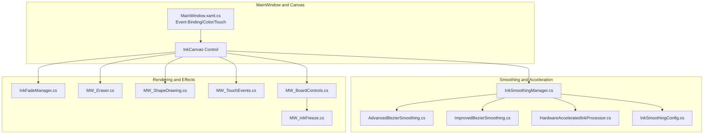
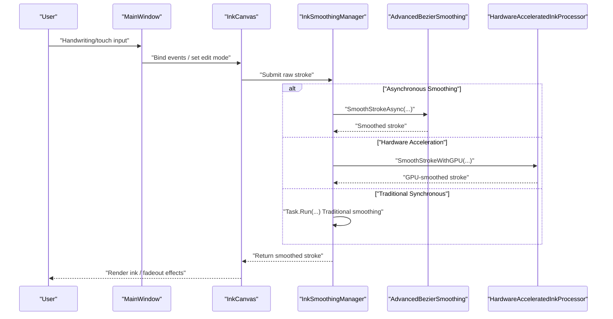
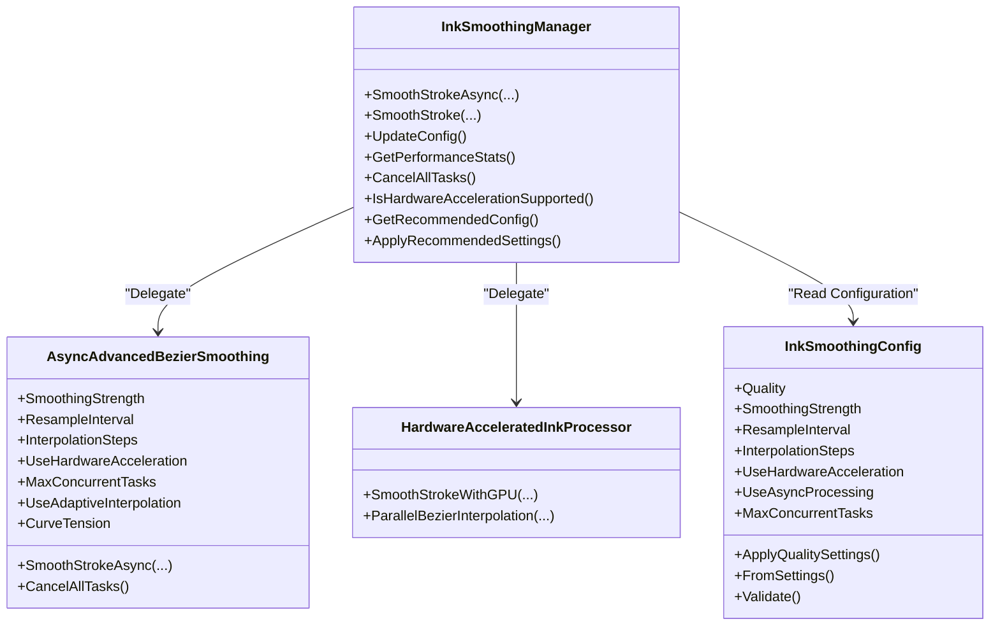
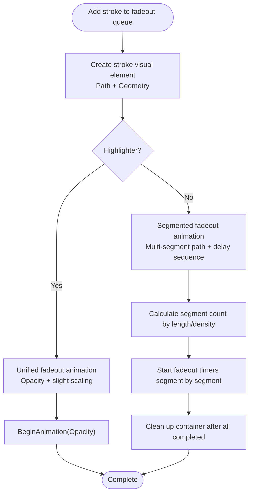
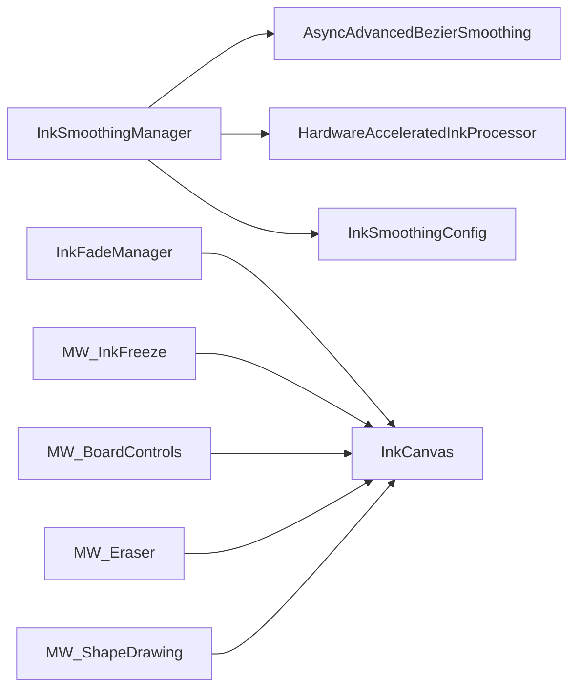

# Whiteboard Writing System

## Introduction
This document addresses the whiteboard writing system of InkCanvasForClass, providing systematic technical explanations surrounding the use of the InkCanvas control, ink data acquisition and storage, smoothing algorithms, hardware-accelerated processors, ink fadeout effects, rendering and visual feedback, color and brush size/opacity control, and more. The document aims to help developers quickly understand and extend the writing experience and performance metrics of the system.

## Project Structure
- Core Writing and Rendering: MainWindow.xaml.cs and its submodules are responsible for InkCanvas event bindings, real-time previews, multi-touch, color, and brush property settings, etc.
- Smoothing and Acceleration: InkSmoothingManager, AdvancedBezierSmoothing, ImprovedBezierSmoothing, HardwareAcceleratedInkProcessor, and InkSmoothingConfig in the Helpers directory provide capabilities such as asynchronous smoothing, Bezier curve fitting, GPU acceleration, and configuration management.
- Fadeout and Freeze: InkFadeManager implements ink fadeout animations and visual management; MW_InkFreeze provides page freezing/unfreezing and non-editable protection.
- Tools and Interactions: MW_Eraser, MW_ShapeDrawing, MW_TouchEvents, and MW_BoardControls modules are responsible for eraser, shape drawing, touch events, and whiteboard page management, respectively.

## Core Components
- InkCanvas Control: Carries ink input, real-time preview, stroke rendering, and UI event interactions.
- InkSmoothingManager: Uniformly schedules asynchronous smoothing, hardware acceleration, and traditional processing paths, supporting hot configuration updates and performance monitoring.
- AdvancedBezierSmoothing / ImprovedBezierSmoothing: Provide Bezier curve fitting, adaptive interpolation, resampling, and pressure value interpolation.
- HardwareAcceleratedInkProcessor: GPU-based path geometry smoothing and parallel Bezier calculations.
- InkFadeManager: Manages ink fadeout animations, segmented rendering, and visual containers, supporting highlighter special effects.
- MW_InkFreeze: Page-level freezing/unfreezing, protecting written contents from editing.
- MW_Eraser / MW_ShapeDrawing / MW_TouchEvents: Eraser geometric hit testing, shape drawing, and touch real-time stylus tip states.

## Architecture Overview
The system adopts a layered design of "event-driven + smoothing pipeline + rendering and effects":
- Event Layer: MainWindow binds StylusDown/Move/Up events of InkCanvas and touch events, switching editing modes and real-time stylus tip states on demand.
- Smoothing Layer: InkSmoothingManager selects AsyncAdvancedBezierSmoothing, HardwareAcceleratedInkProcessor, or traditional paths based on configurations, supporting concurrent tasks and cancellations.
- Rendering Layer: InkCanvas renders ink internally; InkFadeManager attaches visual layers to ink, realizing fadeout and segmented animations.
- Tools Layer: MW_Eraser provides geometric/stroke erasures; MW_ShapeDrawing provides shape drawing previews; MW_InkFreeze provides page freeze protection.

## Detailed Component Analysis

### InkCanvas Control and Event Bindings
- MainWindow binds the StylusDown/Move/Up events of InkCanvas to processing functions, switching editing modes (e.g., None/Ink/EraseByPoint/EraseByStroke/Select) on demand, and handles touch inputs and multi-touch states.
- Controls stroke appearance and behavior via EditingMode and DefaultDrawingAttributes; real-time preview reduces flickering through temporary strokes and throttled updates.

### Ink Data Acquisition and Storage
- Ink is represented by Stroke and StylusPointCollection containing position and pressure information; the InkCanvas.Strokes collection saves all ink.
- Page-level Management: MW_BoardControls maintains the StrokeCollection and history TimeMachineHistories for each page, supporting switching/adding/deleting pages and persistences.
- Freezing Protection: MW_InkFreeze adds property flags to ink on frozen pages, preventing modifications by misoperations.

### InkSmoothingManager and Smoothing Algorithms
- Unified entry SmoothStrokeAsync/SmoothStroke selects AsyncAdvancedBezierSmoothing, HardwareAcceleratedInkProcessor, or traditional paths based on configurations.
- AsyncAdvancedBezierSmoothing uses quintic Bezier sliding window fitting, adaptive interpolation steps, exponential smoothing, and equidistant resampling, balancing quality and performance.
- HardwareAcceleratedInkProcessor uses PathGeometry and parallel Bezier calculations, keeping pressure information, suitable for GPU acceleration scenarios.
- InkSmoothingConfig provides quality levels (Performance/Balanced/Quality) and parameter mappings, supporting loading from settings and validations.

### Hardware-Accelerated Ink Processor
- Uses RenderTargetBitmap and DrawingVisual, cooperating with RenderOptions settings to enhance GPU rendering quality.
- Generates smooth curves via PathGeometry, and converts back to StylusPoint collections, keeping pressure information.
- Parallel Bezier interpolation uses Parallel.For, significantly enhancing calculation efficiency of multi-segment curves.

### Ink Fadeout Effects
- InkFadeManager creates Path visual elements for each stroke, supporting unified/progressive animation strategies.
- Highlighters adopt special blending and slight scaling to enhance the "evaporation" visual; normal ink is rendered by segments, guaranteeing that short strokes are also fully displayed.
- Supports dynamically calculating animation durations based on stroke length and global speed multipliers, providing unified fadeout lifecycle management.

### Rendering and Visual Feedback
- Real-time Preview: MW_ShapeDrawing uses throttled updates (around 60fps) to reduce UI jitters; adds new strokes before removing old strokes to avoid flickering.
- Pressure Visual: MultiTouchInput maps pressure values to stroke thicknesses, enhancing writing realism.
- Stroke Effects: InkFadeManager sets rounded/flat end caps and slight blur for highlighters, enhancing visual hierarchies.

### Color Management, Brush Size and Opacity
- Color: MW_Colors sets InkCanvas.DefaultDrawingAttributes.Color according to themes and pen types, maintaining the most recently used color index.
- Brush Size: Sets Width/Height and StylusTip; laser pen mode is configured independently.
- Opacity: Links the Alpha channel of DrawingAttributes.Color with sliders, supporting semi-translucent stroke effects.

### Eraser and Shape Drawing
- Geometric Erasure: MW_Eraser uses InkCanvas.Strokes.GetIncrementalStrokeHitTester and StylusShape (ellipse/rectangle) to perform hit testing, supporting real-time feedback and replacement/deletion.
- Stroke Erasure: Directly removes after filtering out frozen ink.
- Shape Drawing: MW_ShapeDrawing generates geometry point sets on temporary strokes, adding them to InkCanvas.Strokes after submission.

## Dependency Analysis
- InkSmoothingManager depends on AsyncAdvancedBezierSmoothing, HardwareAcceleratedInkProcessor, and InkSmoothingConfig, forming pluggable smoothing strategies.
- InkFadeManager depends on InkCanvas.Children and Dispatcher, managing the visual layer independently to avoid coupling with core ink data.
- MW_BoardControls collaborates with TimeMachineHistories, realizing page-level ink persistence and recovery.
- MW_Eraser is tightly coupled with InkCanvas.Strokes/EraserShape, ensuring erasure hits and performances.

## Performance Considerations
- Concurrency and Rate Limiting: AsyncAdvancedBezierSmoothing uses semaphores to limit concurrent task counts, avoiding CPU/GPU overload.
- Adaptive Interpolation: Dynamically adjusts interpolation steps based on curve length and curvature, balancing quality and speed.
- Equidistant Resampling: Resamples when point counts are excessive, controlling the upper limit of output points, reducing rendering burdens.
- GPU Acceleration: HardwareAcceleratedInkProcessor uses PathGeometry and parallel calculations, suitable for smoothing large batches of strokes.
- Fadeout Optimization: InkFadeManager uses segmented rendering and delay sequences, avoiding creation of massive UI elements at once that leads to stutters.

## Troubleshooting Guide
- Smoothing Failure Fallback: InkSmoothingManager catches exceptions and falls back to original strokes, avoiding interruptions to the writing flow.
- Timeout Protection: Synchronous smoothing provides timeout protections, logging and returning original strokes after timeouts.
- Fadeout Anomalies: InkFadeManager catches exceptions at various stages and cleans up resources, guaranteeing consistent UI states.
- Erasure Failure: MW_Eraser filters out frozen ink during geometric erasures to avoid accidental deletions; submits history records at the end.

## Conclusion
This system realizes high-quality, low-latency whiteboard writing experiences through the combination of "event-driven + pluggable smoothing strategies + GPU acceleration + fadeout visuals". InkSmoothingManager provides flexible configurations and performance monitoring; HardwareAcceleratedInkProcessor and AdvancedBezierSmoothing achieve a good balance between quality and performance; InkFadeManager and modules like MW_Eraser/MW_ShapeDrawing build a complete writing ecosystem together. Developers can extend custom stroke effects and rendering strategies based on existing interfaces.

## Appendix
- Recommended Practices
  - Use InkSmoothingManager.GetRecommendedConfig() to automatically adapt to device performances.
  - For highlighters, it is recommended to enable the highlighter special effects of InkFadeManager.
  - Prioritize enabling hardware acceleration and asynchronous smoothing in large ink scenarios.
  - Adjust SmoothingStrength/ResampleInterval/InterpolationSteps through InkSmoothingConfig to match target quality levels.
- Extension Directions
  - Custom Stroke Effects: Extend Path effects and animation curves in InkFadeManager.
  - Custom Smoothing Algorithms: Implement interfaces similar to AdvancedBezierSmoothing, integrating into InkSmoothingManager.
  - Multi-device Collaboration: Combine TimeMachineHistories and MW_BoardControls to realize stroke synchronizations across pages/devices.
