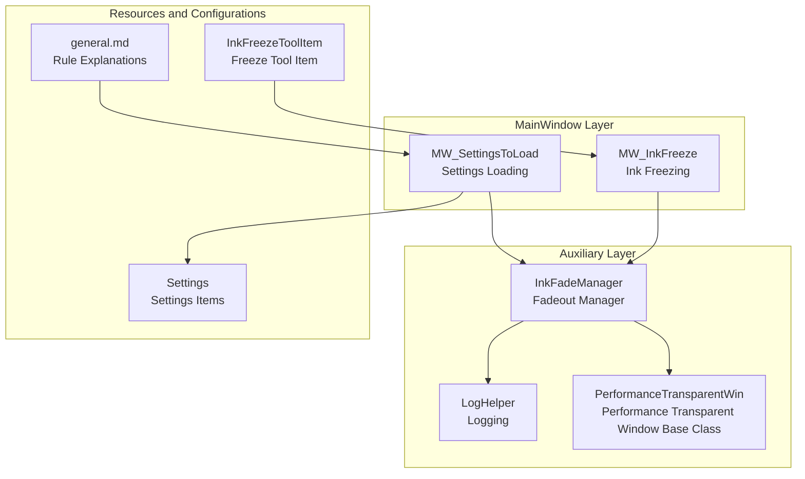
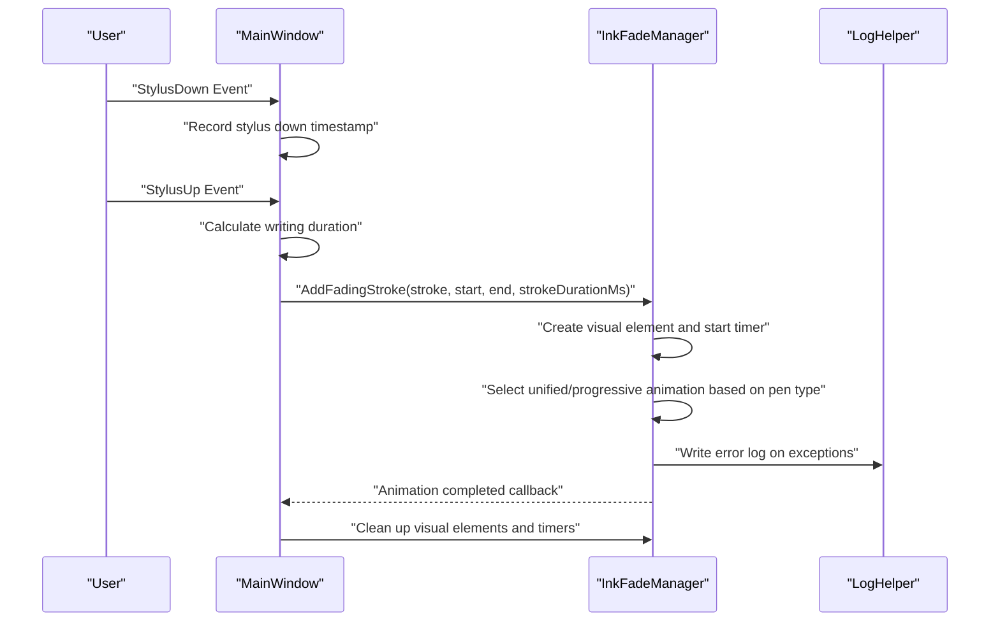
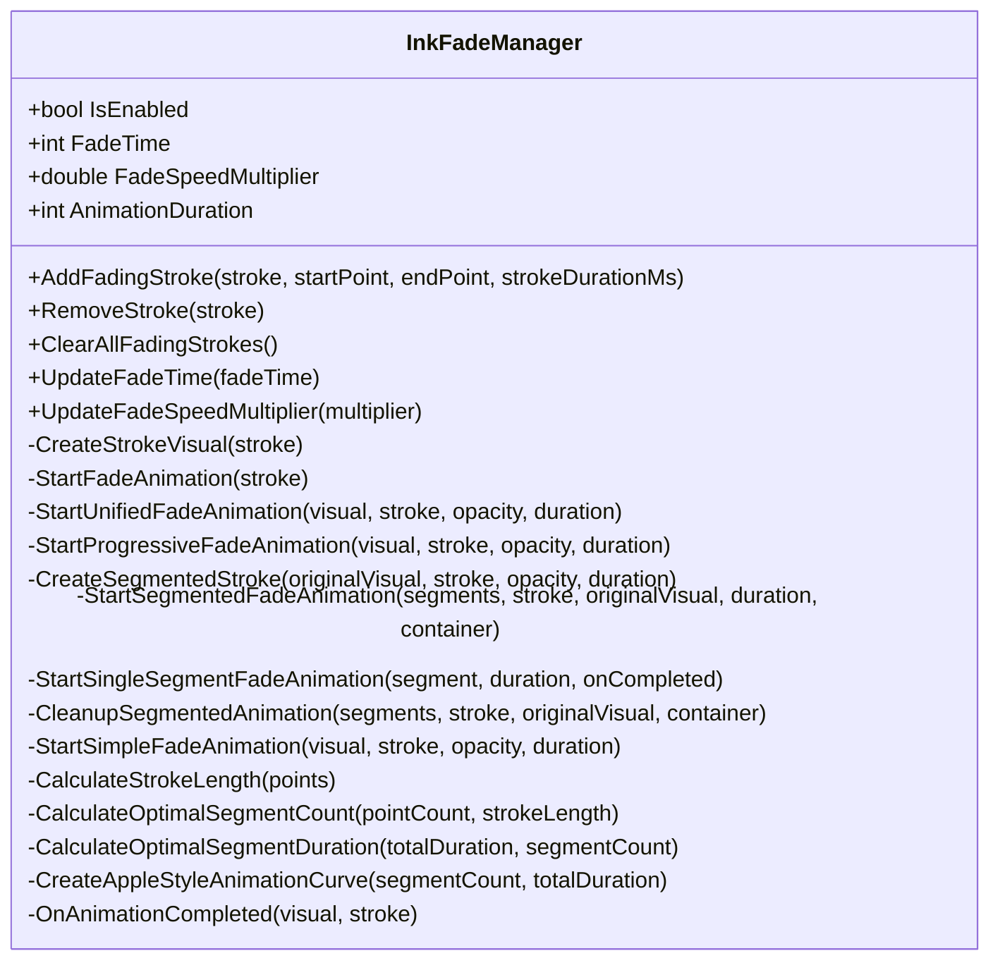
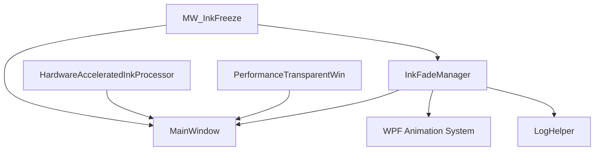

# Ink Fadeout Effect System

## Introduction
This document is an in-depth technical manual for the ink fadeout effect system, centering on the implementation principles of InkFadeManager. It covers fadeout algorithms, time control mechanisms, visual effect management, trigger conditions and configurations, collaborations with the InkFreeze feature, custom options, and performance impact analyses. The document aims to help developers and advanced users comprehensively understand the operational mechanisms and optimization strategies of this system.

## Project Structure
The ink fadeout effect system is mainly distributed across the following modules:
- Auxiliary Layer: InkFadeManager (fadeout management), LogHelper (logging), PerformanceTransparentWin (window performance base class).
- MainWindow Layer: MW_InkFreeze (freezing feature), MW_SettingsToLoad (settings loading).
- Resources and Configurations: Settings (settings items), general.md (rule explanations).
- Toolbar Integration: InkFreezeToolItem (freeze tool item).

## Core Components
- InkFadeManager: Responsible for the lifecycle management of ink fadeouts, including additions, animation starts, segmented processing, unified processing, cleanups, etc.
- MW_InkFreeze: Responsible for page-level ink freezing state maintenance and tool mode switching, providing freezing collaboration for the fadeout system.
- MW_SettingsToLoad: Responsible for loading fadeout parameters from settings and initializing sliders.
- Settings: Provides configuration items such as EnableInkFade, InkFadeTime, InkFadeSpeedMultiplier, etc.
- general.md: Defines laser pen fadeout rules and writing duration recording flows.
- LogHelper: Provides unified error logging to facilitate troubleshooting.
- PerformanceTransparentWin: Window performance base class, indirectly affecting rendering performance.
- HardwareAcceleratedInkProcessor: Hardware-accelerated ink processing, jointly affecting overall performance with the fadeout system.

## Architecture Overview
The ink fadeout system adopts an architecture of "manager + MainWindow collaboration + settings-driven":
- Manager Layer: InkFadeManager uniformly schedules the fadeout lifecycle, creating visual elements and starting animations.
- MainWindow Layer: MW_InkFreeze provides freezing states and tool mode switching, avoiding new ink generation in frozen states.
- Configuration Layer: Settings and MW_SettingsToLoad provide adjustable parameters and slider bindings.
- Rule Layer: general.md defines laser pen fadeout behaviors and writing duration recording flows.

## Detailed Component Analysis

### InkFadeManager Implementation Principles
- Trigger Conditions and Time Control
  - Trigger conditions: When enabled and non-null, receives AddFadingStroke calls from MainWindow.
  - Time control: FadeTime controls display duration; AnimationDuration and FadeSpeedMultiplier jointly determine animation duration; if strokeDurationMs is passed, it is calculated as strokeDurationMs/FadeSpeedMultiplier.
  - Timers: Creates a DispatcherTimer for each stroke, starting the fadeout animation and stopping itself after FadeTime expires.
- Visual Effect Management
  - Unified fadeout: Highlighters use unified opacity animations coupled with slight scaling to enhance natural feel.
  - Progressive segmentation: Normal pens segment ink based on length and point density, starting fadeouts segment by segment to form a "wave-like" vanishing effect.
  - Visual elements: Creates Paths based on Stroke geometries, preserving original brush properties (color, width, end cap, join method), with highlighters additionally applying slight blur and widening strategies.
- Animation Curves and Performance
  - Apple-style curves: Generates segmented delay sequences via CreateAppleStyleAnimationCurve, guaranteeing visual continuity.
  - Segment duration constraints: CalculateOptimalSegmentDuration compromises between total duration and segment count, avoiding overly short durations that cause stutters.
  - Safety timeouts: Sets safety timeouts for segmented animations, preventing abnormal blocks.
- Cleanup and Recycling
  - OnAnimationCompleted uniformly removes visual elements and cleans up dictionaries, avoiding memory leaks.
  - ClearAllFadingStrokes performs batch cleanups, ensuring state consistency.

## Dependency Analysis
- Component Coupling
  - InkFadeManager depends on the inkCanvas and Dispatcher of MainWindow, ensuring UI thread safety and correct coordinate systems.
  - MW_InkFreeze and InkFadeManager coordinate via MainWindow; the freezing state affects the timing of fadeout triggers.
- External Dependencies
  - WPF animation system (DoubleAnimation, EasingFunction, DispatcherTimer).
  - Logging system (LogHelper) for exception tracking.
  - Hardware acceleration (HardwareAcceleratedInkProcessor) and window performance (PerformanceTransparentWin) indirectly affect overall rendering performance.

## Performance Considerations
- Rendering and Memory
  - Each stroke creates an independent Path visual element; segmentation temporarily creates containers and multiple child elements, which requires attention to memory peaks.
  - OnAnimationCompleted performs unified cleanups, avoiding long-term reference retention.
- Animation Strategies
  - Segmented animations adopt multiple timers and safety timeouts, balancing visual effects and stability.
  - Apple-style curves reduce abrupt starts and ends, enhancing visual quality.
- System Resources
  - HardwareAcceleratedInkProcessor and the window performance base class (PerformanceTransparentWin) jointly affect rendering efficiency.
  - It is recommended to lower segment counts and animation durations on low-end devices to avoid stutters.

## Troubleshooting Guide
- Common Issues
  - Visual element addition failure: Check if the inkCanvas parent container exists; fall back to inkCanvas.Children if necessary.
  - Fadeout animation not triggered: Confirm that IsEnabled is true, FadeTime is reasonably set, and the passed Stroke is non-null.
  - Animation abnormally interrupted: Check logs; the system will fall back to simple animations and clean up resources on failure.
- Log Location
  - Use LogHelper to record error call stacks and caller information, facilitating quick troubleshooting.
- Settings Validation
  - Validate settings loading success and slider value ranges via MW_SettingsToLoad.

## Conclusion
InkFadeManager realizes natural and smooth ink fadeout effects through unified and progressive animation strategies, combining different treatments for highlighters and normal pens. Its collaboration with MW_InkFreeze guarantees behavioral consistency under frozen states, while settings-driven and slider bindings provide flexible customizability. In terms of performance, the system guarantees stability via segmented animations and safety timeouts, and recommends moderately lowering complexity on low-end devices to maintain a smooth experience.

## Appendix
- Configuration Items at a Glance
  - EnableInkFade: Whether fadeout is enabled.
  - InkFadeTime: Display duration (milliseconds).
  - InkFadeSpeedMultiplier: Animation speed multiplier.
- Rule Key Points
  - Laser pen fadeout: Display duration is fixed by InkFadeTime; animation duration is dynamically calculated by writing duration/speed multiplier.
  - Writing duration recording: Recorded and calculated in stylus down and stylus up events, passed to the fadeout manager.
