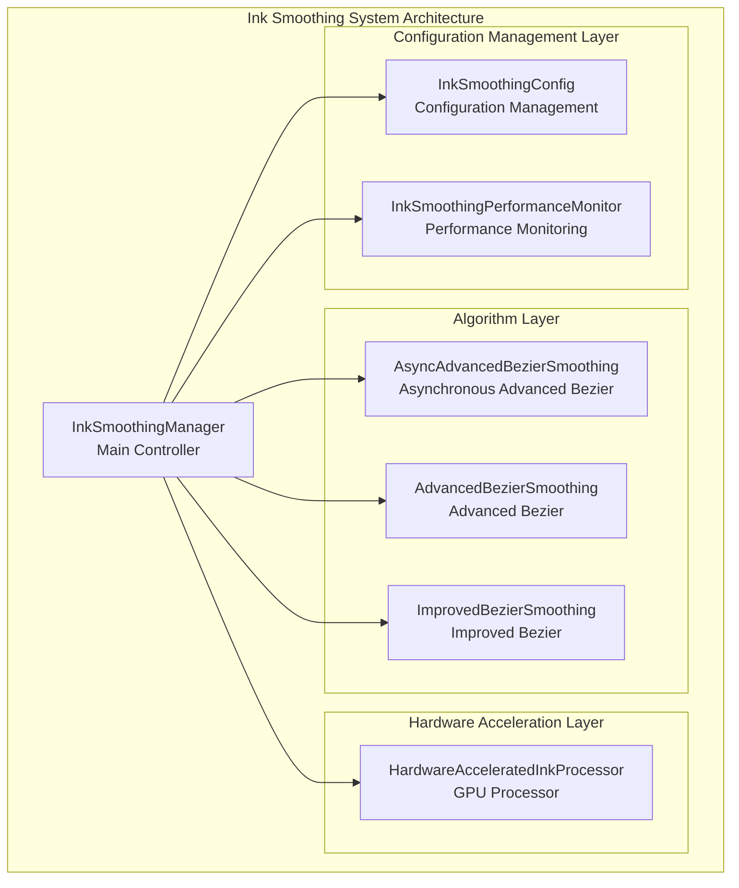
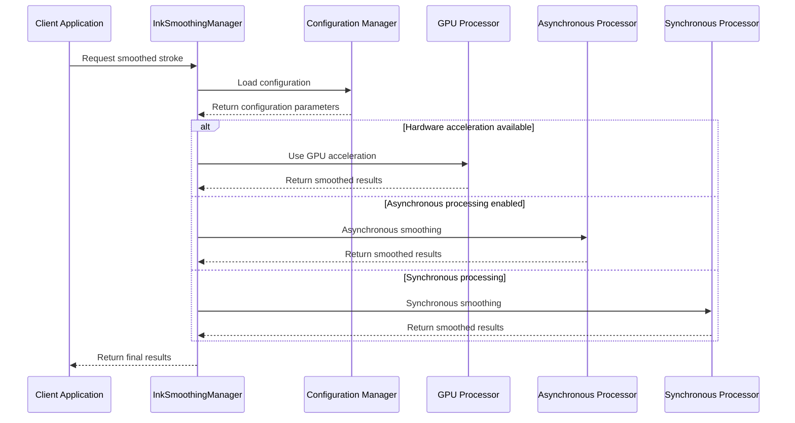
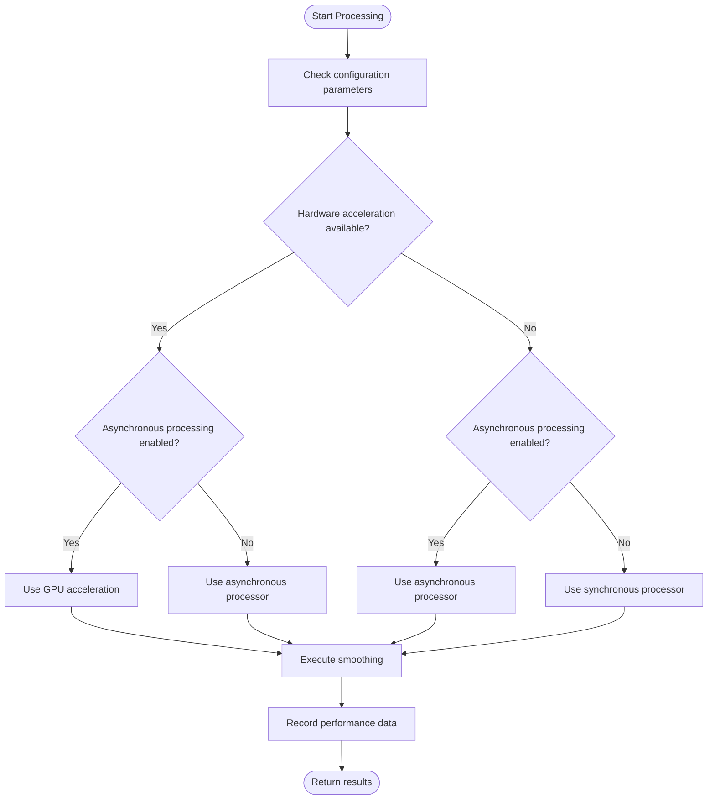
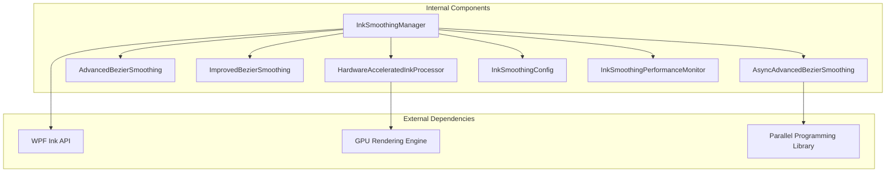

# Ink Smoothing System

## Introduction

The ink smoothing system is a high-performance algorithm framework specifically designed for digital ink rendering, aiming to provide a smooth and natural writing experience. Through the intelligent combination of multiple smoothing algorithms, this system achieves adaptive optimization under different hardware configurations and input devices.

The core advantages of the system include:
- A smoothing mechanism merging multiple algorithms
- Intelligent hardware acceleration detection and configuration
- Real-time performance monitoring and adaptive regulation
- Optimization strategies tailored for different input devices
- Comprehensive error handling and resource management

## Project Structure

The ink smoothing system is located under the Helpers directory of the Ink Canvas project, adopting a modular design where each component has a clear division of responsibilities:

## Core Components

### InkSmoothingManager - Main Controller

InkSmoothingManager is the central controller of the entire system, responsible for coordinating the workflows of each component. Its main functions include:

- **Algorithm Selection and Scheduling**: Automatically selects the most suitable smoothing algorithm based on configurations.
- **Asynchronous Processing Management**: Provides non-blocking smoothing capabilities.
- **Hardware Acceleration Detection**: Automatically detects and enables hardware acceleration features.
- **Performance Monitoring**: Tracks processing performance in real-time and provides statistical information.
- **Resource Management**: Uniformly manages memory and computational resources.

### Algorithm Components

The system provides three different smoothing algorithms, each with its specific application scenarios:

1. **AsyncAdvancedBezierSmoothing**: Asynchronous advanced Bezier algorithm, suitable for high-performance requirements.
2. **AdvancedBezierSmoothing**: Traditional advanced Bezier algorithm, maintaining backward compatibility.
3. **ImprovedBezierSmoothing**: Improved Bezier algorithm, focusing on quality optimizations.

### Configuration Management

InkSmoothingConfig provides comprehensive configuration options, including:
- Smoothing strength and response time parameters
- Bezier curve tension and interpolation steps
- Hardware acceleration and asynchronous processing switches
- Performance/quality level settings

## Architecture Overview

The system adopts a layered architecture design, achieving effective separation of algorithms, hardware acceleration, and configuration management:

## Detailed Component Analysis

### InkSmoothingManager Working Principles

InkSmoothingManager selects the most suitable smoothing algorithm through an intelligent decision mechanism:

## Dependency Analysis

The system adopts a clear dependency hierarchical structure:

## Performance Considerations

### Algorithm Performance Comparison

The system provides multiple algorithms to meet different performance requirements:

#### Time Complexity Analysis

| Algorithm Type | Time Complexity | Space Complexity | Applicable Scenarios |
|---------|-----------|-----------|----------|
| Asynchronous Advanced Bezier | O(n*k) | O(n+k) | High-performance requirements, multi-threaded environments |
| Improved Bezier | O(n*k) | O(n+k) | Quality-first, single-threaded environments |
| Traditional Advanced Bezier | O(n*k) | O(n+k) | Backward compatibility, stable environments |

#### Memory Usage Analysis

The system optimizes memory usage through the following mechanisms:

- **Streaming Processing**: Avoids loading large amounts of data at once.
- **Object Pooling**: Reuses temporary objects to reduce GC pressure.
- **Lazy Evaluation**: Computes on demand to avoid unnecessary intermediate results.

### User Experience Optimization

The system implements several user experience optimization strategies:

#### Response Time Optimization

- **Asynchronous Processing**: Avoids blocking the UI thread.
- **Progress Feedback**: Provides real-time processing states.
- **Cancellation Support**: Allows users to interrupt long-running operations.

#### Adaptive Configuration

The system automatically adjusts configuration parameters based on device characteristics, ensuring a good user experience across various hardware environments.

## Troubleshooting Guide

### Common Issues and Solutions

#### Hardware Acceleration Issues

**Issue**: GPU acceleration is not working normally.
**Solutions**:
1. Check if the system supports hardware acceleration.
2. Confirm GPU driver updates.
3. Try disabling hardware acceleration for downgrade testing.

#### Performance Issues

**Issue**: Smoothing speed is too slow.
**Solutions**:
1. Adjust the smoothing strength parameters.
2. Reduce the interpolation steps.
3. Turn off the adaptive interpolation feature.
4. Lower the number of concurrent tasks.

#### Memory Issues

**Issue**: Memory usage is too high.
**Solutions**:
1. Set a reasonable maximum point count limit.
2. Optimize resampling intervals.
3. Enable memory reclamation mechanisms.

### Debugging Tools

The system provides comprehensive debugging and monitoring features:

- **Performance Statistics**: Displays processing times and resource usage in real-time.
- **Color Validation**: Checks the rationality of parameter settings.
- **Error Logging**: Records detailed error messages and stack traces.

## Conclusion

The ink smoothing system achieves adaptive optimization under different hardware configurations and usage scenarios through a carefully designed multi-algorithm fusion architecture. The main advantages of the system include:

1. **Intelligent Algorithm Selection**: Automatically selects the optimal algorithm based on hardware capabilities and usage scenarios.
2. **High-performance Implementation**: Ensures a smooth user experience through parallel computing and hardware acceleration.
3. **Flexible Configuration Management**: Provides comprehensive parameter adjustment options to meet different needs.
4. **Comprehensive Monitoring Mechanisms**: Tracks performance indicators in real-time and provides optimization recommendations.

This system provides a solid infrastructure for digital ink applications, effectively enhancing users' writing experience.

## Appendix

### Device Type Optimization Recommendations

### Pressure Stylus Devices

- **Recommended Configuration**: Quality mode, hardware acceleration enabled.
- **Key Parameters**: Appropriate smoothing strength, moderate interpolation steps.
- **Optimization Points**: Maintain the integrity of pressure information, optimize response times.

### Mouse Devices

- **Recommended Configuration**: Balanced mode, asynchronous processing enabled.
- **Key Parameters**: Higher smoothing strength, moderate resampling intervals.
- **Optimization Points**: Compensate for mouse input discontinuities, optimize trajectory smoothing.

### Touch Screen Devices

- **Recommended Configuration**: Performance mode, hardware acceleration enabled.
- **Key Parameters**: Lower smoothing strength, larger resampling intervals.
- **Optimization Points**: Reduce touch input delays, optimize multi-touch responses.

### Parameter Tuning Guide

#### Smoothing Strength Tuning

- **Low Strength**: Suitable for fast writing, reducing delays.
- **Medium Strength**: Balances smoothness and responsiveness.
- **High Strength**: Suitable for fine drawing, maximizing smoothing effects.

#### Response Time Optimization

- **Real-time Mode**: Minimizes processing delays.
- **Buffered Mode**: Balances smoothness and accuracy.
- **Batch Mode**: Maximizes processing efficiency.

#### Smoothing Quality Balance

The system achieves the optimal balance between performance and quality through quality level configurations; users can perform fine-tuning according to specific needs.
