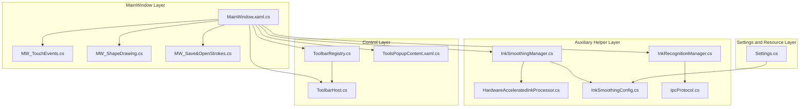
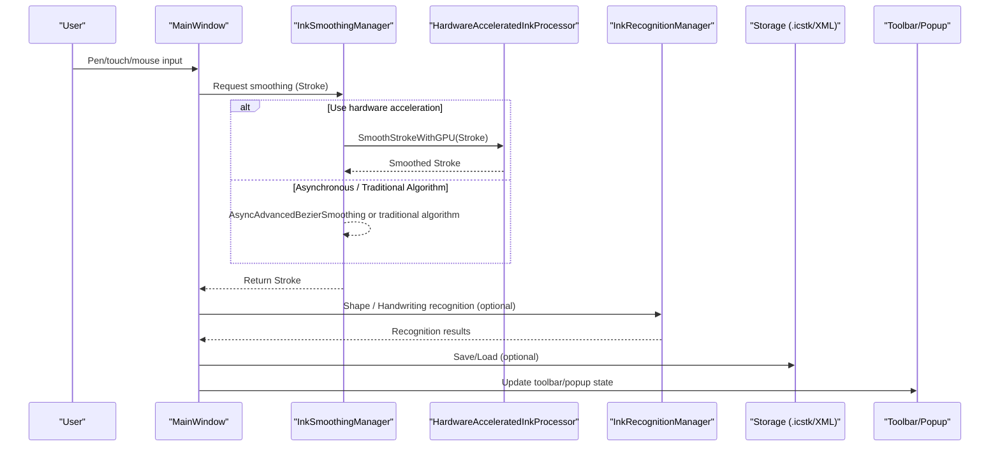
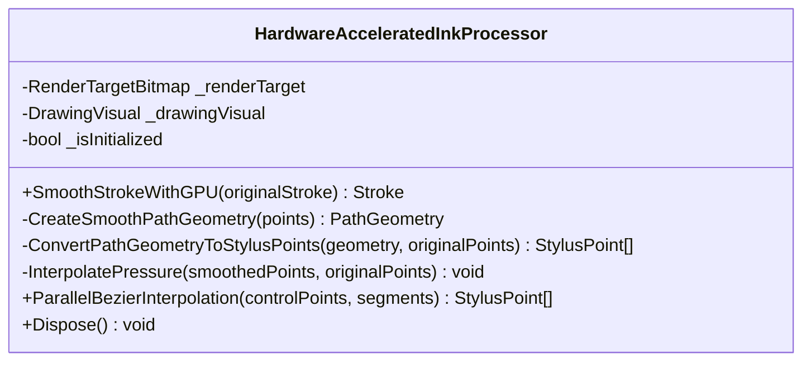
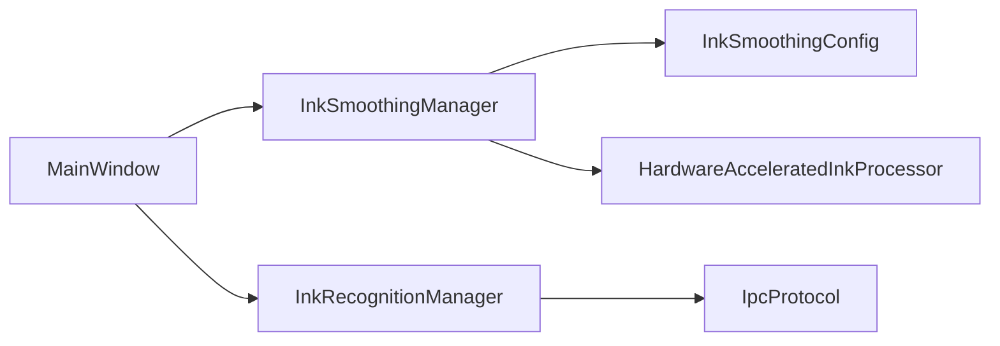

# InkCanvas Core Components

## Introduction
This document addresses the InkCanvas core components, systematically explaining its architectural design and implementation principles, covering ink data acquisition mechanisms, real-time rendering pipelines, event handling systems, hardware-accelerated ink processors (GPU-accelerated rendering, memory management, and performance optimizations), ink data storage formats and serialization mechanisms, data integrity guarantees, and integrations with toolbars, popup systems, settings managers, etc. It also provides performance tuning recommendations, memory usage optimizations, and troubleshooting guidelines for common issues.

## Project Structure
InkCanvas adopts a layered organization of "MainWindow + auxiliary helpers + control layer + settings and resources":
- MainWindow Layer: Responsible for event routing, toolbar and popup interactions, page and canvas management, multi-touch and handwriting input processing.
- Auxiliary Helper Layer: Provides encapsulates of capabilities such as smoothing, recognition, IPC, and hardware acceleration.
- Control Layer: UI components such as toolbars, popups, and quick panels.
- Settings and Resource Layer: Unified JSON configuration models and local persistence.

## Core Components
- Hardware-Accelerated Ink Processor: Based on WPF RenderTargetBitmap and DrawingVisual, realizing GPU-accelerated smoothing and rendering through PathGeometry Bezier curve fitting and parallel interpolation.
- Ink Smoothing Manager: Uniformly schedules asynchronous smoothing, hardware acceleration, and traditional algorithms, providing performance monitoring and configuration recommendations.
- Ink Recognition Manager: Unifies shape recognition and handwriting beautification workflows, supporting both WinRT and IPC auxiliary process backends.
- Event and Input Processing: MainWindow centrally handles pen inputs, touch inputs, mouse inputs, and shape drawing mode toggling.
- Storage and Serialization: Supports .icstk (WPF StrokeCollection built-in format) and custom XML (containing ink and element metadata).
- Toolbars and Popups: Injects UI components via ToolbarHost/Registry; popup content interacts with MainWindow through dependency properties and event bindings.
- Settings and Configurations: The Settings resource model carries configurations such as Canvas/Advanced, and InkSmoothingConfig provides quality levels and parameter mappings.

## Architecture Overview
The core runtime of InkCanvas forms a closed loop consisting of "input acquisition -> smoothing -> rendering -> recognition/storage -> UI interactions". MainWindow takes on input events and UI state coordination; smoothing and recognition are completed by helper classes; and storage adopts both built-in formats and extended XML schemes.

## Detailed Component Analysis

### Hardware-Accelerated Ink Processor (GPU Accelerated Rendering and Smoothing)
- Rendering target and visuals: Uses RenderTargetBitmap and DrawingVisual, enabling high-quality scaling and edge modes to enhance rendering quality.
- Curve smoothing and interpolation: Builds smooth paths via PathGeometry and BezierSegment, and then converts geometry back to StylusPoint collections while interpolating pressure values to guarantee consistency in visuals and pressures.
- Parallel Bezier: Performs parallel computations on control point segments, significantly enhancing interpolation efficiency of large strokes.
- Resource lifecycle: Provides a Dispose flag, facilitating unified reclamation.

## Dependency Analysis
- Component Coupling: MainWindow depends on smoothing and recognition helpers; the smoothing manager depends on configurations and hardware processors; and the recognition manager depends on IPC protocols and WinRT capabilities.
- External Dependencies: WPF Ink, WinRT recognition APIs, IPC shared memory protocols.
- Circular Dependencies: No circular references found; each layer has clear responsibilities and distinct interface contracts.

## Performance Considerations
- Hardware Acceleration: Prioritizes enabling the hardware acceleration path corresponding to the RenderCapability Tier, reducing CPU pressure.
- Asynchronous and Concurrency: Combines asynchronous smoothing and parallel Bezier interpolations, reasonably setting maximum concurrent task numbers to avoid excessive preemption.
- Parameter Tuning: Automatically recommends configurations based on device performances; in quality-first scenarios, reasonably relaxes interpolation steps and resampling intervals.
- Input Path Optimization: Multi-touch real-time interpolations and visual redraws should be performed outside the UI thread to avoid blocking the main thread.
- Storage and Upload: .icstk saving and XML generation use asynchronous uploads to avoid blocking the UI.

[This section contains general guidelines and does not directly analyze specific files]

## Troubleshooting Guide
- Smoothing Failure Fallback: When asynchronous or hardware acceleration fails, automatically falls back to traditional algorithms and logs errors.
- Timeout Protection: Sets timeouts when synchronously waiting for hardware acceleration, returning original strokes and logging warnings upon timeouts.
- Recognition Unavailable: Automatically falls back to IPC or local IACore when WinRT is unavailable, returning null results and logging errors if it still fails.
- Storage Failure: Pops notifications and logs errors when saving .icstk/XML fails, locating abnormal file paths.
- Configuration Validation: InkSmoothingConfig provides parameter range validations; abnormal parameters will be rejected and logged.

## Conclusion
InkCanvas realizes the complete chain from input acquisition to rendering, recognition, and storage through an architecture of "MainWindow event hub + helper class capability encapsulates + UI component decoupling". Hardware acceleration and asynchronous processing effectively enhance real-time performance and stability, and configuration-driven quality strategies adapt to different device performances. Through standardized storage formats and extended metadata, it balances interoperability and readability. It is recommended to automatically apply recommended configurations based on device capabilities during deployment, and continuously monitor smoothing and recognition performance metrics to optimize user experience.

[This section contains summary content and does not require specific file references]

## Appendix
- Key Flow Reference Paths

[This section contains indexing content and does not directly analyze specific files]
