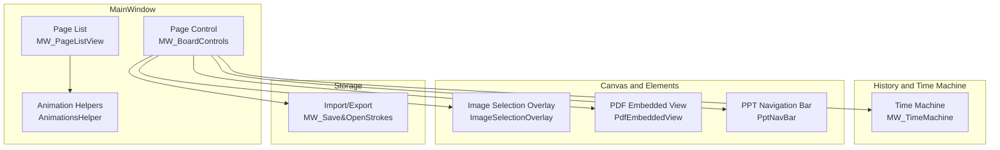
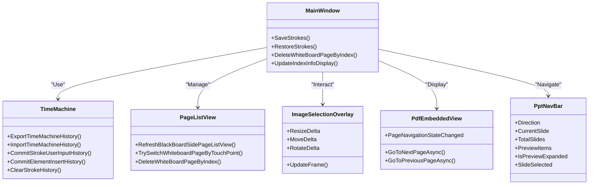
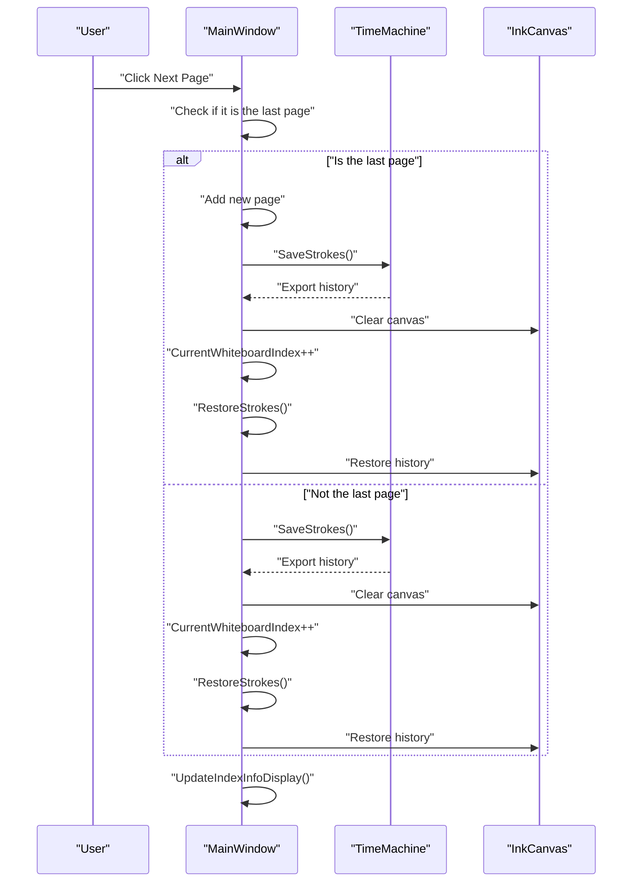
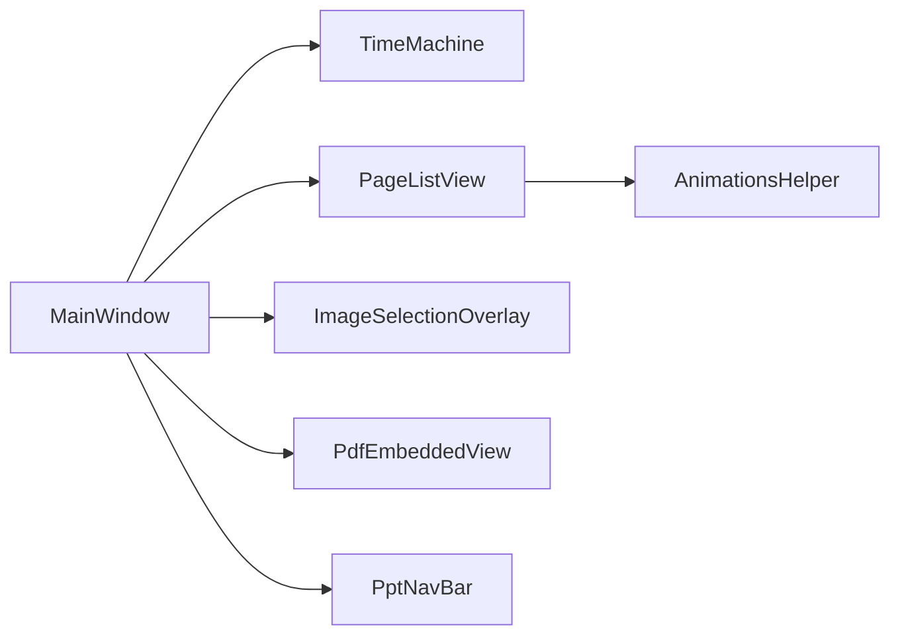

# Page and Canvas Management System

## Introduction
This project is a WPF-based page and canvas management system, supporting multi-page architectures, page switching, animation effects, state preservation, and memory optimizations. Centering on the InkCanvas control, the system provides complete page lifecycle management, history and undo/redo, page thumbnail lists, image selection overlays, PDF embedded views, and PPT navigation bars.

## Project Structure
The system is mainly divided into the following modules:
- MainWindow and Page Control: responsible for page indices, additions/deletions/modifications, switching, and state displays.
- Time Machine and History Management: responsible for history records of ink and elements, undo/redo, and memory optimizations.
- Page List and Thumbnails: responsible for generating thumbnails, drag-and-drop sorting, and batch operations.
- Image Selection Overlay: responsible for image movements, resizing, rotation, and interactions.
- PDF Embedded View: responsible for PDF page rendering and navigation.
- Animation Helpers: responsible for animation effects of page lists and popups.
- Storage and Import/Export: responsible for serialization of page data and version compatibility processing.

## Core Components
- InkCanvas: Main canvas, carrying ink and image/media elements.
- TimeMachine: History record engine, supporting undo/redo and memory optimizations.
- PageListView: Page thumbnail list, supporting click switching and deletion.
- ImageSelectionOverlay: Image selection overlay, supporting movement, resizing, and rotation.
- PdfEmbeddedView: PDF embedded view, displaying only the current page, with page turns controlled by MainWindow.
- PptNavBar: PPT page turning and enhanced preview integrated control.
- AnimationsHelper: Unified animation effect encapsulates.

## Architecture Overview
The system adopts a layered architecture:
- Presentation Layer: MainWindow and its controls (PageListView, PptNavBar, ImageSelectionOverlay, etc.).
- Business Logic Layer: Page Control (MW_BoardControls), History Management (MW_TimeMachine).
- Data Persistence Layer: Import/Export (MW_Save&OpenStrokes).

## Detailed Component Analysis

### Page and Canvas Lifecycle Management
- Page Creation: Before reaching the maximum page count (99), realized by inserting a blank page and clearing the history.
- Page Switching: Save current page state -> Clear canvas -> Switch index -> Restore target page.
- Page Deletion: Delete the specified page and fill forward, while flattening history to optimize performance.
- State Saving: Submits ink and elements on the canvas to TimeMachine history, saving the multi-finger writing mode state.

## Dependency Analysis
- MainWindow depends on TimeMachine for history management.
- PageListView depends on AnimationsHelper to realize animation effects.
- ImageSelectionOverlay interacts with InkCanvas elements.
- PdfEmbeddedView links with the PDF sidebar of MainWindow.
- PptNavBar integrates with the PPT mode of MainWindow.

## Performance Considerations
- History Flattening: Flattens history to "final state only" before deleting pages, reducing lags during subsequent page turns.
- Batch Element Processing: Handles positions and event bindings of images/media elements uniformly after restoring pages, lowering layout update counts.
- Memory Optimization: Clears the canvas and history, releasing resources timely.
- Image Compression: Compresses large images to balance quality and performance.
- Lightweight Animations: Uses easing functions and minimum animation durations to guarantee smoothness.

## Troubleshooting Guide
- Page Switching Anomalies: Check exception handling logic, ensuring switching processes are not interrupted.
- Thumbnails Not Updating: Confirm collection length evaluations and reconstruction branches.
- Image Selection Toolbar Does Not Disappear: Check unselection flows and editing mode restorations.
- PDF Page Turning Ineffective: Confirm current page index and busy state evaluations.
- Import Mode Mismatch: View log outputs and user prompts.

## Conclusion
This system realizes a stable and efficient multi-page canvas system through a clear layered design and comprehensive lifecycle management. TimeMachine and history flattening strategies effectively enhance performance; the page list and animations enhance interactive experiences; and the image selection overlay provides intuitive control over elements. Storage and import/export modules guarantee data portability and version compatibility.

## Appendix
- Best Practices
  - Save state uniformly before page switching, and restore uniformly after switching.
  - Compress large images to avoid excessive memory peaks.
  - Use history flattening to reduce lags caused by lengthy histories.
  - Batch process element event bindings, reducing layout jitters.
- Performance Optimization Recommendations
  - Reasonably use animation durations, avoiding impacts on response speeds.
  - Defer handling complex elements when restoring pages, enhancing first-frame rendering.
  - Periodically clean up unneeded history records, controlling memory footprints.
